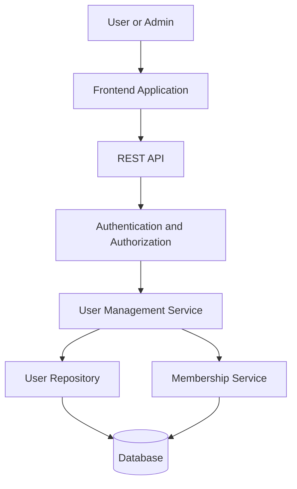
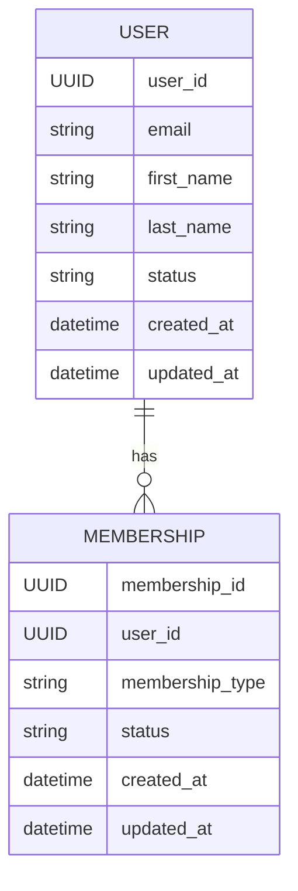
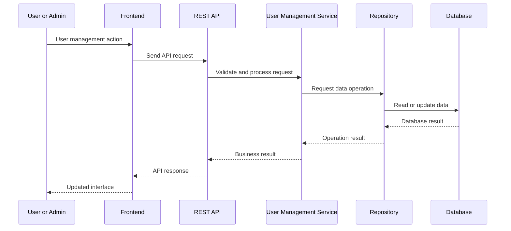

# AX1-CORE-002-FS-01 — User Management Architecture

## Task Information

| Field | Value |
|---|---|
| Task ID | AX1-CORE-002-FS-01 |
| Phase | Phase 1 — Core Platform |
| Module | CORE-002 |
| Feature | User Management |
| Team | Full-Stack |
| Deliverable | End-to-end architecture for user profiles, list/detail, create/edit, status and membership |

---

## 1. Purpose

This document defines the proposed end-to-end architecture for the CORE-002 User Management module.

The architecture covers the complete flow between the frontend application, API layer, authentication and authorization, user-management services, data-access layer and database.

The module is designed to support the following capabilities:

- User profiles
- User list and user detail
- User creation
- User editing
- User status management
- User membership management

The design follows the modular architecture of AXIVON ONE and separates presentation, integration, business logic and persistence responsibilities.

---

## 2. End-to-End Architecture

The User Management module follows a layered architecture in which each layer has a clearly defined responsibility.

---

### Architecture Flow

The end-to-end request flow is:

1. The user or administrator interacts with the frontend.
2. The frontend sends a request to the REST API.
3. Authentication and authorization verify the requester and access permissions.
4. The User Management Service applies business rules and validation.
5. The User Repository or Membership Service handles the required data operation.
6. The database stores or retrieves the requested information.
7. The result is returned through the API to the frontend.
8. The frontend updates the user interface based on the response.

This separation keeps presentation, integration, business logic and persistence responsibilities clearly defined.

## 3. Layer Responsibilities

The following sections define the responsibility of each application layer in the User Management architecture.

---
### 3.1 Frontend Application

The frontend application is responsible for presenting user-management screens and handling user interactions.

Responsibilities include:

- Displaying the user list and user details.
- Providing forms for creating and editing users.
- Displaying and updating user status.
- Displaying membership information and available membership actions.
- Sending user-management requests to the API layer.
- Handling loading, success and error states.
- Updating the interface using the response received from the backend.

The frontend does not directly access the database. All data operations are performed through the API layer.
### 3.2 API Layer

The API layer provides the integration boundary between the frontend application and the User Management services.

Responsibilities include:

- Exposing proposed REST endpoints for user-management operations.
- Receiving and validating request data.
- Passing authenticated requests to the appropriate service.
- Returning consistent success and error responses.
- Preventing direct access from the frontend to persistence components.
- Supporting user list, detail, create, edit, status and membership operations.

The API layer acts as the controlled entry point for User Management operations.

### 3.3 Authentication and Authorization

The authentication and authorization layer protects User Management operations from unauthorized access.

Responsibilities include:

- Verifying the identity of the requester.
- Validating the authentication token or session.
- Checking whether the requester has permission to perform the requested operation.
- Restricting administrative operations to authorized users.
- Rejecting invalid or unauthorized requests before business processing.
- Providing the authenticated user context to the User Management Service.
- 
### 3.4 User Management Domain

The User Management Service contains the core business logic for managing users and their memberships.

Responsibilities include:

- Applying user-management business rules.
- Validating user profile data before persistence.
- Handling user creation and editing.
- Retrieving user lists and individual user details.
- Managing user status changes.
- Coordinating membership operations.
- Returning business results or validation errors to the API layer.

The service coordinates the required repository and membership operations without directly handling frontend concerns.
Authorization decisions should be applied before sensitive user or membership operations are executed.

### 3.5 Repository and Persistence Layer

The repository and persistence layer manages access to user and membership data stored in the database.

Responsibilities include:

- Creating, retrieving and updating user records.
- Retrieving user lists and individual user details.
- Updating user status.
- Reading and maintaining membership records.
- Executing database operations through defined repository interfaces.
- Keeping database-specific operations separate from business logic.

The repository layer should return structured data to the User Management Service and should not contain frontend or API-specific logic.

## 4. User Management Data Model

The User Management module uses user and membership data as its primary domain entities.

---

### 4.1 User

The User entity represents the profile and account information managed by the User Management module.

| Field | Purpose |
|---|---|
| User ID | Unique identifier for the user |
| Email | User's email address |
| First Name | User's first name |
| Last Name | User's last name |
| Status | Current account status |
| Created At | Date and time the user was created |
| Updated At | Date and time the user was last updated |

The User entity is the primary record for profile, account status and user-management operations.

### 4.2 Membership

The Membership entity represents the relationship between a user and the organization, role or membership context within AXIVON ONE.

| Field | Purpose |
|---|---|
| Membership ID | Unique identifier for the membership |
| User ID | References the associated user |
| Membership Type | Defines the membership category |
| Status | Current membership status |
| Created At | Date and time the membership was created |
| Updated At | Date and time the membership was last updated |

Membership data is associated with the User entity and is managed through the User Management Service.

### 4.3 Entity Relationship

The relationship between the User and Membership entities is defined as follows:

### 4.4 Data Integrity

The User Management data model should maintain consistency between user and membership records.

Key considerations include:

- Each user must have a unique user ID.
- Email addresses should follow the defined validation rules.
- Membership records must reference an existing user.
- User status values should use a controlled set of supported states.
- Membership status values should use a controlled set of supported states.
- Required fields should be validated before database operations.
- User and membership updates should preserve referential integrity.

These rules help keep user and membership data consistent across the application layers.

## 5. User Management Operations

The User Management module supports the following core operations for managing user profiles, account status and membership information.

---

### 5.1 User List

The User List operation retrieves a collection of users for authorized users.

The proposed flow is:

1. The frontend requests the user list through the API.
2. Authentication and authorization validate the requester.
3. The User Management Service applies access rules and query parameters.
4. The repository retrieves the matching user records.
5. The API returns the user list to the frontend.
6. The frontend displays the results.

The operation should support pagination and filtering where required by the final implementation.

### 5.2 User Detail

The User Detail operation retrieves the complete available profile and membership information for a specific user.

The proposed flow is:

1. The frontend requests a user by its unique ID.
2. Authentication and authorization validate the requester.
3. The User Management Service validates the user ID and access rules.
4. The repository retrieves the user record.
5. The Membership Service retrieves the associated membership information.
6. The API returns the combined user detail response.
7. The frontend displays the user profile and membership information.

### 5.3 Create User

The Create User operation creates a new user profile after validating the submitted information.

The proposed flow is:

1. The frontend submits the user profile through the API.
2. Authentication and authorization validate the requester.
3. The User Management Service validates the submitted data.
4. The service checks required uniqueness constraints, such as email.
5. The repository creates the new user record.
6. The API returns the creation result to the frontend.
7. The frontend displays the updated result or an appropriate error message.

### 5.4 Edit User

The Edit User operation updates an existing user profile after validating the requested changes.

The proposed flow is:

1. The frontend submits the updated profile through the API.
2. Authentication and authorization validate the requester.
3. The User Management Service validates the user ID and updated fields.
4. The service verifies that the requested user exists.
5. The repository updates the user record.
6. The API returns the updated result to the frontend.
7. The frontend refreshes the displayed user information.

### 5.5 Status Management

The Status Management operation allows authorized users to update the current status of a user account.

The proposed flow is:

1. The frontend submits the requested status change through the API.
2. Authentication and authorization validate the requester.
3. The User Management Service validates the requested status.
4. The service verifies that the target user exists.
5. The repository updates the user's status.
6. The API returns the operation result to the frontend.
7. The frontend refreshes the displayed user status.

### 5.6 Membership Management

The Membership Management operation manages the membership relationship associated with a user.

The proposed flow is:

1. The frontend submits the membership action through the API.
2. Authentication and authorization validate the requester.
3. The User Management Service validates the user and membership information.
4. The Membership Service applies the required membership rules.
5. The repository creates, updates or retrieves the membership record.
6. The API returns the operation result to the frontend.
7. The frontend refreshes the user's membership information.

## 6. Validation and Error Handling

The User Management module should validate requests at appropriate application layers and return clear errors when an operation cannot be completed.

Key validation areas include:

- Required user profile fields.
- Valid email format.
- Unique email constraints during user creation or editing.
- Valid user and membership identifiers.
- Supported user and membership status values.
- Authorization for protected operations.
- Existence checks before updating or retrieving records.

### 6.1 Request Validation

User Management requests should be validated before business processing.

Validation should cover:

- Required user profile fields.
- Valid email format.
- Valid user and membership identifiers.
- Supported user and membership status values.
- Valid membership information.
- Input values that must satisfy defined length or format rules.

Invalid requests should be rejected before database operations are performed.

### 6.2 Business Validation

The User Management Service should apply business-level validation after receiving a valid API request.

Business validation should include:

- Checking whether a user exists before retrieving or editing the user.
- Checking email uniqueness when creating or updating a user.
- Verifying that membership operations reference an existing user.
- Ensuring that requested status changes are supported.
- Ensuring that the requester has permission for protected operations.

### 6.3 Error Handling

Errors should be handled consistently across the User Management layers.

The API should return appropriate responses for cases such as:

- Invalid request data.
- Unauthorized or forbidden operations.
- User not found.
- Duplicate email or conflicting data.
- Invalid membership information.
- Unexpected server or database failures.

The frontend should display clear user-facing messages while avoiding exposure of internal system details.

### 6.4 Validation Responsibility by Layer

Validation responsibilities should be separated across the architecture:

| Layer | Validation Responsibility |
|---|---|
| Frontend | Basic input and form validation |
| API | Request structure and input validation |
| Authentication and Authorization | Identity and access validation |
| User Management Service | Business rules and entity validation |
| Repository | Persistence constraints and data integrity |
| Database | Final data integrity and relational constraints |

Errors should be handled consistently across the API and frontend so that users receive clear feedback without exposing internal implementation details.

## 7. Security Considerations

The User Management module handles account and membership information, so security controls should be applied across all layers.

### 7.1 Authentication

User Management requests should require a valid authenticated session or access token where authentication is required.

The authentication layer should verify the requester before protected operations are processed.

### 7.2 Authorization

Access to user-management operations should be controlled based on the permissions of the authenticated requester.

Sensitive operations such as creating users, editing profiles, changing status and managing memberships should be restricted to authorized users.

### 7.3 Data Protection

User information should be protected during transmission and storage.

The implementation should:

- Use secure communication for API requests.
- Avoid exposing sensitive information in API responses.
- Avoid storing passwords in plain text.
- Apply appropriate database access controls.
- Prevent unauthorized access to user and membership records.

### 7.4 Input and API Security

All API inputs should be validated before processing.

The implementation should also protect against:

- Unauthorized requests.
- Invalid or manipulated identifiers.
- Injection attacks.
- Excessive or malformed requests.
- Accidental exposure of internal errors or database details.

### 7.5 Auditability

Important user-management actions should be traceable where required.

Examples include:

- User creation.
- Profile updates.
- Status changes.
- Membership changes.

Audit information should support operational troubleshooting and accountability without exposing unnecessary sensitive data.

## 8. Frontend State and Integration Flow

The frontend should maintain a clear state for user-management operations and update the interface according to API responses.

### 8.1 User List State

The frontend should manage:

- Loading state while users are being retrieved.
- User list data after a successful response.
- Empty state when no users are available.
- Error state when the request fails.

### 8.2 User Detail State

The frontend should manage:

- Loading state while user details are retrieved.
- User profile and membership data after a successful response.
- Not-found state when the requested user does not exist.
- Error state when the request fails.

### 8.3 Create and Edit State

For create and edit operations, the frontend should manage:

- Form input state.
- Client-side validation errors.
- Submission/loading state.
- Successful operation state.
- API validation or business errors.

### 8.4 Status and Membership State

Status and membership actions should update the interface after the backend confirms the operation.

The frontend should avoid displaying a successful state until the API response confirms that the requested operation was completed.

### 8.5 Integration Flow

## 9. Integration Boundaries

The User Management module should maintain clear boundaries between the frontend, API, business and persistence layers.

### 9.1 Frontend to API

The frontend communicates with User Management through defined API contracts.

The frontend should not directly access backend services or database resources.

### 9.2 API to Service

The API layer forwards validated requests to the appropriate User Management Service operation.

The service remains responsible for business rules and processing decisions.

### 9.3 Service to Repository

The User Management Service communicates with repositories for user and membership data operations.

Repositories are responsible for persistence concerns and should not contain frontend-specific logic.

### 9.4 User and Membership Integration

User and membership operations should use the user identifier to maintain the relationship between the two entities.

Membership operations should verify that the referenced user exists before creating or updating membership information.

### 9.5 Response Boundary

The API should return structured responses that allow the frontend to distinguish between successful operations, validation failures, authorization failures, not-found cases and server errors.

## 10. Expected End-to-End Flow

The User Management module is expected to follow a consistent flow from user interaction to data persistence.

### 10.1 Read Operations

For user list and detail requests:

1. The frontend sends the request.
2. The API validates the request and authentication context.
3. The User Management Service applies access and business rules.
4. The repository retrieves the required data.
5. The API returns the result.
6. The frontend updates the interface.

### 10.2 Write Operations

For create, edit, status and membership operations:

1. The frontend collects and validates user input.
2. The API receives the request.
3. Authentication and authorization validate access.
4. The User Management Service validates business rules.
5. The appropriate repository or Membership Service performs the data operation.
6. The API returns the operation result.
7. The frontend updates the displayed state.

### 10.3 Failure Flow

If validation, authorization, business processing or persistence fails, the error should propagate through the API as a structured response.

The frontend should convert the response into an appropriate user-facing error state without exposing internal implementation details.

## 11. Future Implementation Alignment

The architecture described in this document represents the proposed structure for implementing the CORE-002 User Management module.

Future implementation should maintain the defined separation between:

- Frontend presentation and state management.
- REST API integration.
- Authentication and authorization.
- User Management business logic.
- Membership management.
- Repository and database operations.

The implementation should follow the existing AXIVON ONE modular structure and reuse shared types, validation and utility packages where applicable.

API routes, database schemas and service implementations should be finalized during the implementation phase based on the approved project requirements.

## 12. Summary

The proposed CORE-002 User Management architecture provides an end-to-end structure for managing user profiles, user list and detail views, user creation and editing, account status and membership.

The architecture separates frontend, API, authentication and authorization, business logic, membership management, repository and database responsibilities.

This separation provides clear integration boundaries and establishes a consistent foundation for the future implementation of the User Management module in AXIVON ONE.

