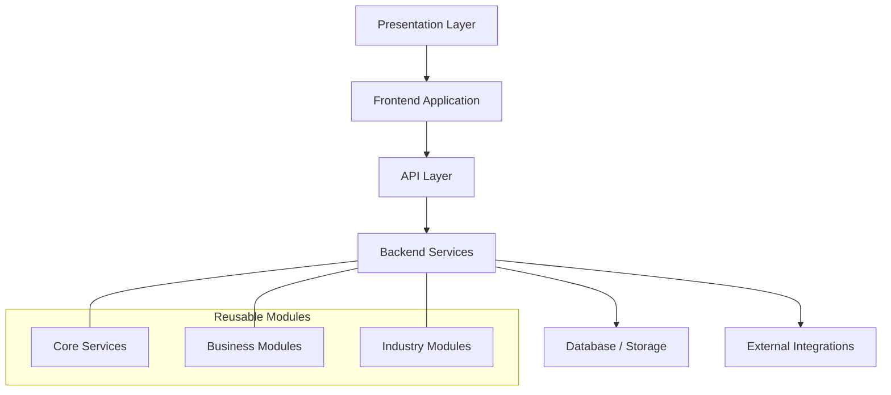

# 00-PROJECT-OVERVIEW.md

## 1. Document Information

| Field | Value |
|---|---|
| Project Name | AXIVON ONE |
| Product Name | AXIVON ONE — Modular Business & Management Platform |
| Document Name | Project Overview |
| Document Version | 1.0 |
| Status | Draft — Living Document |
| Owner | Product Management / Engineering Leadership |
| Audience | Leadership, Project Managers, UI/UX, Frontend, Backend, Full-Stack, QA, future team members |
| Purpose | Serves as the single source of truth for what AXIVON ONE is, why it exists, its scope, structure, and roadmap |
| Related Documents | `01-UI-UX-TEAM.md`, `02-FRONTEND-TEAM.md`, `03-BACKEND-TEAM.md`, `04-FULL-STACK-TEAM.md`, and future documents listed in §37 |
| Last Updated | TBD — set on first commit to repository |

---

## 2. Executive Summary

AXIVON ONE is an internal, modular business and management platform designed to be **built once and reused across many future client projects**, rather than rebuilt from scratch for each new customer. It provides a shared foundation — authentication, user and organization management, dashboards, notifications, and a growing library of reusable business modules (CRM, tasks, projects, billing, and more) — on top of which industry-specific capabilities (education, healthcare, hospitality, retail, and others) and client-specific configuration are layered.

What makes this different from a normal project is its **explicit reusability mandate**: every module is designed to be shared across clients through configuration rather than duplication. This reduces repeated development effort, produces a more consistent and secure product across all client engagements, and turns each new client project into an exercise in assembly and configuration rather than a from-scratch build. Over time, AXIVON ONE becomes company-owned technology — a compounding asset whose value increases with every project it powers.

---

## 3. Project Vision

**Where should AXIVON ONE be in the future?**

AXIVON ONE should become the company's standard internal platform for delivering business and management software to clients across multiple industries — a foundation mature enough that launching a new client project is primarily a matter of enabling modules, applying branding, and adding well-scoped custom features, rather than writing a new application.

This vision is pursued incrementally. AXIVON ONE will not support every industry immediately, and it is not expected to replace every external tool a client might use. The vision is one of **steady, deliberate expansion**: a strong, well-tested core first, a growing catalog of reusable business modules next, and industry modules added as real client needs justify them.

---

## 4. Project Mission

The practical mission for the first versions of AXIVON ONE is to establish a foundation that is:

- **Reusable** — modules work across clients and industries with configuration, not forks.
- **Reliable** — core services (auth, users, permissions) are stable and well-tested before anything is built on top of them.
- **Maintainable** — a new developer can understand and safely extend the platform.
- **Scalable** — the architecture supports more organizations, users, modules, and data without redesign.
- **Modular** — clear boundaries between Core, Reusable Modules, Industry Modules, and Client Configuration.
- **Secure** — security is built into the foundation, not retrofitted per client.
- **Consistent** — one design system, one set of API conventions, one authentication system.
- **Faster for future delivery** — each subsequent client project should take less net-new effort than the one before it.

---

## 5. Problem Statement

Without a platform like AXIVON ONE, a software company delivering custom business applications typically faces recurring, avoidable problems:

- **Rebuilding similar features repeatedly** — authentication, user management, and dashboards are re-implemented for every client project.
- **Duplicated code** — similar CRUD screens, forms, and APIs are written from scratch each time, with subtle inconsistencies.
- **Inconsistent UI** — each project develops its own visual language, increasing design and QA effort.
- **Inconsistent APIs** — different naming, pagination, and error conventions across projects make onboarding new developers harder.
- **Different authentication systems per project** — security review has to happen from scratch every time.
- **Different admin systems** — internal operations staff must learn a new admin experience per client.
- **Long development cycles** — every project starts near zero.
- **Poor documentation** — knowledge lives in individual developers' heads rather than in reusable documentation.
- **Difficult maintenance** — bug fixes and improvements don't propagate between unrelated projects.
- **Difficult onboarding** — new developers face a different codebase and set of conventions on every project.
- **Lack of reusable business modules** — common capabilities like CRM or billing are rebuilt instead of reused.

AXIVON ONE addresses these problems by centralizing the foundation and reusable modules in one continuously improved platform, with client differences expressed through configuration rather than duplicated code.

---

## 6. Business Objectives

- Reduce repeated development effort across client projects.
- Increase the proportion of each new client project delivered through reuse rather than new code.
- Standardize development practices, API conventions, and design language across all teams.
- Improve delivery speed for future client projects as the module catalog matures.
- Improve overall product quality and consistency across client engagements.
- Reduce long-term maintenance effort by consolidating similar logic into shared modules.
- Build reusable intellectual property that increases in value with each project delivered.
- Make client-specific customization faster and lower-risk through a clear configuration model.

*(These are directional business objectives. Specific numerical targets, such as "reduce delivery time by X%," should be proposed and tracked separately once baseline data from the first 1–2 client projects is available.)*

---

## 7. Product Goals

### Short-Term Goals
- Establish the Core Platform (authentication, users, roles, permissions, organization/tenant, dashboard shell, notifications, file management, settings, audit logs).
- Establish the AXIVON design system and shared component library.
- Deliver an initial set of Reusable Business Modules (CRM foundation, tasks, basic reporting).
- Establish shared engineering standards (Git workflow, API conventions, testing expectations, documentation practices).

### Medium-Term Goals
- Expand the Reusable Business Module catalog (projects, products, services, billing, payments).
- Deliver the first Industry Module for a real client engagement, validating the assembly model (§25).
- Mature the client configuration model (branding, enabled modules, business rules).

### Long-Term Goals
- Support multiple industries through a growing catalog of Industry Modules.
- Reduce the average net-new effort required per new client project.
- Establish AXIVON ONE as the default starting point for new client engagements company-wide.

---

## 8. Non-Goals

AXIVON ONE is explicitly **not** trying to do the following, at least in its current and near-term phases:

- It is not trying to build every industry module at once.
- It is not trying to implement every conceivable feature "just in case" a future client needs it.
- It is not trying to over-engineer the architecture for scale or flexibility the platform does not yet need.
- It is not trying to replace every external SaaS product a client might already use (e.g., it will integrate with payment/email/SMS providers rather than reinvent them).
- It is not a collection of unrelated demo projects — every module must fit the Core / Reusable / Industry / Client Configuration model.
- It is not committing to specific technology choices prematurely — unresolved technology decisions are explicitly marked `TBD` throughout this and related documents.
- It is not a replacement for sound project-specific discovery — client engagements still require requirements gathering, even if much of the implementation is reused.

---

## 9. Target Users

| Category | Description |
|---|---|
| Platform Administrators | Internal company staff who manage the platform itself across all client organizations |
| Organization Administrators | Admin users within a client organization, managing their own users, roles, and settings |
| Managers | Users who oversee teams, projects, or business operations within an organization |
| Employees / Staff | Day-to-day users performing operational tasks (CRM, tasks, billing, etc.) |
| Customers / End Users | External users of a client's deployment (e.g., a parent viewing a student's attendance, a patient viewing an appointment) |
| Industry-Specific Users | Roles that only exist within a given industry module, e.g., Student, Teacher, Doctor, Patient, Restaurant Staff, Hotel Staff |

The exact roles present in any given deployment are **configurable per client** — not every client will have every role, and industry-specific roles only appear when the relevant Industry Module is enabled.

---

## 10. User & Role Model

```text
Platform
   ↓
Organization / Tenant
   ↓
Users
   ↓
Roles
   ↓
Permissions
```

- **User** — an individual account, always associated with one or more organizations.
- **Organization / Tenant** — a client's isolated instance of the platform, with its own users, configuration, and enabled modules.
- **Membership** — the relationship connecting a user to an organization.
- **Role** — a named set of permissions assignable to users within an organization (e.g., "Org Admin", "Billing Staff", "Teacher").
- **Permission** — a specific allowed action, granted through role assignment.
- **Access control** — the enforcement of permissions at the API layer, ensuring users can only perform actions their role allows within their organization.

This is a conceptual model, not a database schema. Detailed entity design belongs in a future `06-DATABASE-ARCHITECTURE.md` document.

---

## 11. Product Architecture Overview



At a conceptual level:
- The **Presentation Layer** and **Frontend Application** render the AXIVON design system and consume APIs.
- The **API Layer** exposes consistent, versioned contracts to the frontend.
- **Backend Services** implement Core, Reusable, and Industry module logic against a shared data layer.
- **Database/Storage** persists data with multi-tenant awareness (see §27).
- **External Integrations** (email, SMS, payment providers) sit behind provider-agnostic abstractions.

Specific technology choices (frontend framework, backend framework/language, database engine, API style) are `TBD — Architecture/Technical Lead decision`, to be documented in a future `05-SYSTEM-ARCHITECTURE.md`.

---

## 12. Platform Structure

### A. Core Platform
Shared functionality used by almost every client: Authentication, User Management, Role Management, Permission Management, Organization/Tenant Management, Dashboard, Notifications, File Management, Settings, Audit Logs, Search, Common Reporting.

### B. Reusable Business Modules
Capabilities useful across most industries: CRM, Customer Management, Lead Management, Employee Management, Task Management, Project Management, Product Management, Service Management, Billing, Payment, Communication, Reports.

### C. Industry Modules
Capabilities specific to a vertical, built on top of Core + Reusable Modules:

| Industry | Example Modules |
|---|---|
| Education | Student, Teacher, Course, Class, Attendance, Fees, Exam, Result, Timetable |
| Hospital | Patient, Doctor, Appointment, Billing, medical-record architecture readiness |
| Restaurant | Menu, Table, Order, Kitchen, Billing |
| Hotel | Room, Booking, Guest, Housekeeping |
| E-Commerce | Product, Category, Cart, Order, Payment, Delivery |

### D. Client Customization
Per-client configuration layered on top of everything above: Branding, Logo, Colors, Domain, Enabled modules, Roles, Permissions, Business rules, Custom fields, Custom workflows, Integrations, Customer-specific features.

```text
                    AXIVON ONE
                        │
              ┌─────────┴─────────┐
              │                   │
        CORE PLATFORM       REUSABLE MODULES
              │                   │
              │          ┌────────┼────────┐
              │          │        │        │
              │         CRM     Billing   Projects
              │
              └──────────────┬───────────────
                             │
                     INDUSTRY MODULES
                             │
          ┌──────────────────┼──────────────────┐
          │                  │                  │
      Education           Hospital          Restaurant
          │                  │                  │
          └──────────────────┼──────────────────┘
                             │
                    CLIENT CONFIGURATION
                             │
                     CLIENT PROJECT
```

---

## 13. Module Classification Rules

| Question | If Yes → Classify As |
|---|---|
| Is this functionality useful across almost every client, regardless of industry? | **Core** |
| Is this functionality useful across multiple industries, but not universal (e.g., not needed by a pure internal tool)? | **Reusable Business Module** |
| Is this functionality specific to one industry (e.g., attendance tracking, patient records)? | **Industry Module** |
| Is this functionality specific to one customer's unique process? | **Client Customization** |

Classification is not permanent — a feature built as Client Customization for one client may be promoted to a Reusable or Industry Module if a second client needs the same capability. This decision is made deliberately (see §38 Change Management), not automatically.

---

## 14. Core Module Catalog

| Module | Purpose | Priority | Reusable | Initial Scope |
|---|---|---:|---|---|
| Authentication | Secure login, registration, password recovery | P0 | Yes | MVP |
| User Management | User profiles, status, org membership | P0 | Yes | MVP |
| Roles | Definition and assignment of roles | P0 | Yes | MVP |
| Permissions | Granular access control | P0 | Yes | MVP |
| Organization/Tenant | Client isolation and configuration | P0 | Yes | MVP |
| Dashboard | KPI/widget shell | P1 | Yes | MVP |
| Notifications | In-app/email/SMS/push delivery | P1 | Yes | MVP |
| File Management | Upload/download/access control | P1 | Yes | MVP |
| Settings | Profile/org/security/branding settings | P1 | Yes | MVP |
| Audit Logs | Record of significant actions | P1 | Yes | MVP |
| Search | Cross-module search | P2 | Yes | V1 |
| Common Reporting | Shared reporting infrastructure | P2 | Yes | V1 |

---

## 15. Reusable Business Module Catalog

| Module | Purpose | Business Value | Priority | Reusability | Phase |
|---|---|---|---:|---|---|
| CRM (Customers/Leads) | Track prospects and customers | Sales/relationship management for nearly every client | P0 | Very High | MVP |
| Employee Management | Manage staff records | Needed by nearly every organization | P1 | High | V1 |
| Task Management | Assign and track work | Universal operational need | P0 | Very High | MVP |
| Project Management | Manage multi-step initiatives | Common across service/corporate clients | P1 | High | V1 |
| Product Management | Manage sellable items | Needed by retail/e-commerce/service clients | P2 | Medium-High | V1/V2 |
| Service Management | Manage offered services | Needed by service-based businesses | P2 | Medium-High | V1/V2 |
| Billing | Generate invoices | Needed by almost every paying client | P1 | Very High | V1 |
| Payments | Track and process payments | Needed alongside Billing | P1 | Very High | V1 |
| Reports | Cross-module reporting/export | Supports decision-making | P2 | High | V1 |
| Communication | Internal/external messaging | Improves operational efficiency | P3 | Medium | V2 |

---

## 16. Industry Module Roadmap

| Industry | Module Focus | Priority | Phase | Reason |
|---|---|---:|---|---|
| Education | Student, Teacher, Course, Attendance, Fees | P2 | V2 | Common vertical with clear reusable patterns (record-keeping, scheduling, billing) |
| Coaching/Training | Course, Session, Attendance, Payment | P2 | V2 | Overlaps heavily with Education patterns |
| Healthcare/Hospital | Patient, Doctor, Appointment, Billing | P3 | V2/Future | Higher regulatory/security complexity; build once Core security posture is proven |
| Restaurant | Menu, Table, Order, Kitchen, Billing | P3 | Future | Distinct operational model (POS/kitchen flow); lower reuse of existing patterns |
| Hotel | Room, Booking, Guest, Housekeeping | P3 | Future | Distinct booking/inventory model |
| Retail | Product, Inventory, POS | P3 | Future | Overlaps with E-Commerce, but adds physical inventory/POS concerns |
| E-Commerce | Product, Cart, Order, Payment, Delivery | P2 | V2 | High reuse of Product/Billing/Payment reusable modules |
| Corporate/Service Business | Projects, Tasks, Billing | P1 | V1 | Nearly fully covered by Reusable Business Modules already |

Industries are not built in parallel from day one. Prioritization follows: (1) how much of the industry's needs are already covered by Reusable Modules, (2) actual client demand, and (3) regulatory/security complexity.

---

## 17. MVP Definition

The MVP establishes the **platform foundation**, not a finished client-ready product for any single industry.

### Foundation
- Project setup, repository structure, development standards
- Design system foundation
- Authentication
- User Management
- Roles & Permissions
- Organization/Tenant
- Dashboard (shell)
- Settings
- Notifications
- File Management
- Audit Logs

### Initial Business Capability
- Basic CRM (Customers, Leads)
- Task Management
- Basic Reporting

**Why these are good MVP candidates:** every one of them is Core or a near-universally reusable module (§13–14). Nothing industry-specific is included, ensuring the foundation is validated against general-purpose needs before industry complexity is introduced.

---

## 18. MVP Non-Scope

The following are explicitly **not** part of the first MVP unless a specific, strong business reason emerges:

- Full hospital management functionality
- Full hotel management functionality
- Full restaurant POS functionality
- Advanced e-commerce functionality (cart, checkout, delivery logistics)
- Complex AI-driven systems
- Large-scale analytics/BI capabilities
- Support for every possible payment provider
- Every possible third-party integration

The objective of the MVP is a strong, reusable foundation — not broad feature coverage.

---

## 19. Version Roadmap

### MVP
**Goals:** Prove the Core Platform and initial reusable modules work reliably and are genuinely reusable.
**Major Modules:** See §17.
**Expected Outcome:** A working platform shell usable as the starting point for the first real or pilot client engagement.
**Out of Scope:** Industry modules, advanced billing/payment, advanced reporting.

### V1
**Goals:** Mature the Reusable Business Module catalog.
**Major Modules:** Employee Management, Project Management, Billing, Payments, Reports, Search, Common Reporting.
**Expected Outcome:** Enough reusable capability to serve most general business/corporate/service clients without new module development.
**Out of Scope:** Full industry modules (only architectural readiness, not full builds).

### V2
**Goals:** Deliver the first Industry Modules based on real client demand.
**Major Modules:** Education and/or E-Commerce (highest reuse potential per §16), Product/Service Management maturity.
**Expected Outcome:** Validated assembly model (§25) — a real client project built primarily from Core + Reusable + one Industry Module + Configuration.
**Out of Scope:** Remaining industries not yet in demand.

### Future
**Goals:** Expand ecosystem capability based on validated demand and platform maturity.
**Potential Areas:** Additional industries (Hospital, Restaurant, Hotel, Retail), advanced analytics, workflow automation, marketplace-style module ecosystem (see §39).
**Expected Outcome:** A mature multi-industry platform.
**Out of Scope:** Anything not yet justified by client demand or platform readiness.

---

## 20. Development Phases

```text
Phase 0 — Discovery & Architecture
   Define technology stack decisions, confirm module classification, set engineering standards.

Phase 1 — Foundation
   Repository setup, CI/CD, design system foundation, development conventions.

Phase 2 — Core Platform
   Authentication, Users, Roles, Permissions, Organization/Tenant, Dashboard shell, Notifications, Files, Settings, Audit Logs.

Phase 3 — Business Modules
   CRM, Tasks, Projects, Billing, Payments, Reports.

Phase 4 — Industry Modules
   First industry module(s), built on validated Core + Reusable foundation.

Phase 5 — Client Customization Framework
   Mature branding/configuration tooling, custom feature process.

Phase 6 — Continuous Improvement
   Ongoing module expansion, performance/security hardening, ecosystem growth.
```

---

## 21. Four-Team Collaboration Model

```text
UI/UX
  ↓
Design System + UX + UI
  ↓
Frontend
  ↓
Frontend Implementation
  ↓
Backend
  ↓
APIs + Business Logic + Data
  ↓
Full Stack
  ↓
End-to-End Integration
```

This flow describes typical information handoff, **not a strict waterfall sequence**. In practice:
- UI/UX typically works one sprint ahead of Frontend.
- Backend can develop APIs in parallel with Frontend work once a contract is agreed, using mocked data.
- Full-Stack engages early on complex/cross-cutting features, sometimes before Frontend or Backend implementation begins, to help scope the end-to-end shape of the feature.

Refer to each team's document (`01`–`04`) for full workflow, Definition of Ready/Done, and standards.

---

## 22. Team Responsibility Summary

| Area | UI/UX | Frontend | Backend | Full Stack |
|---|---|---|---|---|
| Requirements | Supporting | Supporting | Supporting | Consulted |
| UX | Primary | Informed | Informed | Consulted |
| UI | Primary | Supporting | Informed | Consulted |
| Design System | Primary | Supporting | Informed | Informed |
| Frontend | Consulted | Primary | Informed | Supporting |
| Backend | Informed | Informed | Primary | Supporting |
| Database | Informed | Informed | Primary | Consulted |
| API | Informed | Consulted | Primary | Supporting |
| Authentication | Consulted | Supporting | Primary | Informed |
| Authorization | Informed | Informed | Primary | Consulted |
| Business Logic | Informed | Informed | Primary | Supporting |
| Integrations | Informed | Consulted | Primary | Primary (owned modules) |
| Testing | Supporting | Primary | Primary | Primary |
| Documentation | Primary | Primary | Primary | Primary |
| Release | Informed | Supporting | Supporting | Primary |

*(See each team's document for the full, module-level responsibility matrix.)*

---

## 23. End-to-End Feature Lifecycle

Example: **Customer Management**

```text
Requirement (Product Management)
↓
UX Flow (UI/UX)
↓
UI Design (UI/UX)
↓
Frontend Implementation (Frontend)
↓
Backend API (Backend)
↓
Database (Backend)
↓
Integration (Frontend ⇄ Backend, or Full-Stack if cross-cutting)
↓
Testing (Frontend, Backend, Full-Stack for E2E)
↓
Review (respective team leads)
↓
Documentation (all teams, per their layer)
↓
Release (Full-Stack coordinates if cross-cutting; otherwise Frontend/Backend release independently)
```

**Where Full-Stack participates:** if Customer Management remains a straightforward CRUD module using existing patterns, Full-Stack is not required — Frontend and Backend deliver it independently. If it grows to include cross-cutting complexity (e.g., customer-facing payment integration), Full-Stack takes end-to-end ownership per the criteria in `04-FULL-STACK-TEAM.md` §6.

---

## 24. Reusability Model

- **Build Once** — invest properly in Core and widely-reusable modules rather than building quick, throwaway versions.
- **Standardize** — every team follows shared design and engineering standards (design system, API conventions, Git workflow).
- **Modularize** — modules have clear boundaries and minimal coupling.
- **Reuse** — new client projects start from existing modules, not blank files.
- **Configure** — client differences expressed through configuration wherever possible.
- **Customize** — genuinely client-specific functionality is added deliberately and kept isolated from the reusable core.

```text
Reusable Core
     +
Reusable Modules
     +
Industry Modules
     +
Configuration
     +
Custom Development
     =
Client Solution
```

---

## 25. Client Project Assembly Model

### Example 1 — School
```text
AXIVON CORE
+
CRM
+
Education Module
+
Student
+
Teacher
+
Attendance
+
Fees
+
Exam
+
Client Branding
=
School Management Platform
```

### Example 2 — Hospital
```text
AXIVON CORE
+
CRM
+
Hospital Module
+
Patient
+
Doctor
+
Appointment
+
Billing
+
Client Configuration
=
Hospital Management Platform
```

### Example 3 — Restaurant
```text
AXIVON CORE
+
CRM
+
Restaurant Module
+
Menu
+
Table
+
Order
+
Kitchen
+
Billing
=
Restaurant Management Platform
```

In every example, the same Core Platform and much of the same Reusable Module set (CRM, Billing) is reused. Only the Industry Module and Client Configuration layer change — this is the reusability payoff the entire platform is designed to produce.

---

## 26. Configuration vs. Custom Development

### Configuration (preferred)
Logo, colors, enabled modules, roles, permissions, labels/terminology, business settings (tax rates, currency), workflow toggles.

### Custom Development (used sparingly)
Unique business logic not shared by any other client, a unique third-party integration, unique bespoke reporting, a genuinely one-off feature.

**Principle:** Configuration should always be preferred over custom development where the underlying need is even plausibly shared by future clients. Custom development is reserved for genuinely unique requirements and should be reviewed (see §38) before being built, to avoid quietly turning AXIVON ONE into a collection of client-specific forks.

---

## 27. Multi-Tenant / Organization Readiness

At the product level, AXIVON ONE must support multiple client organizations operating independently within the same platform:

- **Organization isolation** — one client's data must never be visible to another.
- **User membership** — a user belongs to one or more organizations.
- **Roles & permissions** — defined and assignable per organization.
- **Organization settings** — branding, enabled modules, business rules stored per organization.
- **Data isolation** — enforced at the architecture level (specific isolation strategy is a technical decision — see `03-BACKEND-TEAM.md` §8 and future `06-DATABASE-ARCHITECTURE.md`).
- **Configuration** — each organization's enabled modules and settings drive what its users see and can do.

This section describes product-level requirements only; the specific database/architecture implementation is `TBD — Architecture/Technical Lead decision`, documented separately.

---

## 28. Security Principles

- Secure authentication and session handling.
- Authorization enforced server-side (RBAC).
- Input validation on all data entering the system.
- Secure, access-controlled file storage.
- Secrets management — no credentials in source control.
- Audit logs for significant and administrative actions.
- Data isolation between organizations.
- Secure, versioned, rate-limited APIs.
- Ongoing dependency/vulnerability management.
- Structured logging and error handling that avoids leaking sensitive information.

*(No claim of compliance with any specific law or certification — e.g., HIPAA, GDPR, PCI-DSS — is made here. Such compliance requires dedicated review once specific client or industry requirements, such as the Hospital or Payment modules, are scoped.)*

---

## 29. Quality Principles

- **Reliability** — the platform behaves predictably and fails gracefully.
- **Maintainability** — code and design are understandable by future team members.
- **Reusability** — modules serve multiple clients without modification to core logic.
- **Security** — protection of data and access is treated as a first-class requirement.
- **Performance** — the platform remains responsive as data and usage grow.
- **Accessibility** — the platform is usable by people with a range of abilities.
- **Scalability** — the platform supports more organizations, users, and modules without redesign.
- **Testability** — features are verifiable through automated and manual testing.
- **Documentation** — decisions and usage are documented, not left as tribal knowledge.
- **Consistency** — one design language, one set of API conventions, one authentication system.

---

## 30. Agile Development Model

AXIVON ONE is developed using **Agile**, not Waterfall.

- **Product Backlog** — the prioritized list of all planned work.
- **Epics** — large bodies of work (e.g., "Core Identity & Access").
- **Features** — meaningful slices of an Epic (e.g., "Role & Permission Management").
- **User Stories** — user-facing descriptions of value (e.g., "As an Org Admin, I can create custom roles").
- **Tasks/Sub-tasks** — concrete units of implementation work.
- **Sprint Planning** — the team commits to a set of ready work for the sprint.
- **Daily Stand-up** — brief sync on progress and blockers.
- **Backlog Refinement** — ongoing clarification and estimation of upcoming work.
- **Sprint Review** — demonstration of completed, working software.
- **Sprint Retrospective** — reflection on process improvements.
- **Definition of Ready / Definition of Done** — team-specific criteria defined in each team's document (`01`–`04`).

---

## 31. Initial Sprint Roadmap

| Sprint | Focus |
|---|---|
| Sprint 0 | Architecture decisions, repository setup, design foundation, development standards |
| Sprint 1 | Authentication, initial design system, component library foundation |
| Sprint 2 | Users, Roles, Permissions |
| Sprint 3 | Organization/Tenant, Dashboard shell |
| Sprint 4 | Notifications, File Management, Settings, Audit Logs |
| Sprint 5 | CRM foundation |
| Sprint 6 | Customers, Leads, Tasks |

This is a **recommended baseline**, to be adjusted based on actual team capacity and findings from earlier sprints. It is not a delivery-date commitment.

---

## 32. Project Dependency Model

```text
Design System
      ↓
Frontend Foundation
      ↓
Authentication UI  ⇄  Backend Authentication
      ↓
User Management
      ↓
Roles & Permissions
      ↓
Organization/Tenant
      ↓
Business Modules
```

**Areas that can run in parallel once contracts are agreed:**
- UI/UX design work for a future sprint's modules, while Frontend implements the current sprint's designs.
- Backend API development for a module, while Frontend builds against a mocked contract.
- Full-Stack production-readiness/testing infrastructure work, alongside Core module development.

---

## 33. Project Scope

### In Scope
- Core Platform (Authentication, Users, Roles, Permissions, Organization/Tenant, Dashboard, Notifications, Files, Settings, Audit Logs).
- A growing catalog of Reusable Business Modules.
- A design system and shared component library.
- A client configuration model (branding, enabled modules, business rules).
- Engineering standards shared across all four teams (Git workflow, API conventions, testing, documentation).
- Architectural readiness for multi-tenant/multi-industry growth.

### Out of Scope (Current Phase)
- Full builds of every Industry Module.
- Advanced AI-driven features.
- Large-scale analytics/BI platforms.
- Support for every possible third-party integration or payment provider.
- Mobile-native applications (unless explicitly scoped later).
- Public developer/marketplace ecosystem (see §39, Future).

---

## 34. Project Success Criteria

- Core modules work reliably and are used, unmodified, across multiple projects.
- Reusable modules are genuinely reused, not forked, for a second client engagement.
- All four teams follow the shared standards documented in `01`–`04`.
- Documentation is current and sufficient for a new developer to onboard without tribal knowledge.
- Client configuration (branding, modules, roles) works without requiring code changes for standard cases.
- A new client project can be assembled predominantly from existing modules plus configuration.
- Duplicate development across projects visibly decreases over time.
- New developers can explain the platform's structure (Core/Reusable/Industry/Configuration) after reading this document.

---

## 35. Risks

| Risk | Impact | Probability | Mitigation |
|---|---|---|---|
| Over-engineering the Core before real usage validates it | High | Medium | Build MVP scope only (§17); validate with a real/pilot client before expanding |
| Scope creep into industry modules too early | High | Medium | Enforce module classification rules (§13) and roadmap gating (§16) |
| Building too many industries too early, diluting focus | High | Medium | Prioritize by reuse potential and real demand, not speculative coverage |
| Poor module boundaries causing tight coupling | High | Medium | Enforce reusability rules defined in each team document; architecture review for new modules |
| Duplicate code/components across teams | Medium | Medium | Shared component library and API conventions; code review checks for duplication |
| Weak or outdated documentation | Medium | Medium | Documentation is part of each team's Definition of Done |
| Poor cross-team communication | Medium | Low-Medium | Documented handoff checklists (see `01`–`04`), shared channels, no undocumented decisions |
| API/design mismatch | Medium | Medium | Design handoff checklist, API contract review before implementation |
| Security issues introduced under delivery pressure | High | Low-Medium | Security review as part of Definition of Done for Auth/RBAC-related work |
| Insufficient automated testing | Medium | Medium | Testing responsibilities defined per team; Definition of Done requires passing tests |
| Uncontrolled client customization forking the core | High | Medium | Configuration-first principle (§26); custom development reviewed via change management (§38) |

---

## 36. Project Governance

| Decision Area | Decision Owner (Role) |
|---|---|
| Product scope and priorities | Product Management |
| Overall architecture | Architecture/Technical Lead |
| Design system direction | UI/UX Lead |
| API standards | Backend Lead (with Architecture/Technical Lead) |
| Database standards | Backend Lead / Database Engineer (with Architecture/Technical Lead) |
| Security posture | Backend Lead (with Architecture/Technical Lead) |
| Release approval | Engineering Manager |
| Major technical decisions (e.g., tenant isolation strategy, REST vs. GraphQL) | Architecture/Technical Lead |
| Cross-team process/standards | Engineering Manager, with input from all four Team Leads |

Specific individuals are not named in this document; role titles are used so this document remains valid as team membership changes.

---

## 37. Documentation Ecosystem

```text
00-PROJECT-OVERVIEW.md        ← this document: WHAT, WHY, WHO, SCOPE, ROADMAP
        │
        ├── 01-UI-UX-TEAM.md            ← UI/UX team mission, workflow, standards
        ├── 02-FRONTEND-TEAM.md         ← Frontend team mission, workflow, standards
        ├── 03-BACKEND-TEAM.md          ← Backend team mission, workflow, standards
        ├── 04-FULL-STACK-TEAM.md       ← Full-Stack team mission, workflow, standards
        │
        ├── 05-SYSTEM-ARCHITECTURE.md   ← (future) detailed technical architecture, stack decisions
        ├── 06-DATABASE-ARCHITECTURE.md ← (future) schema, entities, tenant isolation implementation
        ├── 07-API-SPECIFICATION.md     ← (future) detailed endpoint/contract specification
        ├── 08-GIT-GITHUB-STANDARD.md   ← (future) consolidated Git/GitHub standard across teams
        ├── 09-AGILE-SPRINT-PLAN.md     ← (future) live, detailed sprint plan
        ├── 10-MVP-ROADMAP.md           ← (future) detailed MVP delivery plan
        └── 11-MODULE-CATALOG.md        ← (future) living catalog of all modules and their status
```

This document is the top-level entry point. Team documents (`01`–`04`) define how each team executes; future technical documents (`05`–`11`) will define detailed implementation once the relevant architectural decisions are made.

---

## 38. Change Management

Significant changes to AXIVON ONE must be documented and reviewed before implementation, including:

- A new module (Reusable or Industry).
- A significant new feature within an existing module.
- An architecture change (e.g., changing tenant isolation strategy).
- A database change affecting shared entities.
- An API contract change, especially breaking changes.
- A design-system change affecting multiple modules.
- A security-relevant change.
- A client customization request that could plausibly become a Reusable or Industry Module.

**Process:** Propose the change (issue or short proposal document) → review by the relevant Decision Owner (§36) → document the decision and rationale → implement per the standard team workflow. Undocumented, verbally-agreed architectural changes should be avoided.

---

## 39. Future Evolution

The following are potential future directions for AXIVON ONE. They are **not committed requirements** — they are possibilities to be evaluated once the foundation and initial industry modules are proven:

- Advanced analytics and business intelligence.
- AI-assisted features (e.g., smart suggestions, automation).
- Workflow automation tooling.
- Advanced, configurable reporting.
- Additional industry modules beyond the initial roadmap (§16).
- Additional third-party integrations.
- Mobile applications.
- Advanced notification systems (richer channels, preferences).
- A developer platform / internal APIs for extending the platform.
- A marketplace-style ecosystem of reusable modules, potentially extending beyond internal use.

---

## 40. Final Product Principles

1. Build reusable software, not one-off projects.
2. Avoid unnecessary duplication of components, APIs, and logic.
3. Keep modules independent and clearly bounded.
4. Prefer configuration over hardcoding client-specific behavior.
5. Keep client-specific logic outside the reusable core wherever practical.
6. Design for maintainability, not just for the next deadline.
7. Security is everyone's responsibility, not just Backend's.
8. Document important decisions — undocumented decisions are effectively lost.
9. Test before release; a feature isn't done until it's verified.
10. Do not over-engineer prematurely — build for validated need, not speculative future need.
11. Build the foundation before expanding into new industries.
12. Reuse before rebuilding — always check for an existing module or component first.
13. Keep ownership clear — every module and decision has a defined owner.
14. Keep APIs and interfaces consistent across the entire platform.
15. Continuously improve the platform — AXIVON ONE is never "finished."

---

## 41. Final Executive Summary

AXIVON ONE, today, is the beginning of a reusable Core Platform and a growing catalog of Reusable Business Modules, deliberately scoped to avoid premature industry-specific or speculative work. It is intended to become the company's standard foundation for delivering business and management software across multiple industries — where a new client engagement is primarily an exercise in enabling existing modules, applying configuration, and adding genuinely unique features, rather than starting from zero.

Each of the four teams should think of their contribution not as "work for this client" but as **work for every future client**: the UI/UX Team maintains the single design language every module inherits; the Frontend Team builds the schema-driven application layer every client's UI runs on; the Backend Team builds the secure, multi-tenant-ready services every module depends on; and the Full-Stack Team ensures the complex, cross-cutting features that span all of the above are delivered as complete, production-ready capabilities. Together, they are not building a project — they are building a platform.
