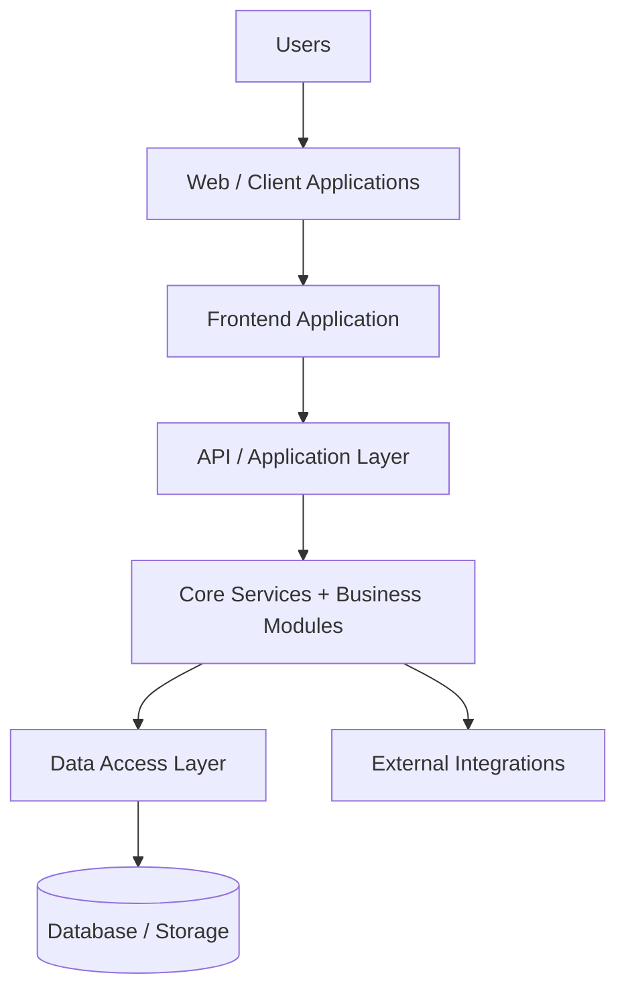

# 05-SYSTEM-ARCHITECTURE.md

## 1. Document Information

| Field | Value |
|---|---|
| Project | AXIVON ONE — Modular Business & Digital Platform |
| Document | System Architecture |
| Version | 1.0 |
| Status | Draft — Living Document |
| Owner | Architecture/Technical Lead |
| Audience | Backend Team, Frontend Team, Full-Stack Team, UI/UX Team, Engineering Leadership |
| Purpose | Defines HOW AXIVON ONE is technically structured, complementing the WHAT/WHY defined in `00-PROJECT-OVERVIEW.md` |
| Related Documents | `00-PROJECT-OVERVIEW.md`, `01-UI-UX-TEAM.md`, `02-FRONTEND-TEAM.md`, `03-BACKEND-TEAM.md`, `04-FULL-STACK-TEAM.md`, `06-DATABASE-ARCHITECTURE.md`, future `07-API-SPECIFICATION.md` |
| Last Updated | TBD — set on first commit to repository |

This document does not contradict `00-PROJECT-OVERVIEW.md`. Where a decision is not yet made at the product level, it is marked `TBD` here as well, with recommended options and criteria rather than a final choice.

---

## 2. Architecture Objectives

| Objective | Why It Matters for AXIVON ONE |
|---|---|
| Modularity | Modules (Core, Reusable, Industry) must be addable/removable per client without destabilizing the rest of the system |
| Reusability | The same code must serve every client — the architecture must not encode client-specific assumptions |
| Maintainability | New developers must be able to understand and safely extend the system as the module catalog grows |
| Scalability | The platform must support more organizations, users, and modules without redesign |
| Security | A shared platform serving many clients must isolate data and enforce access control rigorously |
| Performance | Reusable modules must perform acceptably across varying client data volumes |
| Testability | Modules must be independently verifiable to avoid regressions as the catalog grows |
| Extensibility | Adding an Industry Module or a Reusable Module must not require rewriting the Core |
| Client Configurability | Client differences must be expressible through configuration, not code branches |
| Clear Team Boundaries | Architecture must map cleanly onto the four teams' ownership (`01`–`04`) to avoid overlapping responsibility |

---

## 3. Architectural Principles

1. **Separation of concerns** — presentation, application, business logic, and data access are distinct layers.
2. **Modularity** — Core, Shared Services, Reusable Modules, and Industry Modules are separately identifiable units.
3. **Reusability** — no module encodes logic specific to one client; client differences live in configuration.
4. **Loose coupling** — modules interact through well-defined interfaces/APIs, not by reaching into each other's internals.
5. **High cohesion** — each module contains everything needed to fulfill its own responsibility, and nothing more.
6. **Configuration over hardcoding** — behavior that varies per client is driven by stored configuration, not code branches.
7. **Security by design** — authorization and tenant isolation are enforced structurally, not left to developer discipline alone.
8. **API-first thinking** — internal module boundaries are treated as contracts, even before they are exposed externally.
9. **Observability** — the system exposes enough logging/metrics to diagnose issues without guesswork.
10. **Testability** — modules are structured so business logic can be tested without a full running environment.
11. **Backward compatibility where practical** — published contracts (APIs, shared component props) avoid breaking changes without a documented migration path.
12. **Avoid premature optimization** — performance work is driven by measured need, not speculation.
13. **Avoid premature abstraction** — a second real use case is required before generalizing a pattern into a reusable abstraction.
14. **Documentation of important decisions** — architecture decisions are recorded (see §29), not left as tribal knowledge.

---

## 4. High-Level System Architecture



| Layer | Responsibility |
|---|---|
| Users | Platform Admins, Org Admins, Staff, End Customers, industry-specific roles (see `00-PROJECT-OVERVIEW.md` §9) |
| Web / Client Applications | The browser (and potentially future mobile clients) rendering the Frontend Application |
| Frontend Application | Implements the design system, routes, state, and consumes the API layer (owned by Frontend Team, `02-FRONTEND-TEAM.md`) |
| API / Application Layer | Exposes versioned, authenticated, authorized endpoints; validates requests; orchestrates business logic |
| Core Services + Business Modules | Implements Core Platform, Shared Services, Reusable Modules, and Industry Modules (owned by Backend Team, with Full-Stack for cross-cutting modules) |
| Data Access Layer | Mediates all persistence, encapsulating query/storage details from business logic |
| Database / Storage | Persists relational/business data and files, with multi-tenant awareness (see §11 and `06-DATABASE-ARCHITECTURE.md`) |
| External Integrations | Email, SMS, payment, and other third-party providers, accessed through abstraction interfaces (see §17) |

---

## 5. AXIVON ONE Architectural Model

```text
AXIVON ONE
│
├── Presentation Layer        → UI rendering, design system implementation
├── Application/API Layer     → Request handling, validation, orchestration, authN/authZ enforcement
├── Core Platform             → Auth, Users, Roles, Permissions, Org/Tenant, Dashboard, Settings, Audit
├── Shared Services           → Notification, File/Storage, Search, Reporting, Email/SMS, Payment abstraction, Logging
├── Reusable Business Modules → CRM, Tasks, Projects, Products, Services, Billing, Payments, Reports
├── Industry Modules          → Education, Hospital, Restaurant, Hotel, E-Commerce, etc. (built on top of the above)
├── Configuration Layer       → Per-organization settings, enabled modules, branding, feature flags, business rules
├── Data Layer                → Persistence, migrations, tenant-aware schema (see `06-DATABASE-ARCHITECTURE.md`)
└── Integration Layer         → Provider-agnostic interfaces to external services
```

Each layer depends only on the layers below it (see §10, Dependency Rules). Industry Modules depend on Reusable Modules and Core; they must never be a dependency of Core or Shared Services.

---

## 6. Core Platform Architecture

| Module | Purpose | Responsibility | Dependencies | Exposes | Should NOT Know About |
|---|---|---|---|---|---|
| Authentication | Verify identity, issue sessions/tokens | Login, registration, password reset, verification, OTP (if enabled) | None (foundation) | Auth API, session/token issuance | Business modules, industry logic |
| User Management | Manage user profiles and org membership | CRUD on users, profile data, membership status | Authentication | User API | Module-specific business data |
| Roles | Define assignable roles | Role CRUD, role-permission association | User Management | Roles API | Specific module permission meanings (only names/keys) |
| Permissions | Define the permission catalog | Permission CRUD, permission catalog | None (foundation) | Permission catalog API | Which roles a client actually uses them in |
| Organization/Tenant | Represent and isolate a client | Org CRUD, org settings, enabled modules | User Management | Org API, tenant context | Specific business module data structures |
| Dashboard | Render configurable KPI/widget shell | Widget composition, layout | Reporting, Reusable Modules (data sources) | Dashboard config API | Underlying business logic of each widget's data source |
| Notifications | Deliver messages across channels | Templates, channel selection, delivery tracking | Organization, User | Notification API | Business reasons a notification was triggered (only receives events) |
| File Management | Store/retrieve files with access control | Upload, download, preview, metadata | Organization, User, Auth | File API | Business meaning of a file's content |
| Settings | Store profile/org/security/branding config | Settings CRUD | Organization, User | Settings API | Module-specific business rules |
| Audit Logs | Record significant actions | Append-only event log | Organization, User | Audit query API | Business logic details beyond what's logged |
| Search | Cross-module search | Query dispatch across searchable modules | Reusable Modules (index sources) | Search API | Module internal logic beyond indexed fields |
| Reporting | Shared reporting infrastructure | Aggregate/export data from modules | Reusable Modules (data sources) | Reporting API | Module internal logic beyond exposed reportable fields |

Core modules expose narrow, stable interfaces. They must not import or depend on Reusable or Industry Module code — dependencies flow in the opposite direction (see §10).

---

## 7. Shared Services

A **shared service** is functionality used by multiple modules that would otherwise be duplicated if left inside each module.

| Service | Purpose | Consumers |
|---|---|---|
| Authentication Service | Identity verification, token issuance | All modules requiring identity context |
| Authorization Service | Centralized permission checks | All modules requiring access control |
| Notification Service | Multi-channel message delivery | Any module triggering user-facing events |
| File/Storage Service | Storage abstraction, access control | Any module handling uploads/attachments |
| Audit Service | Append-only event recording | Any module performing sensitive/administrative actions |
| Search Service | Cross-module search indexing/querying | Any module with user-searchable records |
| Reporting Service | Shared aggregation/export logic | Any module exposing reportable data |
| Email Service | Provider-agnostic email delivery | Notification Service, Auth (verification emails) |
| SMS Service | Provider-agnostic SMS delivery | Notification Service, Auth (OTP) |
| Payment Abstraction | Provider-agnostic payment operations | Billing/Payment Reusable Module, Full-Stack-owned complex modules |
| Integration Service | Generic outbound/inbound third-party integration handling | Any module needing external system connectivity |
| Logging/Observability | Structured logging, metrics, health checks | All modules |

**When something should become a shared service vs. stay inside a module:** if two or more modules need the same capability, or the capability is a cross-cutting concern (auth, logging, notifications), it belongs in Shared Services. If it is specific to one module's business logic (e.g., invoice tax calculation), it stays inside that module even if the module itself is reused across clients.

---

## 8. Module Architecture

Every Reusable or Industry Module should follow a consistent internal structure:

```text
CRM MODULE
│
├── Presentation      → UI components specific to CRM (built from the shared design system)
├── Application        → Request handling, orchestration, validation for CRM use cases
├── Domain / Business Logic → Core CRM rules (lead scoring, conversion logic, etc.)
├── Data Access        → CRM-specific persistence, mediated through the Data Access Layer
├── API                → CRM's exposed endpoints, following platform-wide API conventions
└── Tests               → Unit/integration tests scoped to CRM
```

A well-formed module:
- Has a **clear owning team** (see each module's entry in the Backend/Full-Stack team documents).
- Has **explicit, documented dependencies** on Core/Shared Services and, if any, other Reusable Modules.
- **Avoids unnecessary knowledge** of unrelated modules — CRM should not directly query Project Management's data; it requests it through an API/interface if truly needed.
- **Exposes well-defined interfaces** (API endpoints, and for Frontend, component props/contracts).
- Is **testable** in isolation using mocked dependencies for Core/Shared Services.
- Is **reusable** — no client-specific logic embedded directly in the module.
- Is **configurable** — client-specific behavior (e.g., custom lead statuses) is driven by configuration data, not code changes.

---

## 9. Core vs. Module vs. Industry vs. Client Customization

| Layer | Definition | Example |
|---|---|---|
| **Core** | Shared by almost every project, foundational to the platform itself | Authentication, User Management, Organization/Tenant, Roles & Permissions |
| **Reusable Module** | Useful across multiple industries, built on Core | CRM, Tasks, Projects, Billing, Payments |
| **Industry Module** | Specific to one business domain, built on Core + Reusable Modules | Student/Attendance (Education), Patient/Appointment (Hospital), Menu/Order (Restaurant) |
| **Client Customization** | Specific to one customer, layered on top of everything above | A client-specific report format, a one-off integration, a bespoke workflow rule |

This mirrors the classification rules already defined in `00-PROJECT-OVERVIEW.md` §13; this document adds the architectural consequence: **Core code must never import from Reusable Modules; Reusable Modules must never import from Industry Modules; Industry Modules must never import from Client Customization code.** Dependencies only flow downward through this list.

---

## 10. Dependency Rules

```text
UI
 ↓
Application/API
 ↓
Business Modules (Reusable + Industry)
 ↓
Core/Shared Services
 ↓
Data Access
 ↓
Infrastructure
```

**Allowed:**
- A business module depending on Core/Shared Services (e.g., CRM depending on Authentication and Notification Service).
- An Industry Module depending on Reusable Modules and Core (e.g., Education's Fees depending on the Billing Reusable Module).
- The Application/API layer depending on business modules.
- Any layer depending on the Data Access Layer through its defined interface.

**Not allowed:**
- Core or Shared Services depending on any Reusable or Industry Module (this would invert the dependency direction and break reusability).
- One Reusable Module directly reaching into another Reusable Module's data store instead of going through its API/interface.
- The Presentation Layer directly accessing the Data Access Layer, bypassing the Application/API layer's validation and authorization.
- Client Customization code being imported by, or merged into, Core, Shared Services, or Reusable Module code paths.

---

## 11. Multi-Tenant / Organization Architecture

```text
Platform
 ↓
Organization (Tenant)
 ↓
User
 ↓
Membership
 ↓
Role
 ↓
Permission
```

Every tenant-scoped entity carries a reference to its owning Organization. Access to any tenant-scoped resource is only permitted when the requesting user's membership and role/permission within that organization allow it — enforced at the Application/API layer, never trusted from client-supplied data alone.

### Approaches Considered

| Approach | Description | Trade-offs |
|---|---|---|
| Shared Database / Shared Schema | All organizations share tables; rows carry an `organization_id` | Lowest operational cost and complexity; requires strict, consistently-enforced query discipline to prevent cross-tenant data leaks |
| Shared Database / Separate Schema | Each organization gets its own schema within a shared database instance | Stronger logical isolation; higher operational complexity (schema-per-tenant migrations, connection routing) |
| Separate Database per Tenant | Each organization gets a fully separate database | Strongest isolation; highest operational and cost overhead; complicates cross-tenant reporting/analytics |

**Recommendation for MVP:** Shared Database / Shared Schema with a mandatory `organization_id` on every tenant-scoped entity, enforced through the Data Access Layer (e.g., a repository pattern that always requires and applies the tenant filter) so isolation is structural rather than dependent on every developer remembering to filter correctly.

**Status:** `TBD — Technology/implementation decision to be finalized by the Architecture/Technical Lead`, but Shared Database / Shared Schema is the recommended starting point given the SMB/mid-market target described in `00-PROJECT-OVERVIEW.md`, with a documented migration path to stronger isolation (e.g., schema-per-tenant) if a specific client's contractual or regulatory requirements demand it later.

---

## 12. Authentication Architecture

```text
User
 ↓
Login (credentials submitted)
 ↓
Authentication (credential verification)
 ↓
Session / Token (issued on success)
 ↓
Authorization (permission check per request)
 ↓
Resource Access (granted or denied)
```

**Covered flows:** Registration, Login, Logout, Password Reset (time-limited token), Email Verification, OTP (optional, org-configurable), Session Management, Token Management, Refresh (if the chosen token strategy requires it).

**Security controls:** Rate limiting on authentication endpoints, generic error messaging that avoids revealing account existence, secure password storage (algorithm `TBD`, see `03-BACKEND-TEAM.md` §7), audit logging of authentication events, and enforced expiry/rotation for sessions or tokens.

No production secrets, credentials, or example keys appear in this document.

**Status:** Token/session mechanism (e.g., stateless signed tokens vs. server-side session store) is `TBD — Technology decision to be finalized by the Architecture/Technical Lead`.

---

## 13. Authorization Architecture

Authorization is based on **Role-Based Access Control (RBAC)**, applied at the organization level:

```text
Organization
 ↓
Role (e.g., "Org Admin", "Billing Staff")
 ↓
Permission (e.g., "crm.lead.create")
```

Permissions are expressed at the **module + action** level:

```text
CRM
├── View
├── Create
├── Update
├── Delete
├── Export
└── Assign
```

**How permissions should be checked:** every request to the Application/API layer resolves the requesting user's organization membership and role, loads the associated permission set, and checks it against the specific action being performed — before any business logic executes. Frontend-side hiding of UI elements based on permissions is a UX convenience only; it is never treated as an enforcement boundary (see `02-FRONTEND-TEAM.md` §21).

Custom, organization-defined roles are supported by composing roles from the shared permission catalog (see `03-BACKEND-TEAM.md` §8) rather than requiring code changes to add a new role.

---

## 14. API Architecture

High-level principles (full contract detail belongs in the future `07-API-SPECIFICATION.md`):

- **Resource-oriented design** — endpoints represent resources (e.g., `/customers`, `/invoices`), not actions.
- **Naming** — consistent, plural, lowercase resource names across all modules.
- **Versioning** — all endpoints versioned (e.g., `/api/v1/...`); breaking changes require a new version, not an in-place change.
- **Request validation** — every request validated server-side regardless of client-side validation.
- **Response structure** — a consistent envelope/shape across all modules (exact shape defined in `07-API-SPECIFICATION.md`).
- **Error structure** — a consistent error shape with actionable codes (see §21).
- **Pagination, filtering, sorting** — consistent query parameter conventions reused across every list endpoint.
- **Authentication & authorization** — enforced uniformly via shared middleware, not reimplemented per module.
- **Rate limiting** — applied especially to authentication and other sensitive endpoints.
- **Idempotency** — considered for operations like payment submission where retries must not cause duplicate effects.

**Status:** REST vs. GraphQL is `TBD — Technology decision to be finalized by the Architecture/Technical Lead` (see trade-off discussion in `03-BACKEND-TEAM.md` §10).

---

## 15. Frontend Architecture

Conceptual structure (framework-agnostic; specific technology `TBD`):

- **Pages/Routes** — map to modules and their views (list, detail, form).
- **Layouts** — the app shell, navigation, and module-loading structure.
- **Components** — implementations of the AXIVON design system (`01-UI-UX-TEAM.md`), organized as a shared library plus module-specific compositions.
- **State** — client-side state management for session, UI state, and cached API data (specific approach `TBD`).
- **API Layer** — a dedicated service layer responsible for all backend communication, isolating components from raw HTTP/data-fetching details.
- **Authentication & Authorization (UI)** — route guarding based on auth state; permission-aware rendering as a UX convenience, not a security boundary.
- **Forms & Validation** — client-side validation mirroring (not replacing) backend validation rules.
- **Error / Loading / Empty States** — every data-driven view implements all four states consistently (default, loading, empty, error).
- **Responsive Behavior** — implemented per the design system's breakpoints for mobile, tablet, and desktop.

Full detail is owned by `02-FRONTEND-TEAM.md`; this section exists so the system architecture is complete without duplicating that document.

---

## 16. Backend Architecture

```text
API Layer            → Request routing, authentication/authorization middleware, input validation
Application Layer     → Use-case orchestration, transaction boundaries
Domain/Business Logic → Module-specific rules (e.g., invoice calculation, lead scoring)
Data Access           → Repository/query layer, tenant-scoping enforcement
Infrastructure        → Framework, external service clients, background job runners
```

**Separation rationale:** keeping Domain/Business Logic independent of the API and Data Access layers allows business rules to be unit-tested without a running database or HTTP server, and allows the Data Access implementation to change (e.g., if the database technology changes) without rewriting business logic.

Validation, authentication, authorization, logging, and error handling are implemented as shared, reusable middleware/utilities consumed by every module rather than reimplemented per module. Background processing (e.g., bulk notification sends, scheduled report generation) is isolated behind a job-queue abstraction; specific queue technology is `TBD`.

Full detail is owned by `03-BACKEND-TEAM.md`; this section provides the system-level view.

---

## 17. Integration Architecture

External integrations (Email, SMS, Payment, Storage, Analytics, Maps, WhatsApp, third-party business systems) are accessed through **provider-agnostic abstraction interfaces**, never called directly from business logic:

```text
Business Logic → Integration Interface (e.g., "PaymentProvider") → Concrete Provider Adapter (e.g., "StripeAdapter")
```

This allows:
- Swapping providers per client or per region without touching business logic.
- Testing business logic against a mock/fake provider.
- Adding a new provider without modifying existing modules.

Specific providers for Email, SMS, Payment, and other integrations are `TBD — to be finalized by the Architecture/Technical Lead and Product Management`, based on target markets and client contracts.

---

## 18. Notification Architecture

```text
Business Event (e.g., "Invoice Created")
 ↓
Notification Service
 ↓
Channel Selection (based on org/user preference and event type)
 ├── In-App
 ├── Email
 ├── SMS
 └── Push
```

- **Templates** — notification content is template-driven, supporting per-organization branding/text customization without code changes.
- **Preferences** — users/organizations can configure which channels they receive which event types on.
- **Delivery status** — every notification attempt is tracked (queued, sent, delivered, failed).
- **Retry handling** — transient failures are retried with backoff; permanent failures are marked and surfaced (e.g., in an admin delivery log).
- **Failure handling** — failures on one channel do not block delivery attempts on other configured channels.

---

## 19. File & Storage Architecture

- **Upload** — files are validated (type, size) before acceptance.
- **Metadata** — stored separately from the file's binary content (see `06-DATABASE-ARCHITECTURE.md` §17).
- **Storage abstraction** — actual file bytes are stored behind a storage interface (local disk for development, cloud object storage for production — specific provider `TBD`), never assumed to be a specific backend throughout the codebase.
- **Access control** — downloads/previews are access-token or signed-URL gated, respecting organization and permission boundaries; files are not public-by-default.
- **Download & Preview** — supported through the same access-controlled interface.
- **Deletion** — respects any relevant retention requirements before physical removal.
- **Retention** — retention policy per file type/module is a product/legal decision, `TBD` where not yet defined.

---

## 20. Audit & Logging Architecture

| Concern | Audit Logs | Application Logs |
|---|---|---|
| Purpose | Record significant business/security actions for accountability | Technical diagnostics for developers/operations |
| Audience | Org Admins, Platform Admins, compliance review | Engineering/DevOps |
| Retention | Longer-term, tied to business/compliance needs | Shorter-term, operational |
| Content | Actor, Action, Resource, Resource ID, Timestamp, Result, relevant metadata | Stack traces, request/response diagnostics, performance data |

**Audit log fields:** Actor (user + organization), Action (e.g., "role.updated"), Resource type and ID, Timestamp, Result (success/failure), and minimal relevant metadata (e.g., what changed) — never full sensitive payloads (e.g., passwords, full payment card data) or unnecessary personal data beyond what's needed for accountability.

---

## 21. Error Handling

A consistent error architecture ensures the Frontend and any API consumer can handle failures predictably:

| Error Type | HTTP-style Category | Handling Principle |
|---|---|---|
| Validation errors | 400-class | Field-level detail returned so Frontend can highlight specific inputs |
| Authentication errors | 401-class | Generic messaging; triggers re-authentication flow client-side |
| Authorization errors | 403-class | Generic "not permitted" messaging; no leakage of what the user isn't allowed to see |
| Not found | 404-class | Consistent "resource not found" shape, tenant-aware (a resource from another org appears "not found," not "forbidden") |
| Conflict | 409-class | Used for state conflicts (e.g., duplicate email on registration) |
| Rate limiting | 429-class | Consistent retry-after guidance |
| Internal server errors | 500-class | Generic message to client; full detail captured in application logs, not exposed to the client |
| External integration errors | Mapped to an appropriate category | Distinguish "our system" errors from "the provider" errors internally, without necessarily exposing that distinction to end users |

All error responses share a consistent shape (exact schema defined in `07-API-SPECIFICATION.md`) so Frontend error handling logic is written once and reused across every module.

---

## 22. Performance Architecture

- **Efficient queries** — avoid N+1 patterns; batch/join where appropriate.
- **Pagination** — mandatory on all list endpoints; no unbounded result sets.
- **Caching** — introduced where a measured need exists (e.g., frequently-read, rarely-changed configuration data); mechanism `TBD`.
- **Lazy loading** — Frontend loads module code/data as needed rather than all upfront.
- **Asset optimization** — images/icons optimized per `01-UI-UX-TEAM.md` guidance.
- **Background processing** — long-running or non-critical-path work (bulk notifications, report generation) is moved off the request/response cycle.
- **Database indexing** — applied deliberately based on real query patterns (see `06-DATABASE-ARCHITECTURE.md` §21).
- **API performance** — monitored via response-time metrics (see §28, Observability).

Performance work is prioritized by measured impact, not speculative concern — consistent with the "avoid premature optimization" principle in §3.

---

## 23. Scalability Architecture

| Growth Dimension | Approach |
|---|---|
| Users | Stateless application layer allows horizontal scaling of API instances |
| Organizations | Tenant-aware data model (§11) supports growth without per-org infrastructure |
| Modules | Modular architecture (§8) allows adding modules without touching unrelated ones |
| Data | Indexing, pagination, and (later) archival strategies prevent unbounded growth from degrading performance |
| Traffic | Stateless services behind a load balancer; specific infrastructure `TBD` |
| Integrations | Abstraction layer (§17) allows adding providers without core changes |

**Practical, near-term recommendations:** design the Application/API layer to be stateless (no in-memory session state that would prevent running multiple instances), and keep the Data Access Layer as the single place where query patterns are optimized, so scaling decisions can be made centrally rather than module-by-module.

**Future Architecture Considerations** (not required now, revisit only if measured need arises): read replicas for the database, caching layers (e.g., an in-memory cache for hot configuration/session data), and background job infrastructure scaling independently from the API layer. Full details on read replicas, sharding, and partitioning are covered in `06-DATABASE-ARCHITECTURE.md` §27.

---

## 24. Security Architecture

- **Authentication** — secure credential handling, no plaintext storage or logging of credentials (see §12).
- **Authorization** — RBAC enforced server-side on every request (see §13).
- **Tenant isolation** — structural enforcement via the Data Access Layer, not developer discipline alone (see §11).
- **Input validation** — applied server-side on all inputs, regardless of client-side checks.
- **Secure file handling** — access-controlled storage, validated uploads (see §19).
- **API security** — authenticated, authorized, rate-limited endpoints (see §14).
- **Secrets** — managed via environment variables/secret manager; never committed to source control.
- **Encryption** — sensitive data encrypted at rest where applicable (mechanism `TBD`); data encrypted in transit (TLS, assumed standard practice regardless of hosting choice).
- **Logging** — audit and application logs avoid capturing unnecessary sensitive data (see §20).
- **Dependency security** — third-party packages reviewed periodically for known vulnerabilities.
- **Rate limiting** — applied to sensitive and high-traffic endpoints.
- **Session security** — expiry, rotation, and revocation on logout/password change.

No claim of compliance with any specific law or certification (e.g., HIPAA, GDPR, PCI-DSS) is made here; such compliance requires dedicated review once specific client or industry requirements (e.g., Hospital, Payment modules) are scoped, consistent with `00-PROJECT-OVERVIEW.md` §28.

---

## 25. Testing Architecture

| Test Type | Primary Owner | Notes |
|---|---|---|
| Unit testing | Frontend (components/utils), Backend (business logic/validation) | Fastest feedback loop, run on every PR |
| Integration testing | Frontend (component + state), Backend (service + database) | Verifies modules work with their real dependencies |
| API testing | Backend | Verifies contract correctness |
| Component testing | Frontend | Verifies UI components in isolation |
| End-to-end testing | Full-Stack (owns), Frontend/Backend (support) | Verifies complete user flows across the stack |
| Regression testing | Full-Stack, with Frontend/Backend support | Focused on previously-fixed defects and critical flows |
| Security testing | Backend (owns), Full-Stack (applies in owned modules) | Focused on auth, authorization, input handling |
| Performance testing | Backend (query/API), Full-Stack (owned modules) | Driven by measured need, not speculative load |

This mirrors and is fully consistent with the testing responsibilities already defined in `01`–`04`.

---

## 26. Deployment Architecture

```text
Development
   ↓
Testing
   ↓
Staging
   ↓
Production
```

- **Development** — local or shared development environment, used for active feature work.
- **Testing** — automated CI runs (unit/integration tests) on every pull request.
- **Staging** — a production-like environment for pre-release verification, including manual QA and stakeholder review.
- **Production** — the live environment serving real client organizations.

Each environment is configured independently (see §27) so that development/testing activity never risks production data. Specific cloud provider, hosting platform, and deployment tooling (e.g., containers, CI/CD pipeline specifics) are `TBD — Technology decision to be finalized by the Architecture/Technical Lead`.

---

## 27. Environment & Configuration Management

| Concept | Handling |
|---|---|
| Environment variables | Used for environment-specific configuration (URLs, feature toggles); never hardcoded |
| Secrets | Stored in a secrets manager or equivalent secure mechanism; never committed to Git, never placed in this or any other documentation |
| Configuration | Application-level configuration (non-secret) is version-controlled per environment |
| Feature flags | Used to enable/disable in-progress or client-specific features without a full deployment |
| Client configuration | Organization-level settings (branding, enabled modules, business rules) are stored in the database, not environment configuration, since they vary per tenant rather than per environment |

**Principle:** environment configuration answers "where and how is this instance running," while client configuration (per `00-PROJECT-OVERVIEW.md` §26) answers "how does this specific organization want the platform to behave." These are architecturally distinct and must not be conflated.

---

## 28. Observability

Before any production release, the system should have:

- **Logging** — structured application logs (see §20) accessible for troubleshooting.
- **Metrics** — request rates, response times, and error rates at minimum.
- **Monitoring** — dashboards or equivalent visibility into system health.
- **Error tracking** — a mechanism to capture and triage unhandled exceptions (tooling `TBD`).
- **Health checks** — endpoints or mechanisms confirming each service/environment is operational.
- **Alerts** — notification to the responsible team when critical thresholds are breached (e.g., elevated error rate, service downtime).

Specific tooling (logging platform, APM, error tracking service) is `TBD — Technology decision to be finalized by the Architecture/Technical Lead`; the requirement is architectural (observability must exist), not a specific vendor commitment.

---

## 29. Architectural Decision Records

Significant architecture decisions (e.g., tenant isolation strategy, API style, token strategy) should be recorded using a lightweight ADR format:

```text
Title
Context        — What problem or question prompted this decision?
Decision        — What was decided?
Alternatives    — What other options were considered?
Reason          — Why was this option chosen over the alternatives?
Consequences    — What trade-offs or follow-up work does this decision introduce?
Status          — Proposed / Accepted / Superseded
```

ADRs are stored alongside the codebase (e.g., an `/adr` or `/docs/decisions` directory) and referenced by ticket/PR when implementing the decision, consistent with the Change Management process in `00-PROJECT-OVERVIEW.md` §38.

---

## 30. Architecture Review Checklist

Use this checklist when introducing a new module or significant architectural change:

- [ ] Clear module boundary defined
- [ ] Dependencies identified and consistent with §10 (Dependency Rules)
- [ ] Security considered (authN/authZ, tenant isolation, input validation)
- [ ] Data ownership defined (which team, which module owns the data)
- [ ] API contract defined (even if only internally, before external documentation)
- [ ] Error handling defined per §21 conventions
- [ ] Testing strategy defined per §25
- [ ] Logging/observability considered per §20/§28
- [ ] Scalability considered per §23 (at least "will this work at 10x current scale," not necessarily solved)
- [ ] Documentation completed (module docs, ADR if a significant decision was made)
- [ ] Reusability verified (no client-specific logic hardcoded)

---

## 31. System Architecture Summary

**Architecture goals:** a modular, reusable, secure, and maintainable foundation where Core, Shared Services, Reusable Modules, and Industry Modules have clear, one-directional dependencies, and client differences are expressed entirely through configuration.

**Key boundaries:** Core/Shared Services never depend on Reusable or Industry Modules; Reusable Modules never depend on Industry Modules; Industry Modules never depend on Client Customization code. Tenant isolation is enforced structurally in the Data Access Layer, not left to developer discipline.

**Major decisions confirmed in this document:** the layered architecture model (§4–§5), the dependency direction rules (§10), the recommended (not yet finalized) shared-database/shared-schema multi-tenant approach for MVP (§11), and the provider-agnostic integration abstraction pattern (§17).

**TBD decisions (see Decision Table below):** frontend framework, backend framework/language, database engine, API style (REST vs. GraphQL), authentication token mechanism, cloud/hosting provider, caching technology, message/queue technology, observability tooling, and specific third-party providers (email, SMS, payment).

**Next architecture documents:** `06-DATABASE-ARCHITECTURE.md` (this pair), followed by `07-API-SPECIFICATION.md`, `08-GIT-GITHUB-STANDARD.md`, and subsequent planning documents listed in `00-PROJECT-OVERVIEW.md` §37.

---

## Architecture Decision Table

| Decision | Status | Current Recommendation | Reason | Owner |
|---|---|---|---|---|
| Layered modular architecture (Core/Shared/Reusable/Industry) | Confirmed | N/A — already adopted | Matches the reusable-platform philosophy in `00-PROJECT-OVERVIEW.md` | Architecture/Technical Lead |
| Multi-tenant data isolation strategy | Recommended | Shared database, shared schema, `organization_id` scoping enforced at the Data Access Layer | Lowest operational overhead for MVP; SMB/mid-market target per `00-PROJECT-OVERVIEW.md` | Architecture/Technical Lead |
| API style (REST vs. GraphQL) | TBD | Lean REST for CRUD-heavy MVP modules | Simpler tooling, mature RBAC/middleware patterns; revisit if frontend query flexibility becomes a bottleneck | Architecture/Technical Lead |
| Frontend framework | TBD | — | Depends on team familiarity and existing tooling investment | Architecture/Technical Lead |
| Backend framework/language | TBD | — | Depends on team familiarity, hiring pool, ecosystem maturity for chosen API style | Architecture/Technical Lead |
| Database engine | TBD | — | See `06-DATABASE-ARCHITECTURE.md` §4 for detailed criteria | Architecture/Technical Lead |
| Authentication token mechanism | TBD | — | Depends on chosen backend framework and stateless-scaling requirements | Architecture/Technical Lead |
| Cloud/hosting provider | TBD | — | Depends on cost, team familiarity, and compliance needs of future industry clients | Architecture/Technical Lead |
| Caching technology | Future | — | Introduce only when a measured performance need arises | Architecture/Technical Lead |
| Message/queue technology (background jobs) | TBD | — | Needed once background processing (bulk notifications, reports) is implemented | Architecture/Technical Lead |
| Observability tooling | TBD | — | Needed before first production release | Architecture/Technical Lead |
| Email/SMS/Payment providers | TBD | — | Depends on target markets and client contracts | Architecture/Technical Lead + Product Management |
| Microservices / event-driven architecture / CQRS / event sourcing | Future | Not adopted for MVP | Adds significant complexity not justified by current scale or requirements; revisit only if a specific, measured need emerges | Architecture/Technical Lead |
