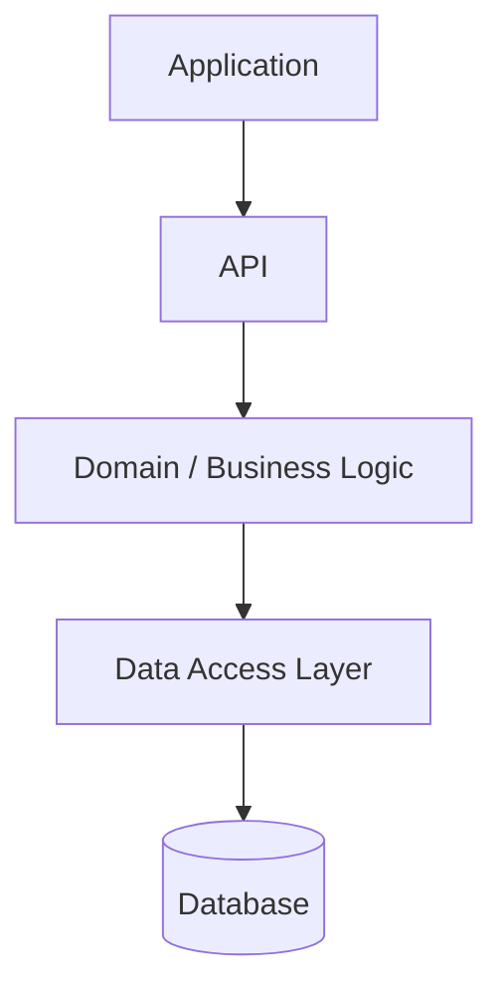
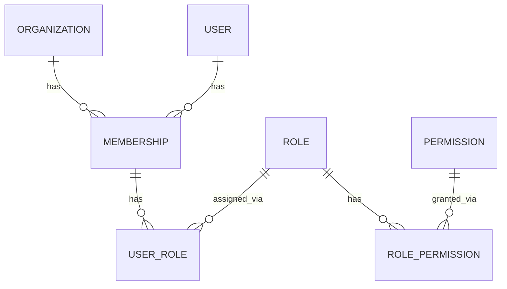
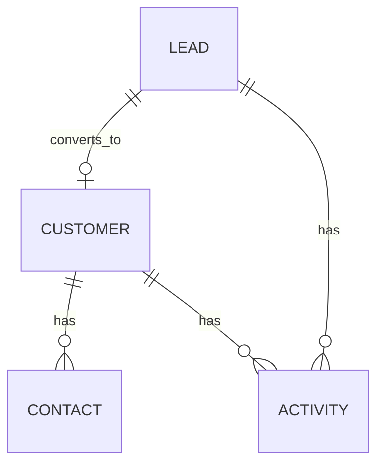
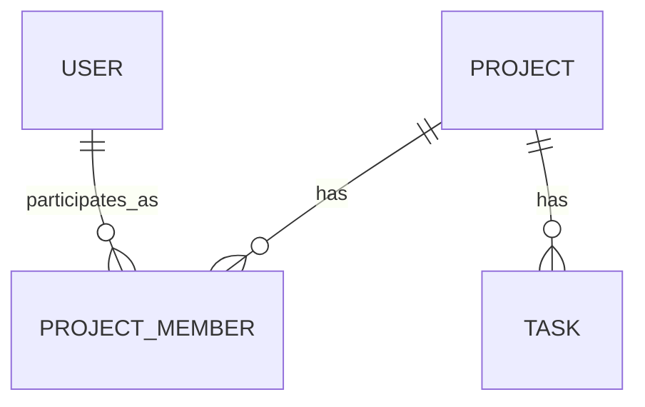
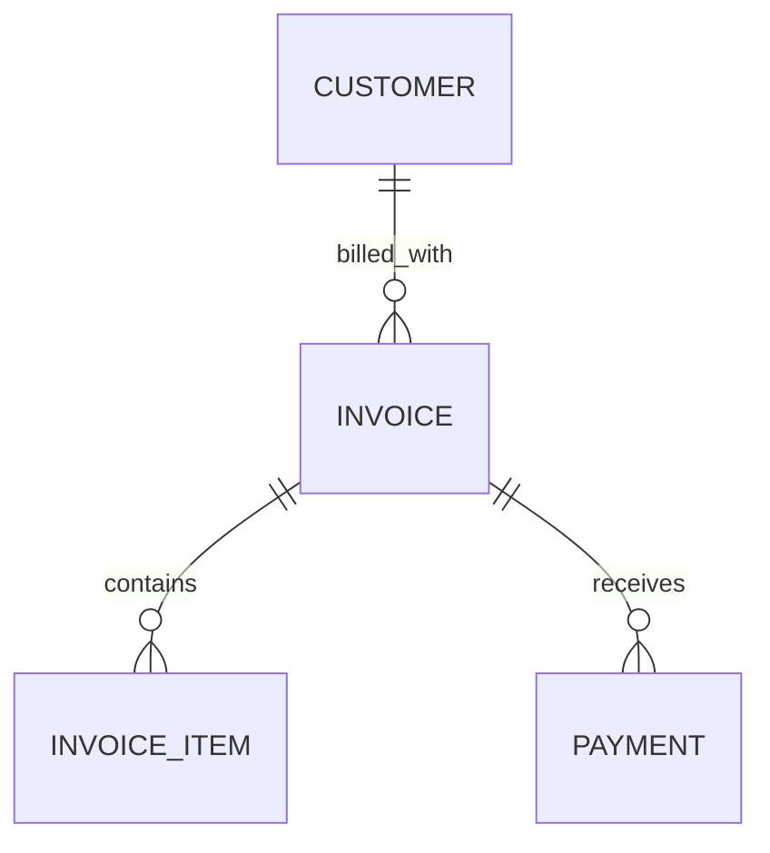

# 06-DATABASE-ARCHITECTURE.md

## 1. Document Information

| Field | Value |
|---|---|
| Project | AXIVON ONE — Modular Business & Digital Platform |
| Document | Database Architecture |
| Version | 1.0 |
| Status | Draft — Living Document |
| Owner | Backend Lead / Database Engineer (with Architecture/Technical Lead) |
| Audience | Backend Team, Full-Stack Team, Architecture/Technical Lead, Engineering Leadership |
| Purpose | Defines the conceptual database architecture, entity model, and data principles for AXIVON ONE |
| Related Documents | `00-PROJECT-OVERVIEW.md`, `03-BACKEND-TEAM.md`, `05-SYSTEM-ARCHITECTURE.md`, future `07-API-SPECIFICATION.md` |
| Last Updated | TBD — set on first commit to repository |

This document builds directly on `05-SYSTEM-ARCHITECTURE.md` §11 (Multi-Tenant Architecture) and does not contradict `00-PROJECT-OVERVIEW.md`. It defines conceptual entities and relationships, not a final physical schema — final column-level schema design is an implementation task for the Backend Team once technology decisions in §4 are finalized.

---

## 2. Database Objectives

The database layer must support:

- **Reusability** — the same schema patterns serve every client and, eventually, every industry module.
- **Data integrity** — referential integrity and validation prevent inconsistent state.
- **Multi-tenant readiness** — data belonging to one organization is never exposed to another.
- **Scalability** — the schema supports growth in organizations, users, and data volume without redesign.
- **Security** — sensitive data is protected at rest and access is tightly controlled.
- **Maintainability** — naming and structure are consistent enough for any backend developer to navigate.
- **Reporting** — data is structured so cross-module reporting is possible without excessive duplication.
- **Auditing** — significant actions are traceable to an actor, organization, and timestamp.
- **Module independence** — each module's data is clearly owned, minimizing unnecessary cross-module coupling at the data layer.

---

## 3. Database Principles

1. **Normalization where appropriate** — avoid duplicate storage of the same fact, but do not over-normalize to the point of harming query clarity or performance for well-understood access patterns.
2. **Clear ownership** — every table/entity has one owning module and team (see §28).
3. **Referential integrity** — foreign key relationships are enforced where the underlying technology supports it.
4. **Consistent naming** — one naming convention across the entire schema (see §13).
5. **Indexing** — applied deliberately based on real query patterns, not speculatively (see §21).
6. **Auditability** — significant changes to sensitive entities are traceable (see §16).
7. **Tenant isolation** — every tenant-scoped entity carries an organization reference, enforced structurally (see §6, §11).
8. **Migration discipline** — all schema changes are version-controlled and reviewed (see §24).
9. **Backup/recovery** — every environment has a defined backup approach appropriate to its purpose (see §25).
10. **Minimal duplication** — shared reference data (e.g., permission catalog) is stored once and referenced, not copied per module.
11. **Performance awareness** — schema decisions consider realistic query patterns from the outset, without over-engineering for scale the platform doesn't yet have.

---

## 4. Database Technology

**Status:** `TBD — Technology decision to be finalized by the Architecture/Technical Lead.`

No database engine has been confirmed in `00-PROJECT-OVERVIEW.md` or `05-SYSTEM-ARCHITECTURE.md`. The following are **recommended options and selection criteria**, not a decision:

| Option | Consideration |
|---|---|
| Relational (e.g., PostgreSQL, MySQL) | Strong fit for the highly relational Core/Reusable Module data (users, orgs, roles, CRM, billing); mature tooling for constraints, transactions, and reporting queries |
| Document-oriented (e.g., MongoDB) | Better fit if industry modules introduce highly variable, semi-structured data (e.g., flexible custom fields per client); weaker native support for cross-entity referential integrity |
| Hybrid approach (relational core + document store for specific flexible data) | Balances strong integrity for Core/Reusable data with flexibility for client-specific custom fields; adds operational complexity of running two data stores |

**Selection criteria to apply when finalizing:** strength of referential integrity needed for Core/business data (favors relational), team familiarity, need for flexible/variable schema per client (favors document or hybrid), reporting/query complexity requirements, and hosting/operational cost.

**Recommendation to present to the Architecture/Technical Lead:** a relational database as the primary store for Core and Reusable Module data, given the highly relational nature of users, organizations, roles, CRM, and billing data, with a documented path to add a document-oriented store later specifically for highly variable industry/custom-field data if that need materializes — consistent with "avoid over-engineering" in §27 of `00-PROJECT-OVERVIEW.md`.

---

## 5. High-Level Data Architecture



```text
Database
 ├── Core Data      → Users, Organizations, Roles, Permissions, Sessions, Settings, Audit Logs
 ├── Module Data    → CRM, Tasks, Projects, Products, Services, Billing, Payments
 ├── Industry Data  → Education, Hospital, Restaurant, Hotel, E-Commerce entities (added as modules are built)
 └── Audit Data     → Append-only records of significant actions across all of the above
```

The Data Access Layer (defined in `05-SYSTEM-ARCHITECTURE.md` §16) is the only component permitted to issue queries directly against the database; business logic never embeds raw queries, keeping the database technology swappable in principle and tenant-scoping enforcement centralized.

---

## 6. Tenant / Organization Data Model

```text
Platform
 ↓
Organization
 ↓
Users
 ↓
Membership
 ↓
Roles
 ↓
Permissions
```

- An **Organization** represents one client/tenant.
- A **User** may hold **Memberships** in one or more Organizations (supporting cases like a consultant working across multiple client orgs, if ever needed).
- Each **Membership** is associated with one or more **Roles** within that specific Organization.
- Each **Role** is associated with a set of **Permissions** drawn from a shared, platform-wide permission catalog.

**Tenant isolation requirement:** every entity that logically belongs to one Organization (see §11) must carry an `organization_id`-style reference, and every query against such an entity must be scoped by that reference — enforced at the Data Access Layer per `05-SYSTEM-ARCHITECTURE.md` §11, not left to be remembered ad hoc in each module.

---

## 7. Core Entity Catalog

| Entity | Purpose | Owner Module | Tenant Scoped? | Notes |
|---|---|---|---|---|
| Users | Individual accounts | User Management | No (a user can belong to multiple orgs) | Org association lives in Membership |
| Organizations | Client/tenant record | Organization/Tenant | N/A (this entity defines the tenant) | Root of tenant scoping |
| Memberships | User ↔ Organization association | Organization/Tenant | Yes | Links Users to Organizations with status (active/invited/suspended) |
| Roles | Named permission sets | Roles | Yes (org-defined roles) + a small set of platform-level default roles | Supports custom org-defined roles |
| Permissions | Catalog of assignable actions | Permissions | No (shared catalog) | Not org-specific; referenced by Roles |
| Role-Permissions | Role ↔ Permission association | Roles | Inherits Role's tenant scope | Join entity |
| User-Roles | User ↔ Role association (within a Membership) | Roles | Yes | Join entity, scoped via Membership |
| Sessions | Active login sessions/tokens | Authentication | No (tied to User, not Organization) | Exact structure depends on token strategy (`TBD`, see `05-SYSTEM-ARCHITECTURE.md` §12) |
| Notifications | Delivered/pending notifications | Notification Service | Yes | See §18 |
| Files | File metadata | File Management | Yes | Binary content stored externally (see §17) |
| Settings | Profile/org/security/branding config | Settings | Mixed — user-level and org-level settings both exist | Two logical scopes within one conceptual entity family |
| Audit Logs | Record of significant actions | Audit Service | Yes (with a platform-level subset for cross-org admin actions) | Append-only, see §16 |

No additional core entities are introduced beyond what is needed to support the Core modules defined in `00-PROJECT-OVERVIEW.md` §14 and `03-BACKEND-TEAM.md` §8.

---

## 8. Business Entity Catalog

| Entity | Purpose | Relationships |
|---|---|---|
| Customers | Confirmed business relationships | Related to Leads (a Lead converts to a Customer); has many Contacts, Activities |
| Leads | Prospective business relationships | Converts to a Customer; has Activities/Follow-ups |
| Contacts | Individual people associated with a Customer | Belongs to a Customer |
| Employees | Staff records | Belongs to an Organization; may belong to a Department |
| Departments | Organizational grouping of Employees | Belongs to an Organization |
| Tasks | Units of assignable work | May belong to a Project; assigned to a User |
| Projects | Multi-task initiatives | Has many Project Members, many Tasks |
| Project Members | User ↔ Project association | Join entity between Users and Projects |
| Products | Sellable items | Belongs to a Category |
| Categories | Grouping for Products/Services | Self-referential (optional sub-categories) |
| Services | Offered services | Belongs to a Category (shared with Products where useful) |
| Invoices | Billing documents | Has many Invoice Items; belongs to a Customer |
| Invoice Items | Line items on an Invoice | Belongs to an Invoice; may reference a Product or Service |
| Payments | Payment records against Invoices | Belongs to an Invoice |
| Reporting structures | Shared aggregation/export definitions | References data from multiple modules; does not duplicate underlying data |

This catalog reflects the Reusable Business Module scope defined in `00-PROJECT-OVERVIEW.md` §15. Fields within each entity are intentionally not exhaustively specified here — that level of detail belongs to implementation-time schema design once relevant modules are actively being built, avoiding premature over-specification.

---

## 9. Industry Entity Readiness

The following are **future/industry-module entities**, not part of the MVP schema, and are listed here only to confirm the Core and Business entity design does not conflict with adding them later:

### Education
Students, Teachers, Courses, Classes, Attendance, Fees, Exams, Results.

### Hospital
Patients, Doctors, Appointments, Billing (reuses the Reusable Billing module), medical-record architecture readiness (specific structure deferred until this module is scoped, given its regulatory sensitivity).

### Restaurant
Menus, Menu Items, Tables, Orders, Order Items, kitchen workflow state.

### Hotel
Rooms, Room Types, Bookings, Guests, Housekeeping records.

### E-Commerce
Products (reuses the Reusable Product module), Categories (reuses the Reusable Category concept), Carts, Orders, Order Items, Payments (reuses the Reusable Payment module), Delivery records.

Each industry module is expected to **reuse** Core entities (Users, Organizations) and Reusable Module entities (Products, Billing, Payments) wherever the concepts overlap, adding only genuinely industry-specific entities (e.g., Attendance, Housekeeping) — consistent with the reusability model in `00-PROJECT-OVERVIEW.md` §24.

---

## 10. Entity Relationships

### Identity


### CRM


### Project Management


### Billing


**Assumptions:** a Lead converts to at most one Customer (conversion is a state transition, not a duplication); a Project can exist without being tied to a Customer (internal projects are supported); an Invoice can receive multiple partial Payments (full payment-in-one-transaction is not assumed).

---

## 11. Tenant-Scoped Data

**Tenant-scoped (belongs to one Organization):** Customers, Leads, Contacts, Employees, Departments, Tasks, Projects, Products, Categories, Services, Invoices, Invoice Items, Payments, Notifications, Files, org-defined Roles, Audit Logs (org-level), Settings (org-level).

**Global/shared (not tied to one Organization):** the Permission catalog (a shared list of possible actions, referenced by every organization's roles), and platform-level default Roles (a starting template that organizations can copy and customize, rather than a tenant-owned record).

**Why some data is global:** the Permission catalog defines *what actions the platform is capable of gating* — this is a property of the software itself, not of any one client, so duplicating it per organization would create unnecessary maintenance burden (a new permission would need to be added to every organization individually). Roles, by contrast, are tenant-scoped because different organizations legitimately want different named roles built from that shared catalog.

---

## 12. Identifiers

| Concept | Recommendation | Trade-off Notes |
|---|---|---|
| Primary keys | Use a non-sequential, globally unique identifier (e.g., UUID or ULID) rather than a simple auto-incrementing integer, particularly for tenant-scoped entities | Avoids leaking record counts/creation order across organizations; ULIDs additionally preserve rough time-ordering, which can help with indexing/debugging compared to random UUIDs |
| Foreign keys | Reference the same identifier type as the referenced entity's primary key | Consistency simplifies joins and application code |
| Public IDs | Consider a separate, shorter, human-readable identifier for anything exposed in URLs or shared with end users (e.g., an invoice number) | Keeps internal identifiers decoupled from anything client-facing, allowing internal ID strategy to change without breaking external references |
| Internal IDs | The primary key used only within the system/API, not necessarily shown to end users | — |

**Status:** the exact identifier technology (UUID v4, UUID v7, ULID, or database-native auto-increment) is `TBD — Technology decision to be finalized by the Architecture/Technical Lead`, informed by the database engine chosen in §4 and indexing performance characteristics of that engine.

---

## 13. Naming Conventions

| Element | Convention | Example |
|---|---|---|
| Table names | Plural, lowercase, snake_case | `customers`, `invoice_items` |
| Column names | Lowercase, snake_case | `organization_id`, `created_at` |
| Primary key column | `id` | `id` |
| Foreign key column | `<referenced_entity_singular>_id` | `organization_id`, `customer_id` |
| Join/association tables | `<entity_a>_<entity_b>` (singular, snake_case) | `role_permission`, `project_member` |
| Index names | `idx_<table>_<column(s)>` | `idx_invoices_organization_id` |
| Constraint names | `<type>_<table>_<column(s)>` | `uq_users_email`, `fk_invoices_customer_id` |
| Enum/status values | Lowercase, snake_case, descriptive | `active`, `pending`, `cancelled` |

These conventions apply regardless of the final database technology chosen in §4, and should be enforced through code review as part of each module's Definition of Done.

---

## 14. Timestamps

Standard fields, applied consistently where relevant:

- `created_at` — set once, on record creation.
- `updated_at` — updated on every modification.
- `deleted_at` — used only where soft deletion is deliberately chosen (see below); `NULL` indicates an active record.

**Soft deletion guidance:** soft deletion (`deleted_at`) should be applied selectively — to entities where a business or audit need exists to recover or reference "deleted" records (e.g., Invoices, Customers, Audit-relevant entities), not applied blanket-wide. For entities with no such need (e.g., a transient notification delivery attempt), a hard delete is simpler and avoids every query needing a `WHERE deleted_at IS NULL` clause. The decision should be made per entity, documented, and consistent within a given module.

---

## 15. Status & Enum Design

Common status values follow a consistent, minimal vocabulary where possible:

```text
active
inactive
pending
completed
cancelled
archived
```

**When to use each modeling approach:**

| Approach | Use When |
|---|---|
| Enum (fixed set, defined in code/schema) | The set of values is small, stable, and shared platform-wide (e.g., Invoice status: draft/sent/paid/overdue/cancelled) |
| Lookup/reference table | The set of values may need to grow without a code change, or needs additional metadata per value (e.g., a configurable list of Lead sources) |
| Configurable value (org-defined) | The value set is legitimately different per organization (e.g., custom Task statuses for a specific client's workflow) |

Defaulting to enums for stable, platform-wide concepts keeps the schema simple; lookup tables or org-configurable values are reserved for cases where real variability is expected, consistent with the "avoid premature abstraction" principle in `05-SYSTEM-ARCHITECTURE.md` §3.

---

## 16. Audit Data

Audit records should capture, at minimum:

| Field | Purpose |
|---|---|
| Actor | The user (and organization context) who performed the action |
| Organization | The tenant the action occurred within (or a platform-level marker for cross-org admin actions) |
| Action | A stable, descriptive action code (e.g., `role.updated`, `invoice.created`) |
| Resource | The type of resource affected (e.g., `Invoice`) |
| Resource ID | The specific record affected |
| Timestamp | When the action occurred |
| Result | Success or failure |
| Metadata | Minimal relevant context (e.g., which fields changed) |

**What should NOT be stored:** full sensitive payloads (passwords, full payment card numbers, complete document contents), or personal data beyond what's needed for accountability. Audit records should be treated as append-only and protected from modification or deletion through normal application pathways.

---

## 17. File Data Model

File **metadata** (not binary content) is stored in the database:

| Field | Purpose |
|---|---|
| File ID | Unique identifier |
| Organization | Tenant scope |
| Owner | The user who uploaded the file |
| Storage Reference | Pointer to the actual file content in the storage backend (see `05-SYSTEM-ARCHITECTURE.md` §19) |
| File Name | Original/display file name |
| MIME Type | Content type, used for validation and preview handling |
| Size | For quota/validation purposes |
| Created Date | Upload timestamp |
| Access Metadata | Any additional access-control context needed (e.g., linked resource this file belongs to) |

**Principle:** large binary file content is not stored directly in the primary database unless there is a strong, specific reason (e.g., a database engine chosen specifically for that purpose) — the default assumption is that binary content lives in an external storage backend, referenced by metadata stored here.

---

## 18. Notification Data Model

| Entity | Purpose | Relationships |
|---|---|---|
| Notification | A specific notification instance sent to a user | Belongs to an Organization and a recipient User; references a Notification Template |
| Notification Template | Reusable content definition for a notification type | Referenced by many Notifications; may have per-organization overrides for branding/text |
| User Preference | A user's chosen channels for a given event type | Belongs to a User |
| Delivery Attempt | A record of one attempt to deliver a Notification via a specific channel | Belongs to a Notification |
| Delivery Status | The outcome of a Delivery Attempt (queued/sent/delivered/failed) | Belongs to a Delivery Attempt |

This separation allows a single business event to generate one Notification with multiple Delivery Attempts (e.g., email and SMS), each independently tracked for retry/failure handling as described in `05-SYSTEM-ARCHITECTURE.md` §18.

---

## 19. CRM Data Model

Conceptual relationships only (avoiding premature field-level design):

- **Leads** capture prospective relationships, with **Activities**/**Follow-ups** tracking engagement over time.
- **Customers** represent confirmed relationships, converted from a Lead or created directly.
- **Contacts** represent individual people associated with a Customer (a Customer may be a company with multiple Contacts).
- **Activities** (calls, emails, meetings, notes) can be associated with either a Lead or a Customer, providing a shared engagement history.
- **Tasks** (from the Task Management module) can optionally reference a Lead or Customer as their subject, reusing the platform-wide Task entity rather than creating a CRM-specific duplicate.

Detailed field-level design (e.g., exact Lead source options, custom fields) is deferred to implementation time, when actual client requirements for the first CRM-using engagement are known.

---

## 20. Billing Data Model

```text
Invoice
 ↓
Invoice Items
 ↓
Payment
```

**Conceptual considerations:**
- **Taxes** — represented per Invoice Item (to support mixed tax rates on one invoice) with an organization-level default tax configuration.
- **Discounts** — supported at the Invoice Item level and/or the whole-Invoice level; exact rules deferred to implementation once specific business requirements are known.
- **Currency** — every Invoice records its currency explicitly; multi-currency support within one organization is a decision deferred until required by a real client.
- **Payment status** — tracked on both the Invoice (aggregate status: unpaid/partially paid/paid/overdue) and individual Payment records (their own status: pending/completed/failed/refunded).
- **Transaction reference** — each Payment stores a reference to the external payment provider's transaction identifier (see the Payment Abstraction integration pattern in `05-SYSTEM-ARCHITECTURE.md` §17).
- **Refund readiness** — the Payment entity's status vocabulary includes `refunded` as a future-supported state, without requiring full refund workflow implementation in the MVP.

---

## 21. Indexing Strategy

Indexes are added deliberately, based on real query patterns, prioritizing:

- **Tenant ID (`organization_id`)** — near-universal, since almost every query is scoped by organization.
- **Foreign keys** — to support efficient joins (e.g., `customer_id` on Invoices).
- **Frequently filtered fields** — status columns used in list-view filtering (e.g., Invoice status).
- **Search fields** — fields used in text search (e.g., Customer name), noting that full-text search may eventually be handled by the dedicated Search Service (`05-SYSTEM-ARCHITECTURE.md` §7) rather than ad hoc database indexes.
- **Dates** — fields used for date-range filtering or sorting (e.g., `created_at` on list views).
- **Composite indexes** — where a query consistently filters/sorts by more than one field together (e.g., `organization_id` + `status`).

**Principle:** avoid indexing every column speculatively — each additional index has a write-performance cost. Indexes should be added or revisited based on observed query patterns once modules are in real use, and reviewed as part of the Architecture Review Checklist (`05-SYSTEM-ARCHITECTURE.md` §30) for any new module.

---

## 22. Data Integrity

- **Foreign keys** — enforced at the database level where the chosen technology supports it, to prevent orphaned records.
- **Constraints** — required fields, value ranges, and format checks enforced at the database level as a backstop to application-level validation.
- **Unique constraints** — applied where business rules require uniqueness (e.g., one User per email address).
- **Required fields** — modeled as non-nullable columns where the business rule is unconditional.
- **Validation** — primary validation occurs in the Application/Domain layer (`05-SYSTEM-ARCHITECTURE.md` §16); database constraints act as a safety net, not the primary mechanism.
- **Transactions** — multi-step writes that must succeed or fail together (e.g., creating an Invoice with its Invoice Items) are wrapped in a database transaction.
- **Concurrency** — optimistic concurrency control (e.g., a version/updated_at check) is recommended for entities frequently edited by multiple users concurrently; exact mechanism deferred to implementation.

---

## 23. Database Security

- **Least privilege** — application database credentials are scoped to only the permissions the application actually needs (no unnecessary administrative privileges).
- **Database credentials** — managed via a secrets manager or environment-level secret injection; never committed to source control or written in any project documentation.
- **Secrets** — this document contains no actual credentials, connection strings, or example secrets.
- **Encryption** — data encrypted in transit between application and database as standard practice; encryption at rest for particularly sensitive fields (e.g., specific PII) is `TBD`, pending database technology and hosting decisions.
- **Access controls** — production database access is restricted to authorized roles/personnel; broad developer access to production data is avoided.
- **Production access** — direct production database access should be exceptional and logged, not routine.
- **Auditability** — schema-level changes (migrations) are tracked in version control (§24); data-level significant actions are tracked via Audit Logs (§16).
- **Sensitive data handling** — fields such as passwords are never stored in plaintext or logged; payment card data is not stored directly (handled via the Payment Abstraction and provider tokenization per `05-SYSTEM-ARCHITECTURE.md` §17).

---

## 24. Migration Strategy

- **Version-controlled migrations** — every schema change is expressed as a migration file committed to the repository alongside the code that depends on it.
- **Migration review** — schema changes go through the same pull request review process as application code, with particular attention to backward compatibility and tenant-scoping correctness.
- **Rollback strategy** — migrations should be written with a corresponding rollback path where practical; destructive changes (e.g., dropping a column) are staged (deprecate → verify unused → remove) rather than applied in one step where feasible.
- **Seed data** — reference/lookup data (e.g., the Permission catalog, default Roles) is seeded through version-controlled scripts, not manually inserted per environment.
- **Environment consistency** — the same migration set is applied, in the same order, across all environments:

```text
Development
↓
Testing
↓
Staging
↓
Production
```

No schema change reaches Production without first passing through Testing and Staging.

---

## 25. Backup & Recovery

High-level requirements (specific tooling and exact numeric targets `TBD`, pending hosting/database technology decisions):

- **Backups** — automated, regular backups of the production database are required before go-live.
- **Retention** — a defined retention period for backups, balancing storage cost against recovery needs (specific duration `TBD`).
- **Restore testing** — backup restoration should be periodically tested, not assumed to work.
- **Disaster recovery** — a documented plan for restoring service in the event of a major data-loss incident.
- **Recovery objectives** — specific Recovery Point Objective (RPO) and Recovery Time Objective (RTO) values are not invented here; they should be proposed and approved by Engineering Leadership once hosting infrastructure and client SLA expectations (if any) are known.

---

## 26. Performance

- **Query optimization** — reviewed for data-heavy or frequently-run queries before merge, not only after a performance problem appears.
- **Indexing** — per §21.
- **Pagination** — mandatory on all list-returning queries; no unbounded result sets returned to the application layer.
- **N+1 query prevention** — batch-loading or join strategies applied where a list view would otherwise trigger one query per row.
- **Connection management** — connection pooling used appropriately for the chosen database technology and expected concurrency.
- **Caching** — introduced only where a measured need exists (see `05-SYSTEM-ARCHITECTURE.md` §22).
- **Archiving** — considered for high-volume, low-access data (e.g., old Audit Logs, old Notifications) once real data volumes justify it — not built speculatively for the MVP.
- **Large datasets** — reporting/export queries on large datasets are designed to run asynchronously (background job) rather than blocking a synchronous API request, once such datasets exist.

---

## 27. Scalability

**Future Architecture Considerations** — not required for MVP, listed here so the current design does not preclude them later:

| Approach | When It Would Become Relevant |
|---|---|
| Read replicas | If read traffic (e.g., reporting/dashboard queries) begins to contend with write traffic at scale |
| Partitioning | If a specific large table (e.g., Audit Logs, Notifications) grows large enough to affect query performance despite indexing |
| Sharding | Only if a single database instance can no longer handle aggregate load across all organizations — a significant scale milestone well beyond MVP |
| Separate databases per tenant | Only if a specific client's contractual/regulatory requirements demand stronger isolation than the shared-schema model provides (see `05-SYSTEM-ARCHITECTURE.md` §11) |
| Caching | For frequently-read, rarely-changed data (e.g., organization configuration, permission catalog) |
| Data archival | For high-volume historical data no longer needed in the primary query path |

None of these are adopted now; they are documented so a future team facing a genuine scale problem has a starting point, consistent with the "avoid over-engineering" principle in `00-PROJECT-OVERVIEW.md`.

---

## 28. Database Module Ownership

| Data Area | Primary Team | Supporting Team | Notes |
|---|---|---|---|
| Core Data (Users, Orgs, Roles, Permissions, Sessions) | Backend | Full-Stack (consulted for cross-cutting features) | Foundational; changes require Architecture/Technical Lead awareness |
| Reusable Business Module Data (CRM, Tasks, Projects, Products, Services) | Backend | Full-Stack (for modules it owns end-to-end, e.g., Billing) | See `03-BACKEND-TEAM.md` and `04-FULL-STACK-TEAM.md` for per-module ownership |
| Industry Module Data | Full-Stack (typically leads first build) | Backend (core service dependencies) | Per `04-FULL-STACK-TEAM.md` §6 criteria for Full-Stack ownership |
| Audit Data | Backend | Full-Stack (writes to it from owned modules) | Schema/append-only guarantees owned by Backend |
| File Metadata | Backend | Full-Stack (consumes for owned modules) | Storage backend abstraction owned by Backend |

Frontend and UI/UX teams **consume** data exclusively through the API layer and do not have direct database access or ownership, consistent with `01-UI-UX-TEAM.md` and `02-FRONTEND-TEAM.md`. Backend Team retains overall database architecture authority; Full-Stack Team implements schema changes for the specific modules it owns end-to-end, in coordination with Backend on shared conventions (naming, indexing, migration review).

---

## 29. Database Change Workflow

```text
Requirement
↓
Data Model Change (proposed by Backend or Full-Stack, per module ownership)
↓
Review (Backend Lead, and Architecture/Technical Lead for cross-cutting or Core changes)
↓
Migration (version-controlled, per §24)
↓
Testing (automated tests against the updated schema)
↓
Integration (verified against dependent modules/Frontend)
↓
Staging (verified in a production-like environment)
↓
Production
```

This mirrors the general Team Workflow defined in `03-BACKEND-TEAM.md` §13, specialized for schema changes.

---

## 30. Database Design Checklist

Use this checklist before merging any new entity or schema change:

- [ ] Entity purpose defined
- [ ] Ownership defined (per §28)
- [ ] Tenant scope defined (per §11)
- [ ] Relationships defined and consistent with §10
- [ ] Primary key defined (per §12)
- [ ] Foreign keys defined and enforced
- [ ] Constraints defined (required fields, uniqueness)
- [ ] Indexes reviewed against §21 guidance
- [ ] Security reviewed (per §23)
- [ ] Migration created and reviewed (per §24)
- [ ] Tests updated to cover the new/changed schema
- [ ] Documentation updated (this catalog or module-level docs, as appropriate)

---

## 31. Final Database Architecture Summary

**Core entities:** Users, Organizations, Memberships, Roles, Permissions, Sessions, Notifications, Files, Settings, Audit Logs — the minimal set needed to support the Core Platform defined in `00-PROJECT-OVERVIEW.md` §14.

**Tenant model:** every business-relevant entity carries an `organization_id`-style reference; isolation is enforced structurally at the Data Access Layer, using a recommended (not yet finalized) shared-database/shared-schema approach for MVP.

**Business entities:** Customers, Leads, Contacts, Employees, Departments, Tasks, Projects, Products, Categories, Services, Invoices, Invoice Items, Payments — supporting the Reusable Business Module catalog in `00-PROJECT-OVERVIEW.md` §15.

**Industry readiness:** Education, Hospital, Restaurant, Hotel, and E-Commerce entities are identified conceptually but explicitly deferred to future phases, designed to reuse Core and Business entities wherever concepts overlap.

**Major database principles:** deliberate (not blanket) normalization, structural tenant isolation, consistent naming, deliberate indexing, version-controlled migrations, and a clear ownership model mapping to the four development teams.

**TBD decisions:** database engine, identifier technology (UUID/ULID/auto-increment), encryption-at-rest mechanism, and specific backup/recovery tooling and targets — all pending Architecture/Technical Lead decisions, summarized in the Decision Table below.

**Relationship with system architecture:** this document implements the Data Layer described conceptually in `05-SYSTEM-ARCHITECTURE.md` §5 and §11, and should be read alongside it, not as a standalone specification.

**Next document:** `07-API-SPECIFICATION.md`, which will define the concrete API contracts (endpoints, request/response schemas, error formats) that expose the entities described here to the Frontend and other consumers.

---

## Database Decision Table

| Decision | Status | Current Recommendation | Reason | Owner |
|---|---|---|---|---|
| Database engine (relational vs. document vs. hybrid) | TBD | Relational (e.g., PostgreSQL) as primary store | Core/Reusable Module data is highly relational; strong integrity needs | Architecture/Technical Lead |
| Multi-tenant isolation strategy | Recommended (see `05-SYSTEM-ARCHITECTURE.md` §11) | Shared database, shared schema, `organization_id` scoping | Lowest operational overhead for MVP; consistent with SMB/mid-market target | Architecture/Technical Lead |
| Identifier technology (UUID/ULID/auto-increment) | TBD | UUID or ULID for tenant-scoped entities | Avoids cross-tenant record-count leakage; supports future data merges/migrations more safely | Architecture/Technical Lead |
| Soft deletion policy | Recommended | Apply selectively per entity (not blanket) | Avoids unnecessary query complexity on entities with no recovery/audit need | Backend Lead |
| Encryption at rest for sensitive fields | TBD | — | Pending database/hosting technology decisions | Architecture/Technical Lead |
| Backup/recovery tooling and RPO/RTO targets | TBD | — | Pending hosting infrastructure decisions and any client SLA requirements | Architecture/Technical Lead + Engineering Leadership |
| Caching layer for hot configuration/reference data | Future | — | Introduce only once a measured performance need exists | Architecture/Technical Lead |
| Read replicas / partitioning / sharding | Future | Not adopted for MVP | Adds operational complexity not justified by current scale | Architecture/Technical Lead |
| Separate database per tenant (stronger isolation) | Future | Not adopted for MVP | Reserved for a specific client's contractual/regulatory need, if one arises | Architecture/Technical Lead |
