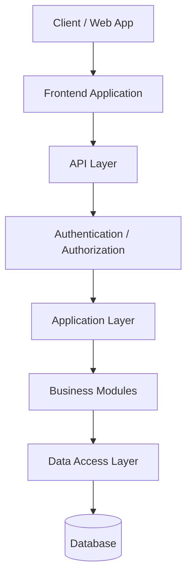

# 07-API-SPECIFICATION.md

## 1. Document Information

| Field | Value |
|---|---|
| Project | AXIVON ONE — Modular Business & Digital Platform |
| Document | API Specification |
| Version | 1.0 |
| Status | Draft — Living Document |
| Owner | Backend Lead (with Architecture/Technical Lead) |
| Audience | Backend Team, Frontend Team, Full-Stack Team, UI/UX Team, QA, Engineering Leadership |
| Purpose | Defines the common API contract — naming, request/response shape, security, versioning, and governance — used by every module across AXIVON ONE, so Backend, Frontend, and Full-Stack teams build against one consistent standard rather than negotiating conventions per module |
| Related Documents | `00-PROJECT-OVERVIEW.md`, `01-UI-UX-TEAM.md`, `02-FRONTEND-TEAM.md`, `03-BACKEND-TEAM.md`, `04-FULL-STACK-TEAM.md`, `05-SYSTEM-ARCHITECTURE.md`, `06-DATABASE-ARCHITECTURE.md` |
| Last Updated | TBD — set on first commit to repository |

This document does not contradict `00-PROJECT-OVERVIEW.md`, `05-SYSTEM-ARCHITECTURE.md`, or `06-DATABASE-ARCHITECTURE.md`. Where those documents mark a decision `TBD`, this document keeps it `TBD` here as well and supplies a labeled recommendation instead of a final choice. Decisions are marked using one of:

- **Confirmed** — already decided in a prior document; this document simply applies it.
- **Recommended** — not yet decided; proposed here for the Architecture/Technical Lead to ratify or override.
- **TBD** — genuinely open; no recommendation is safe to assume yet.
- **Future** — intentionally out of scope for MVP/V1; noted for later phases.

---

## 2. API Vision

The API layer is the contract between Frontend, Backend, and Full-Stack work, and — per `00-PROJECT-OVERVIEW.md` §4 — it is one of the things that must be **consistent** across the entire platform for AXIVON ONE's reusability model to work. A client engagement should never require inventing new API conventions; it should only require configuring and, occasionally, extending the existing ones.

The AXIVON ONE API layer is responsible for:

- Exposing every Core, Reusable, and Industry module capability through a single, uniform contract style.
- Enforcing authentication, authorization, and tenant isolation structurally, at the API layer, per `05-SYSTEM-ARCHITECTURE.md` §11–13 — never relying on the frontend to hide what a user should not be able to reach.
- Validating every request server-side, regardless of what client-side validation has already done.
- Giving every client of the API (the AXIVON frontend today, and potentially other consumers later — mobile apps, integrations, internal tools) predictable, documented behavior.

APIs across AXIVON ONE must be:

| Quality | What it means here |
|---|---|
| Consistent | The same naming, pagination, filtering, error shape, and versioning rules apply whether you're calling `/users` or a future `/students` endpoint |
| Secure | Authenticated, authorized, tenant-scoped, and validated by default — not as an afterthought |
| Predictable | The same request shape produces the same response shape every time; nothing is "special-cased" per module without a documented reason |
| Reusable | A module's API is designed so a second, third, and tenth client can consume it through configuration, not a forked contract |
| Versioned | Breaking changes are additive (new version), never silent |
| Documented | Every endpoint is discoverable and understandable without reading the implementation |
| Testable | Contracts are stable enough to write automated tests against, including negative and authorization tests |
| Maintainable | A new developer can extend an existing module's API without reverse-engineering undocumented conventions |
| Client-independent where appropriate | The API does not assume the specific frontend implementation; it is safe to add other consumers later |

---

## 3. API Design Principles

1. **Consistency** — the same conventions (naming, pagination, errors, versioning) apply across every module, Core through Industry. A developer who has used one AXIVON ONE endpoint should be able to predict the shape of any other.
2. **Resource-oriented design** — endpoints represent nouns (resources), not verbs. `/invoices`, not `/getInvoices` or `/createInvoice`.
3. **Clear naming** — plural, lowercase, consistent resource names; see §9.
4. **Statelessness where appropriate** — each request carries what's needed to process it (identity via token/session, tenant context resolved from that identity); the API does not depend on server-side conversational state between requests, aside from the session/token mechanism itself.
5. **Secure by default** — authentication and authorization are enforced by shared middleware on every endpoint unless explicitly and deliberately marked public (e.g., `/health`, `/auth/login`); nothing is "accidentally open."
6. **Explicit validation** — every input is validated against a defined schema before business logic runs; validation failures return structured, field-level detail (§14–15).
7. **Predictable responses** — the same endpoint returns the same envelope shape for success, and the same error shape for failure, regardless of module.
8. **Consistent error handling** — one error schema platform-wide (§14), so Frontend writes error-handling logic once.
9. **Versioning** — every endpoint is versioned; breaking changes require a new version rather than in-place mutation of a contract (§8).
10. **Backward compatibility** — additive, non-breaking changes are preferred wherever practical; breaking changes are deliberate and reviewed (§33–34).
11. **Observability** — every request is traceable via logs and a correlation ID (§29–30), without requiring guesswork to diagnose an issue.
12. **Idempotency where appropriate** — retryable and financially significant operations (payments, external callbacks) are designed so a retry does not duplicate the effect (§26).
13. **Pagination for collections** — no endpoint returns an unbounded list; every collection endpoint is paginated (§19).
14. **Filtering and sorting standards** — one query-parameter convention for filtering and sorting, reused by every list endpoint (§20–21).
15. **Minimal unnecessary data exposure** — responses return what the consumer needs, not the full internal representation of a record; sensitive or internal-only fields are never serialized into a general-purpose response.

---

## 4. API Architecture



This mirrors `05-SYSTEM-ARCHITECTURE.md` §4's high-level system architecture, with the API layer expanded to show that authentication/authorization and validation sit in front of business logic on every request — never after it.

### API Category Structure

```text
API
├── Core APIs            → Auth, Users, Roles, Permissions, Organizations, Settings, Audit Logs, Dashboard, Notifications, Files
├── Shared Service APIs  → Search, Reporting, Notification delivery, File storage, Email/SMS abstraction
├── Business Module APIs → CRM, Tasks, Projects, Products, Services, Billing, Payments
├── Industry APIs        → Education, Hospital, Restaurant, Hotel, E-Commerce (Future, per 00-PROJECT-OVERVIEW.md §16)
└── Integration APIs     → Outbound/inbound integration with external providers (payment, email, SMS, storage)
```

| Category | Purpose | Consumers |
|---|---|---|
| **Core APIs** | Foundation every client depends on: identity, access control, tenant/org management, and platform-level utility (files, notifications, audit, settings) | Frontend, every other API category |
| **Shared Service APIs** | Cross-cutting capabilities used by multiple business/industry modules so they aren't reimplemented per module (e.g., one Search API indexes across CRM, Tasks, Projects) | Business and Industry APIs, Frontend |
| **Business Module APIs** | Reusable business capability sold to nearly every client, regardless of industry (CRM, Tasks, Projects, Billing, etc.) | Frontend, Industry APIs (e.g., Education's Fees module depends on Billing, per `05-SYSTEM-ARCHITECTURE.md` §10) |
| **Industry APIs** | Vertical-specific capability built on top of Core + Business Module APIs (Future — see `00-PROJECT-OVERVIEW.md` §16 for sequencing) | Frontend, for clients with that Industry Module enabled |
| **Integration APIs** | Provider-agnostic boundary to external systems (payment gateways, email/SMS senders, object storage) so core business logic is never coupled to one vendor (per `05-SYSTEM-ARCHITECTURE.md` §17) | Business Module APIs internally; not directly exposed to Frontend in most cases |

Dependency direction follows `05-SYSTEM-ARCHITECTURE.md` §10: Business Module APIs may depend on Core APIs; Industry APIs may depend on Business Module and Core APIs; Core APIs must never depend on Business or Industry APIs.

---

## 5. API Ownership

| Area | Primary Owner | Supporting Team |
|---|---|---|
| API Architecture | Backend (with Architecture/Technical Lead) | Full Stack |
| API Implementation | Backend | Full Stack (cross-cutting/complex modules, per `04-FULL-STACK-TEAM.md`) |
| API Consumption | Frontend | Full Stack |
| API Integration (external providers) | Full Stack | Backend |
| API Documentation | Backend | Full Stack |
| API Testing | Backend | Full Stack |
| API Contract Review | Backend | Frontend + Full Stack |

This matches `00-PROJECT-OVERVIEW.md` §36 (API standards owned by Backend Lead, with the Architecture/Technical Lead for major decisions) and `03-BACKEND-TEAM.md` §5/§9 (Backend has full ownership of API contract and implementation; Frontend and Full Stack are consumers with feedback rights).

---

## 6. API Style

`05-SYSTEM-ARCHITECTURE.md` §14 and `03-BACKEND-TEAM.md` §10 leave REST vs. GraphQL **TBD — Architecture/Technical Lead decision**, but both documents already lean toward REST as the working assumption for MVP-scoped, CRUD-heavy modules. This document inherits that position and makes it explicit:

| Factor | REST | GraphQL |
|---|---|---|
| Simplicity for CRUD-heavy modules (most of MVP/V1 scope) | Higher | Lower — more upfront schema/resolver setup |
| Flexible querying across many module shapes | Lower — may need multiple endpoints or query params | Higher |
| HTTP-level caching | Simpler | Requires deliberate setup |
| Tooling maturity for RBAC/multi-tenant middleware | Mature, well-understood | Requires custom directive/middleware work |
| Fit for the MVP/V1 scope (§17 of `00-PROJECT-OVERVIEW.md`: Core + CRM + Tasks + basic reporting) | Strong fit | Would add complexity not yet justified |

**Recommendation: REST**, for the MVP and V1 phases, on the grounds that the near-term module catalog (Core Platform, CRM, Tasks, Billing) is predominantly resource-oriented CRUD with well-understood access-control needs — exactly where REST's simplicity and mature tooling pay off, and where GraphQL's flexible-querying advantage is not yet needed. This should be revisited if/when frontend query flexibility across many industry modules becomes a genuine bottleneck (the condition `03-BACKEND-TEAM.md` §10 already flags).

**Status: TBD — Architecture/Technical Lead decision required.** Everything below assumes the REST recommendation so the rest of this document is concrete and usable; if GraphQL is chosen instead, the naming/versioning/pagination sections do not apply as written and this document must be revised.

### REST Conventions (if REST is confirmed)

- One resource per noun, exposed via standard HTTP methods (§10).
- Nested resources only where a true parent-child ownership exists (§9).
- A consistent envelope for all responses (§13).
- A consistent error shape for all failures (§14).

---

## 7. Base URL & Environments

Per `00-PROJECT-OVERVIEW.md` §8 and `05-SYSTEM-ARCHITECTURE.md`, no real domains, cloud provider, or hosting platform are assumed here. Conceptual environments:

```text
Development   → https://api.dev.<domain>
Testing       → https://api.test.<domain>
Staging       → https://api.staging.<domain>
Production    → https://api.<domain>
```

These are **illustrative placeholders**, not real or reserved domains. Each environment:

- Is configured independently (per `05-SYSTEM-ARCHITECTURE.md` §27), with its own credentials, database, and third-party sandbox/production settings — development and testing activity must never be able to reach production data.
- Serves the same API version(s) and contract; environments differ in data and configuration, not in contract shape.
- Uses the same base-path versioning scheme (§8) regardless of environment.

**Status:** actual domains, hosting platform, and API gateway technology are `TBD — Architecture/Technical Lead decision required`, per `05-SYSTEM-ARCHITECTURE.md` §27's TBD list.

---

## 8. API Versioning

**Recommended convention:**

```text
https://api.<domain>/api/v1/...
```

The version is a **path segment**, not a header or query parameter, so it is visible in logs, easy to route at the gateway/proxy level, and unambiguous to every consumer.

### When a New Version Is Required

A new major version (`v2`) is required only for a **breaking change** (see below). Non-breaking changes ship into the current version.

### What Counts as a Breaking Change

- Removing or renaming a field, endpoint, or query parameter.
- Changing a field's data type or semantic meaning.
- Changing required-ness of a previously optional field.
- Changing authentication or authorization behavior in a way that changes who can call an endpoint or what it returns.
- Changing the error shape for an existing error condition.
- Changing default sort/pagination behavior in a way that changes existing consumer results.

### What Does Not Require a New Version

- Adding a new, optional request field.
- Adding a new field to a response (existing fields unchanged).
- Adding a new endpoint.
- Adding a new optional query parameter.
- Adding a new, distinct error `code` value for a genuinely new failure condition (existing `code` values unchanged).

### Backward Compatibility, Deprecation, Migration, Sunset

| Stage | Meaning |
|---|---|
| Active | Current recommended version; new development targets this version |
| Deprecated | Still functional, but marked for removal; documented replacement exists; deprecation is announced (§34) with a target sunset date |
| Sunset | Version is removed; only reached after the deprecation window has passed and consumers have had a documented migration path |

**Example:** `/api/v1/customers` is active. If a breaking change to Customer's response shape is needed, `/api/v2/customers` is introduced, `/api/v1/customers` is marked deprecated with a migration note in the changelog, and `v1` is only removed once known consumers (starting with the AXIVON frontend) have migrated.

**Status:** the path-based `v1` scheme above is **Recommended**; the specific deprecation window length (e.g., 90 days) is **TBD — Architecture/Technical Lead decision required**, to be set once real consumers and release cadence are known.

---

## 9. URL & Resource Naming

### Core Rules

- **Plural nouns** for resource collections: `/customers`, not `/customer`.
- **Lowercase, hyphen-free** path segments: `/invoice-items` is acceptable as a resource name mirroring the DB table (`invoice_items`, per `06-DATABASE-ARCHITECTURE.md` §13), rendered with a hyphen (`invoice-items`) rather than an underscore, per common REST convention; the choice of hyphen vs. underscore in URLs is **Recommended: hyphen**, to be confirmed by the Architecture/Technical Lead alongside the API style decision.
- **Resource IDs** as path parameters: `/customers/{id}`. The `{id}` format matches whatever identifier technology is finalized in `06-DATABASE-ARCHITECTURE.md` §12 (UUID, ULID, or auto-increment — currently TBD); the API layer treats it as an opaque string regardless.
- **Nested resources** only for genuine ownership relationships, matching `06-DATABASE-ARCHITECTURE.md` §10's entity relationships — e.g., `/projects/{id}/members` (a Project owns its Members), `/invoices/{id}/items` (an Invoice owns its Invoice Items). Do not nest resources that merely *reference* each other (e.g., a Task that references a Customer is not nested under `/customers/{id}/tasks` by default — it is queried via `/tasks?customerId={id}`, see §20).
- **Avoid verbs** in resource paths. `/customers` + `POST` creates a customer; there is no `/createCustomer`.
- **Naming consistency** — the same resource is named identically everywhere it appears (path, response body, documentation, error `details`).

### Module Namespacing (Recommended)

`03-BACKEND-TEAM.md` §9 recommends the general shape `/api/v1/{module}/{resource}`. Applied consistently:

- **Core resources** are not module-prefixed, since the module *is* the platform foundation and names are expected to stay unique: `/api/v1/users`, `/api/v1/organizations`, `/api/v1/roles`, `/api/v1/permissions`.
- **Reusable Business Module resources** are similarly flat where the resource name is unlikely to collide across modules: `/api/v1/customers`, `/api/v1/leads`, `/api/v1/tasks`, `/api/v1/projects`, `/api/v1/invoices`.
- **Industry Module resources**, introduced later (per `00-PROJECT-OVERVIEW.md` §16), are namespaced by module where a name would otherwise collide across industries (e.g., "orders" means something different in Restaurant vs. E-Commerce): `/api/v1/restaurant/orders`, `/api/v1/ecommerce/orders`.

This keeps the common, near-universal Core and Business Module surface simple (matching the flat examples used throughout §35–38) while reserving namespacing for the cases that actually need it, rather than namespacing everything pre-emptively (consistent with `00-PROJECT-OVERVIEW.md` §40's "avoid unnecessary duplication" and "do not over-engineer prematurely" principles).

**Status: Recommended**, pending Architecture/Technical Lead confirmation alongside the REST decision (§6).

### Special / Action-Style Endpoints

Action-style endpoints (a verb-shaped path) are justified only when an action does not map cleanly to a CRUD verb on a resource — for example:

```text
POST /auth/login
POST /auth/logout
POST /leads/{id}/convert
POST /invoices/{id}/void
```

Rule: if the action **creates, reads, updates, or deletes a resource**, use the standard HTTP-method-on-resource pattern. If the action represents a **state transition or side-effecting workflow step** that doesn't map to a single field update (e.g., converting a Lead to a Customer per `06-DATABASE-ARCHITECTURE.md` §10's `LEAD ||--o| CUSTOMER : converts_to` relationship), an action-style sub-resource endpoint is acceptable and should be documented as such.

---

## 10. HTTP Methods

| Method | Purpose | Notes |
|---|---|---|
| `GET` | Retrieve a resource or collection | Never has side effects; safe to cache and retry |
| `POST` | Create a resource, or trigger a non-idempotent action | Also used for action-style endpoints (§9) and login |
| `PUT` | Full replacement of a resource | Client sends the complete representation; unspecified fields are treated as cleared, not left unchanged |
| `PATCH` | Partial update of a resource | Client sends only the fields to change; this is the default update method used across AXIVON ONE modules |
| `DELETE` | Delete or deactivate a resource | Maps to a hard delete or a soft delete (`deleted_at`) depending on the entity's decision in `06-DATABASE-ARCHITECTURE.md` §14 — the API contract is the same either way; only the persistence differs |

**Recommendation:** default to `PATCH` for updates across AXIVON ONE (matching how most modules will actually be edited — one or a few fields at a time from a form). `PUT` is reserved for the rarer case of a genuine full-resource replace. This should be confirmed alongside the API style decision but does not block other work.

---

## 11. HTTP Status Codes

| Code | Meaning | When to Use |
|---|---|---|
| `200 OK` | Success | Successful `GET`, `PATCH`, `PUT`, or action endpoint that returns a body |
| `201 Created` | Resource created | Successful `POST` that creates a resource; response includes the created resource |
| `202 Accepted` | Accepted for async processing | An operation queued for background processing (e.g., bulk import, report generation) rather than completed synchronously |
| `204 No Content` | Success, no body | Successful `DELETE`, or an action that succeeds with nothing meaningful to return |
| `400 Bad Request` | Malformed request | Request body/params fail schema-level validation (§15) |
| `401 Unauthorized` | Not authenticated | Missing, invalid, or expired credentials |
| `403 Forbidden` | Not authorized | Authenticated, but the user's role/permission/tenant scope does not allow this action (§17–18) |
| `404 Not Found` | Resource does not exist | Includes the case where a resource exists but belongs to a different organization — see §18, tenant isolation must never leak existence via a `403` instead of `404` |
| `409 Conflict` | State conflict | E.g., a uniqueness violation, or an action that conflicts with the resource's current state (voiding an already-voided invoice) |
| `422 Unprocessable Entity` | Semantically invalid | Request is well-formed and passes schema validation but fails business-rule validation (§15) |
| `429 Too Many Requests` | Rate limited | Client has exceeded a configured rate limit (§27) |
| `500 Internal Server Error` | Unexpected server failure | Generic message to the client; full detail captured in server-side logs only (per `05-SYSTEM-ARCHITECTURE.md` §21) |
| `502 Bad Gateway` / `503 Service Unavailable` | Upstream/dependency failure | The API or a dependency (database, external integration) is unreachable or degraded |

Only the codes above are used; AXIVON ONE does not scatter additional, rarely-understood status codes across the API. `400` vs. `422` is applied consistently: `400` is for structurally invalid requests (wrong type, missing required field); `422` is for requests that are structurally fine but violate a business rule (§15).

---

## 12. Request Format

- **Format:** JSON for all request and response bodies. `Content-Type: application/json` is required on any request with a body.
- **Headers:**
  - `Authorization` — carries the session/token credential (mechanism `TBD`, see §16).
  - `Content-Type: application/json` — required for `POST`/`PUT`/`PATCH` with a body.
  - `X-Request-Id` (optional, client-supplied) or server-generated — see §30.
  - `Accept-Language` (optional) — for future localization support (Future).
- **Path parameters:** resource identifiers only (`/customers/{id}`); never used for filtering or optional data.
- **Query parameters:** used for pagination (§19), filtering (§20), sorting (§21), and search (§22) on collection (`GET` list) endpoints only.
- **Request body:** used for `POST`, `PUT`, `PATCH` payloads; a JSON object matching the resource's writable fields. Fields that are server-managed (`id`, `created_at`, `organization_id`, computed fields) are never accepted from the client, even if supplied — the server ignores or rejects them per §15.
- **File uploads:** `multipart/form-data` for the file itself, per §24; JSON is not used to transport binary file content.
- **Date/time format:** ISO 8601, UTC, e.g., `2026-09-06T14:30:00Z` — see §23 for full detail.
- **Currency/number handling:** monetary amounts are represented as integers in the smallest currency unit (e.g., cents) alongside an explicit currency code, e.g., `{ "amount": 150000, "currency": "USD" }` (recommended, to avoid floating-point rounding errors common with billing data per `06-DATABASE-ARCHITECTURE.md` §20's payment/invoice model). **Status: Recommended**, pending confirmation once the Billing module's implementation begins.

**Example — create Customer request:**

```http
POST /api/v1/customers
Content-Type: application/json
Authorization: Bearer <credential>

{
  "name": "Acme Manufacturing Ltd.",
  "email": "contact@acme.example",
  "phone": "+1-555-0100",
  "status": "active"
}
```

---

## 13. Response Format

A single, consistent envelope is used across every endpoint.

**Single resource:**

```json
{
  "data": {
    "id": "cst_01H...",
    "name": "Acme Manufacturing Ltd.",
    "email": "contact@acme.example",
    "status": "active",
    "createdAt": "2026-09-06T14:30:00Z",
    "updatedAt": "2026-09-06T14:30:00Z"
  },
  "meta": {}
}
```

**Collection:**

```json
{
  "data": [
    { "id": "cst_01H...", "name": "Acme Manufacturing Ltd.", "status": "active" }
  ],
  "meta": {
    "page": 1,
    "pageSize": 20,
    "total": 137
  }
}
```

- `data` is present on every successful response — an object for a single resource, an array for a collection.
- `meta` is **included whenever there's something meaningful to report about the response itself**, not the resource: pagination info on collections, rate-limit remaining counts, or a request ID echo. `meta` is an empty object (`{}`) rather than omitted, so consumers don't need to branch on its presence.
- Wrapping every field name is deliberately **not** over-engineered further (e.g., no additional `links`/HATEOAS envelope) unless a real, validated need for it emerges — consistent with `00-PROJECT-OVERVIEW.md` §40's "avoid over-engineering."
- Field naming inside `data` is `camelCase` in the API (`createdAt`, `organizationId`), translating from the database's `snake_case` convention (`created_at`, `organization_id`, per `06-DATABASE-ARCHITECTURE.md` §13) at the API boundary — this keeps each layer idiomatic to its own ecosystem. **Status: Recommended.**

---

## 14. Error Response Standard

One error shape, used for every failure across every module:

```json
{
  "error": {
    "code": "RESOURCE_NOT_FOUND",
    "message": "The requested resource was not found.",
    "details": [],
    "requestId": "req_01HXYZ..."
  }
}
```

| Field | Purpose |
|---|---|
| `code` | A stable, machine-readable string (`UPPER_SNAKE_CASE`) that Frontend can branch on — never the HTTP status number alone, since multiple `code`s can map to one status |
| `message` | A human-readable, safe-to-display summary of what went wrong |
| `details` | An array, populated for validation errors (§15) with field-level detail; empty otherwise |
| `requestId` | The correlation ID for this request (§30), so a user-reported error can be traced through logs |

**Validation error example:**

```json
{
  "error": {
    "code": "VALIDATION_ERROR",
    "message": "One or more fields are invalid.",
    "details": [
      { "field": "email", "issue": "must be a valid email address" },
      { "field": "name", "issue": "is required" }
    ],
    "requestId": "req_01HXYZ..."
  }
}
```

**Rules:**

- Error responses never expose stack traces, internal file paths, SQL, or raw exception messages (per `05-SYSTEM-ARCHITECTURE.md` §21's principle: full detail goes to server-side logs, never the client).
- `401`/`403` messages are intentionally generic — they do not reveal *why* access was denied (e.g., "account doesn't exist" vs. "wrong password") to avoid account enumeration, matching `05-SYSTEM-ARCHITECTURE.md` §12's authentication security controls.
- Every `code` value used platform-wide is documented in the API documentation (§31) — modules do not invent one-off codes without registering them.

---

## 15. Validation

### Input Validation

Structural correctness, checked before any business logic runs:

- **Required fields** — present and non-null.
- **Data types** — string, number, boolean, array, object as expected.
- **Length** — min/max length on strings, min/max count on arrays.
- **Format** — email, phone, date/ISO-8601, UUID/ULID shape, enum membership.
- **Allowed values** — enum/status fields restricted to their defined vocabulary (per `06-DATABASE-ARCHITECTURE.md` §15).

A failure here returns `400 Bad Request` (malformed) or `422 Unprocessable Entity` with `VALIDATION_ERROR` and field-level `details` (§14).

### Business Validation

Semantic correctness, evaluated against current data/state, after input validation passes:

- **Cross-field validation** — e.g., an end date must be after a start date.
- **Business-rule validation** — e.g., a Lead cannot be converted twice; an Invoice cannot be voided once paid (per `06-DATABASE-ARCHITECTURE.md` §20's status model).
- **Uniqueness/state conflicts** — e.g., duplicate email → `409 Conflict`; invalid state transition → `422 Unprocessable Entity`.

Validation is implemented once, in a **shared validation layer**, and reused across modules rather than reimplemented per module (per `03-BACKEND-TEAM.md` §9), so every module's `VALIDATION_ERROR` responses look and behave identically.

---

## 16. Authentication

Authentication flows follow `05-SYSTEM-ARCHITECTURE.md` §12 conceptually; the token/session mechanism itself is **TBD**.

| Flow | Endpoint (conceptual) | Notes |
|---|---|---|
| Registration | `POST /auth/register` | Creates a User (and, depending on flow, an Organization); may require Email Verification before full access |
| Login | `POST /auth/login` | Verifies credentials; issues a session/token on success |
| Logout | `POST /auth/logout` | Invalidates the current session/token |
| Password Reset (request) | `POST /auth/forgot-password` | Issues a time-limited reset token via email; always returns a generic success response regardless of whether the email exists, to avoid account enumeration |
| Password Reset (confirm) | `POST /auth/reset-password` | Consumes the reset token, sets a new password |
| Email Verification | `POST /auth/verify` | Confirms a verification token sent at registration |
| OTP (org-configurable) | `POST /auth/otp/request`, `POST /auth/otp/verify` | Only active where an organization has enabled OTP, per `05-SYSTEM-ARCHITECTURE.md` §12 |
| Session/Token Refresh | `POST /auth/refresh` | Only applicable if the chosen token strategy requires refresh (e.g., short-lived access token + refresh token) |

**Never exposed:** raw passwords in any response, password hashes, or full token secrets beyond the single response where a new token is issued.

**Status:** the session/token mechanism (stateless signed tokens vs. server-side session store) is `TBD — Architecture/Technical Lead decision required`, per `05-SYSTEM-ARCHITECTURE.md` §12. Every endpoint above is written token/session-agnostic; whichever mechanism is chosen, the flows and endpoint shapes above do not change, only the `Authorization` header's contents and the refresh endpoint's applicability.

---

## 17. Authorization

Authorization is **Role-Based Access Control (RBAC)** applied at the organization level, per `05-SYSTEM-ARCHITECTURE.md` §13 — **Confirmed**.

```text
User → Organization Membership → Role → Permission → Action
```

Every request to a protected endpoint resolves, before business logic executes:

1. The requesting user's identity (from the authentication credential).
2. Their membership and role(s) within the specific organization the request targets.
3. Whether that role's permission set includes the specific action being performed.

**Permission naming** follows `module.resource.action`, matching `05-SYSTEM-ARCHITECTURE.md` §13's example:

```text
crm.customer.read
crm.customer.create
crm.customer.update
crm.customer.delete
crm.customer.export
tasks.task.read
tasks.task.assign
billing.invoice.void
```

- `module` — the owning module (`crm`, `tasks`, `billing`, `users`, `org`, etc.).
- `resource` — the resource within that module (`customer`, `invoice`).
- `action` — the specific action (`read`, `create`, `update`, `delete`, plus module-specific actions like `export`, `assign`, `convert`, `void`).

Custom, organization-defined roles are composed from this shared permission catalog rather than requiring code changes (per `05-SYSTEM-ARCHITECTURE.md` §13 and `03-BACKEND-TEAM.md` §8's RBAC rules) — the API's permission catalog (`GET /permissions`, §35) is the same list every organization's custom roles draw from.

**Frontend enforcement is UX only.** Hiding a button based on permissions improves the experience; it is never the security boundary. Every enforcement decision is re-checked server-side on every request, per `05-SYSTEM-ARCHITECTURE.md` §13 and `02-FRONTEND-TEAM.md` §21.

---

## 18. Multi-Tenant API Security

This is the single most important security property of AXIVON ONE's API layer, per `05-SYSTEM-ARCHITECTURE.md` §11: **Organization A must never be able to access Organization B's data**, under any circumstance, through any endpoint.

### How This Is Enforced

- **Tenant context** is derived from the authenticated user's session/token and their resolved organization membership — **never** from a client-supplied `organizationId` in the request body, query string, or path, even if one is present for readability. If a client-supplied tenant identifier disagrees with the authenticated context, the request is rejected, not "trusted."
- **Query scoping** — every data access for a tenant-scoped entity is automatically filtered by `organization_id` at the Data Access Layer (per `06-DATABASE-ARCHITECTURE.md` §11 and `05-SYSTEM-ARCHITECTURE.md` §11's repository-pattern recommendation), so tenant isolation is structural, not something each endpoint's author must remember to add.
- **Resource ownership** — for path-parameter-addressed resources (`/customers/{id}`), the lookup itself is scoped by the caller's organization. A request for a resource that exists but belongs to a different organization returns `404 Not Found` — **not** `403 Forbidden** — so that a caller cannot distinguish "doesn't exist" from "exists in another tenant" (a data-leakage vector via error responses).
- **Authorization is checked in addition to, not instead of, tenant scoping.** A user with `crm.customer.read` permission in their own organization still cannot read another organization's customers; tenant scoping applies before permission checks are meaningful.
- **Frontend checks are never relied upon** for tenant isolation, for the same reason they are never relied upon for authorization (§17).

### What Must Never Happen

- An endpoint that accepts a client-supplied `organizationId` and trusts it without cross-checking the authenticated user's actual membership.
- A list endpoint that filters by any criteria *other than* the authenticated organization by default.
- An error response that reveals another organization's record existence, count, or any field value.

---

## 19. Pagination

| Approach | Shape | When to Use |
|---|---|---|
| **Page-based** | `?page=1&pageSize=20` | Default for AXIVON ONE's MVP/V1 list endpoints — simpler for the Frontend Team to build standard list/table UIs against, and sufficient for the expected data volumes of Core and Reusable Module entities |
| **Cursor-based** | `?cursor=<opaque-token>` | Reserved for endpoints where result sets are large and/or frequently mutated during pagination (e.g., a high-volume Audit Log or Notification feed), where page-based pagination's "shifting page" problem becomes noticeable |

**Recommended MVP approach: page-based pagination on every collection endpoint**, with `meta.page`, `meta.pageSize`, and `meta.total` always returned (§13). `pageSize` has a sane default (e.g., 20) and a maximum (e.g., 100) enforced server-side, with the exact defaults marked `TBD — Architecture/Technical Lead decision required` (proposed defaults, not final limits).

Cursor-based pagination is left as a **documented future option** for high-volume endpoints (Audit Logs, Notifications) rather than adopted platform-wide immediately, consistent with `00-PROJECT-OVERVIEW.md` §40's "do not over-engineer prematurely."

---

## 20. Filtering

Standard query-parameter filtering, applied as equality filters by default:

```text
GET /customers?status=active
GET /tasks?assigneeId=usr_01H...
GET /leads?department=engineering
```

- Filter parameters match the resource's field names (camelCase, per §13).
- Multiple filters combine with implicit `AND` (`?status=active&department=engineering`).
- For "belongs to" style filtering across resources without true nesting (per §9's nesting rule), a foreign-key-style query parameter is used: `GET /tasks?customerId={id}` rather than `GET /customers/{id}/tasks`, unless the relationship is a genuine ownership nesting.

For more advanced needs (range filters, multi-value filters), a small, consistent extension is used rather than a bespoke query language per module:

```text
?createdAfter=2026-01-01&createdBefore=2026-06-30
?status=active,pending
```

A full filter-expression language (e.g., RSQL/OData-style operators) is explicitly **not** adopted for MVP/V1 — it is more query flexibility than the current module set needs, and is a candidate to revisit only if a genuine, validated need emerges (**Future**, per `00-PROJECT-OVERVIEW.md` §40).

---

## 21. Sorting

```text
?sort=createdAt        (ascending)
?sort=-createdAt        (descending, leading hyphen)
?sort=name,-createdAt    (multi-field, applied in order)
```

- **Allowed sort fields** are explicitly whitelisted per endpoint (documented in §31's per-endpoint documentation) — a client cannot sort by an arbitrary, non-indexed, or internal field.
- **Default sorting** — every list endpoint has a documented default (commonly `-createdAt`, newest first) so results are deterministic even when the client doesn't specify `sort`.
- **Invalid sort handling** — an unrecognized sort field returns `400 Bad Request` with `VALIDATION_ERROR`, rather than being silently ignored (silent ignoring would produce confusing, inconsistent-feeling results for the Frontend).

---

## 22. Search

```text
GET /customers?q=vikas
```

- **Scope** — `q` performs a search within the fields documented as searchable for that resource (typically name, and other free-text-appropriate fields); it is not a full-text search across every field.
- **Pagination** — search results are paginated exactly like any other list endpoint (§19); `meta.total` reflects the matched count.
- **Ranking** — MVP/V1 search ranking is left simple (e.g., prefix/substring match, most-recently-updated first) rather than adding relevance-scoring infrastructure prematurely. A dedicated cross-module Search Service is planned per `05-SYSTEM-ARCHITECTURE.md` §6/§7 for V1 (`Search` is listed as P2/V1 in `00-PROJECT-OVERVIEW.md` §14); until then, `q` is a per-resource, per-endpoint capability, not a platform-wide search endpoint.
- **Security** — search still respects tenant scoping (§18) and field-level authorization; a search never returns a record the caller couldn't otherwise `GET`.
- **Performance** — search fields are indexed per `06-DATABASE-ARCHITECTURE.md` §21's indexing strategy; unindexed, unbounded text search is avoided.

---

## 23. Date & Time Standard

- **Format:** ISO 8601 for every date/date-time value, in both requests and responses.
- **Storage/transport:** all date-times are transmitted in **UTC**, with a trailing `Z` (e.g., `2026-09-06T14:30:00Z`) — never a bare local time with an implicit, unstated timezone.
- **Timezone handling:** the API always speaks UTC; conversion to a user's local timezone for display is a Frontend responsibility, using the user's profile/org timezone setting.
- **Date-only values** (e.g., a due date with no time component) use `YYYY-MM-DD` (e.g., `2026-09-06`), never a date-time with a fabricated time component.
- **Date-time values** always include both date and time, in full ISO 8601 with `Z`.

---

## 24. File Upload API

```text
POST   /files
GET    /files/{id}
DELETE /files/{id}
```

- **Upload** — `POST /files` accepts `multipart/form-data`, returns `201 Created` with the file's metadata (`id`, `filename`, `mimeType`, `size`, `createdAt`) — never the raw bytes in the response body.
- **Download/Preview** — `GET /files/{id}` returns either the file content directly (with correct `Content-Type`) or, more commonly for scalable storage, a short-lived signed URL to fetch it from the underlying storage abstraction, per `05-SYSTEM-ARCHITECTURE.md` §7's storage-abstraction principle. Access is gated by the same authentication/authorization/tenant-scoping rules as any other resource (§17–18); files are never public-by-default.
- **Delete** — `DELETE /files/{id}` removes the file (or its access) per the entity's soft/hard delete decision (`06-DATABASE-ARCHITECTURE.md` §14).

**Behavior to define at implementation time (proposed defaults, not final limits — `TBD — Architecture/Technical Lead decision required`):**

| Concern | Proposed Default |
|---|---|
| File size limits | Configurable per organization/module; a conservative platform-wide default (e.g., 25 MB) proposed pending real usage data |
| MIME validation | Allow-list of accepted MIME types per upload context (e.g., avatar upload vs. invoice attachment), rather than a single global list |
| Access control | Every file carries an `organization_id` and is subject to the same authorization checks as any other resource |
| Metadata | Filename, MIME type, size, uploader, upload timestamp — never business meaning of the file's content, per `05-SYSTEM-ARCHITECTURE.md` §6's File Management scope |
| Storage abstraction | The API never exposes the underlying storage provider's URLs/paths directly to clients; it exposes an opaque `id` and a signed access mechanism |
| Security scanning | Recommended for production (malware/virus scanning on upload) — tooling `TBD` |

---

## 25. Bulk Operations

Bulk endpoints are introduced **only where a real, validated need exists** — not speculatively for every resource (per `00-PROJECT-OVERVIEW.md` §40). A likely first candidate is CRM (`POST /customers/bulk` for a CSV import), given how commonly CRM data arrives as a bulk import from another system.

```text
POST /customers/bulk
```

**Contract for bulk endpoints:**

- **Validation** — each item in the batch is validated independently (§15); the batch does not fail as a whole because one item is invalid.
- **Partial failures** — the response reports a per-item result, so the caller can see exactly which items succeeded and which failed, and why:

```json
{
  "data": {
    "succeeded": 45,
    "failed": 2,
    "results": [
      { "index": 0, "status": "created", "id": "cst_01H..." },
      { "index": 1, "status": "failed", "error": { "code": "VALIDATION_ERROR", "details": [ { "field": "email", "issue": "is required" } ] } }
    ]
  },
  "meta": {}
}
```

- **Idempotency** — bulk creation endpoints are strong candidates for the idempotency pattern in §26, since bulk imports are commonly retried after a partial network failure.
- **Limits** — a maximum batch size is enforced (exact number `TBD`, proposed default e.g. 500 items per request) to protect performance, returning `400 Bad Request` if exceeded.
- **Error reporting** — a batch-level `error` (§14) is only returned if the *entire* request is malformed (e.g., not valid JSON, or exceeds the batch size limit); per-item failures are reported in the success response's `results` array as shown above, since the request as a whole is a partial success.

---

## 26. Idempotency

An operation is idempotent if performing it more than once has the same effect as performing it once. This matters most where a client (or network) might retry a request that already succeeded server-side.

**Operations where idempotency is especially important:**

- **Payments** — a retried "submit payment" request must never charge twice.
- **External callbacks/webhooks** (§40) — a provider may redeliver the same event; processing it twice must not duplicate the effect.
- **Important creation operations** — e.g., invoice generation triggered by a background job that might be retried after a transient failure.
- **Retryable requests generally** — any `POST` a client might reasonably retry after a timeout or ambiguous response.

**Conceptual pattern:** the client supplies an `Idempotency-Key` header (a client-generated unique token) on a `POST` request; the server records which key produced which result, and a retried request with the same key returns the original result rather than performing the action again.

```http
POST /payments
Idempotency-Key: 3f29c1e2-...
```

**Status:** the exact idempotency-key mechanism and which endpoints require it is `TBD — Architecture/Technical Lead decision required`, to be finalized alongside the Billing/Payments module's implementation and the chosen backend framework's tooling for this pattern.

---

## 27. Rate Limiting

Rate limiting exists to protect the platform from abuse (credential stuffing, scraping, accidental client bugs causing request storms) and to keep the platform fair across tenants sharing infrastructure (per the shared-database/shared-schema recommendation in `05-SYSTEM-ARCHITECTURE.md` §11).

**Endpoints needing stronger protection:**

- **Authentication endpoints** (`/auth/login`, `/auth/forgot-password`, `/auth/otp/*`) — highest priority, per `05-SYSTEM-ARCHITECTURE.md` §12's explicit call-out of rate limiting on auth.
- **Public/unauthenticated endpoints** generally (registration, password reset).
- **Expensive operations** — bulk endpoints (§25), report generation, search across large datasets.

A `429 Too Many Requests` response (§11) is returned when a limit is exceeded, with an error `code` of `RATE_LIMITED` and, where practical, a `Retry-After` header.

**Status:** specific numerical limits are **not** invented here; they are `TBD — Architecture/Technical Lead decision required` and must be configurable (per environment, and potentially per organization tier) rather than hardcoded.

---

## 28. Security Requirements

| Requirement | Standard |
|---|---|
| TLS | All API traffic over HTTPS/TLS in every environment; no plaintext HTTP, even in development, where practical |
| Authentication | Enforced by shared middleware on every endpoint except explicitly public ones (§16) |
| Authorization | RBAC enforced server-side on every request (§17) |
| Input validation | Every request validated server-side regardless of client-side validation (§15) |
| Output filtering | Responses serialize only the fields the consumer is authorized to see and that the endpoint is documented to return — never a raw internal object dump |
| Rate limiting | Applied per §27, especially to authentication and expensive endpoints |
| CORS | Configured to allow only known, trusted origins (the AXIVON frontend's domains per environment); wildcard origins are not used in production |
| CSRF | Relevant primarily if a cookie-based session mechanism is chosen (§16); if a bearer-token mechanism is chosen instead, CSRF risk is substantially reduced — the specific mitigation depends on the `TBD` token/session decision |
| Secrets | Never returned in any API response, never logged (§29); managed via environment configuration, not source-controlled |
| Secure headers | Standard security headers applied by shared middleware (e.g., `X-Content-Type-Options`, `X-Frame-Options`, a Content-Security-Policy relevant to the frontend's needs) |
| Logging | Per §29 — what is and is not logged is explicitly defined |
| Sensitive data protection | Passwords, tokens, full payment card data, and unnecessary personal data are never included in API responses or logs (per `05-SYSTEM-ARCHITECTURE.md` §19–20) |

No compliance certification (SOC 2, HIPAA, PCI-DSS, etc.) is claimed by this document; those are business/legal decisions made separately as real client requirements demand them (per `00-PROJECT-OVERVIEW.md` §8's non-goals).

---

## 29. API Security Logging

**Logged on every request, where practical:**

- Request ID (correlation ID, §30)
- Endpoint (method + path template, e.g., `PATCH /customers/{id}`, not the raw path with real IDs interpolated into the log message text — the ID itself is fine as a structured field)
- Timestamp
- Result (status code / success-failure)
- Actor (authenticated user ID)
- Organization (tenant context)
- Error category (for failures — the error `code`, not the full internal exception)

**Never logged:**

- Passwords (plaintext or hashed)
- Authentication secrets, session tokens, or API keys
- Full payment card numbers or other regulated sensitive data
- Unnecessary personal information beyond what's needed for the log's accountability purpose (per `05-SYSTEM-ARCHITECTURE.md` §19's audit-log field guidance, applied equally to security/request logs)

---

## 30. Correlation / Request ID

Every request is assigned a correlation/request ID, so a single user-facing action can be traced across:

```text
Frontend → API → Backend → Database / External Service
```

- If the client supplies `X-Request-Id`, the server uses it (allowing the Frontend to correlate a user session's actions end-to-end); otherwise, the server generates one.
- The request ID is:
  - Echoed back in every response, including errors, as `meta.requestId` (success) or `error.requestId` (failure) — see §13–14.
  - Included in every log line produced while handling that request.
  - Propagated to any downstream service or external integration call made while handling the request, where the downstream system supports it.
- This is the primary mechanism support/engineering uses to go from "a user reports an error" to "the exact server-side log lines for that request," without needing timestamps-and-guesswork correlation.

---

## 31. API Documentation

**Recommended:** OpenAPI/Swagger as the documentation format and source of truth for the contract, generated from (or validated against) the actual implementation rather than maintained as a separate, hand-written document that drifts from reality. **Status: Recommended**, not yet confirmed — depends on the backend framework decision (`05-SYSTEM-ARCHITECTURE.md` §29's TBD list), since tooling quality for OpenAPI generation varies by framework.

Every endpoint's documentation includes:

- **Endpoint** — method + path.
- **Description** — what it does, in plain language.
- **Authentication** — required or public.
- **Authorization** — the specific permission(s) required (§17).
- **Parameters** — path, query, and header parameters, with types and constraints.
- **Request body** — schema, required/optional fields, examples.
- **Response** — success schema and status code, with examples.
- **Errors** — the specific error `code`s this endpoint can return, with when/why.
- **Examples** — at least one realistic request/response pair.
- **Rate limits** — where a non-default rate limit applies (§27).

Documentation is a required part of a module's Definition of Done (per `00-PROJECT-OVERVIEW.md` §36, "documentation is part of each team's Definition of Done"), not an optional follow-up task.

---

## 32. API Contract Management

Recommended workflow for Backend, Frontend, and Full Stack to agree on a contract **before** implementation begins:

```text
Requirement
   ↓
API Contract (proposed endpoint shape, request/response, errors)
   ↓
Review (Backend + Frontend + Full Stack, per §5 ownership)
   ↓
Approval
   ↓
Backend Implementation
   ↓
Frontend Integration
   ↓
Testing
```

**Parallel development:** once a contract is approved, Frontend does not need to wait for a working Backend implementation — Frontend builds against a mock/stub matching the approved contract (§43), and Backend implements against the same contract independently. Both sides integrate and reconcile once real implementation is ready. This is the mechanism that lets Frontend and Backend work in parallel without either blocking the other, and it depends entirely on the contract being agreed upon and written down *before* either side starts, not discovered mid-implementation.

---

## 33. API Change Management

### Non-Breaking Changes

- Adding an optional response field.
- Adding a new endpoint.
- Adding an optional request field or query parameter.
- Adding a new, distinct error `code` for a genuinely new failure condition.

These can ship into the current API version without a contract review beyond normal code review, though the change should still be reflected in documentation (§31).

### Breaking Changes

- Removing or renaming a field.
- Changing a field's data type.
- Changing required-ness of a field.
- Changing authentication/authorization behavior.
- Changing an existing error's shape or meaning.

**Review requirement:** every breaking change follows `00-PROJECT-OVERVIEW.md` §38's Change Management process — proposed, reviewed by the Decision Owner (Backend Lead, with Architecture/Technical Lead per §36), documented, then implemented as a new API version (§8), never as an in-place mutation of the existing contract.

---

## 34. API Deprecation

| Step | Content |
|---|---|
| Deprecation notice | Announced in the API documentation (§31) and, where practical, via a response header (e.g., `Deprecation: true`) on the deprecated version's endpoints |
| Documentation | The replacement endpoint/version is documented alongside the deprecation notice — a consumer should never have to guess what to migrate to |
| Migration path | A concrete before/after example is provided for any shape change |
| Timeline | A specific sunset date is set once a version is deprecated; the exact standard window (e.g., 90 days) is `TBD — Architecture/Technical Lead decision required`, set once real consumer count and release cadence are known — arbitrary timelines are not invented here |
| Version retirement | The deprecated version is removed only after its sunset date has passed and known consumers have confirmed migration |

---

## 35. Core API Catalog

Labeled per `00-PROJECT-OVERVIEW.md` §14's Core Module Catalog and §17's MVP Definition.

### Authentication — MVP

```text
POST /auth/register
POST /auth/login
POST /auth/logout
POST /auth/forgot-password
POST /auth/reset-password
POST /auth/verify
POST /auth/otp/request      (V1 — org-configurable)
POST /auth/otp/verify       (V1 — org-configurable)
```

### Users — MVP

```text
GET    /users
GET    /users/{id}
POST   /users
PATCH  /users/{id}
DELETE /users/{id}
```

### Organizations — MVP

```text
GET   /organizations
GET   /organizations/{id}
POST  /organizations
PATCH /organizations/{id}
```

### Roles — MVP

```text
GET    /roles
POST   /roles
PATCH  /roles/{id}
DELETE /roles/{id}
```

### Permissions — MVP

```text
GET /permissions
```

Read-only: the permission catalog itself is platform-defined, not created via the API (per `05-SYSTEM-ARCHITECTURE.md` §6, Permissions module "Should NOT Know About: which roles a client actually uses them in" — i.e., it's a stable, shared catalog, not tenant-editable).

### Notifications — MVP

```text
GET   /notifications
PATCH /notifications/{id}
```

### Files — MVP

```text
POST   /files
GET    /files/{id}
DELETE /files/{id}
```

### Audit Logs — MVP

```text
GET /audit-logs
```

Read-only, per `05-SYSTEM-ARCHITECTURE.md` §6 — Audit Logs are an append-only system record, never client-writable through this API.

### Dashboard — MVP (shell only, per `00-PROJECT-OVERVIEW.md` §17)

```text
GET   /dashboard
PATCH /dashboard
```

### Settings — MVP

```text
GET   /settings
PATCH /settings
```

### Search — V1

```text
GET /search
```

Future, cross-module search endpoint (per `05-SYSTEM-ARCHITECTURE.md` §6's Search module); until this exists, per-resource `?q=` search (§22) covers MVP needs.

---

## 36. CRM API Catalog

Labeled per `00-PROJECT-OVERVIEW.md` §15 (CRM: **P0, MVP**) and `06-DATABASE-ARCHITECTURE.md` §19's CRM Data Model.

### Customers — MVP

```text
GET    /customers
POST   /customers
GET    /customers/{id}
PATCH  /customers/{id}
DELETE /customers/{id}
```

### Leads — MVP

```text
GET    /leads
POST   /leads
GET    /leads/{id}
PATCH  /leads/{id}
DELETE /leads/{id}
POST   /leads/{id}/convert
```

`POST /leads/{id}/convert` is the action-style endpoint (§9) for the Lead → Customer state transition documented in `06-DATABASE-ARCHITECTURE.md` §10.

### Contacts — V1

```text
GET    /customers/{id}/contacts
POST   /customers/{id}/contacts
GET    /contacts/{id}
PATCH  /contacts/{id}
DELETE /contacts/{id}
```

Nested under `/customers/{id}/contacts` for creation/listing, since a Contact genuinely belongs to one Customer (per `06-DATABASE-ARCHITECTURE.md` §10's `CUSTOMER ||--o{ CONTACT`), matching the nesting rule in §9.

### Activities — V1

```text
GET  /activities?leadId={id}
GET  /activities?customerId={id}
POST /activities
```

Queried by foreign-key filter (§20) rather than nested, since Activities can belong to either a Lead or a Customer (per `06-DATABASE-ARCHITECTURE.md` §10), which doesn't map cleanly to a single nesting path.

### Notes / Follow-ups — V1

```text
GET  /customers/{id}/notes
POST /customers/{id}/notes
GET  /leads/{id}/follow-ups
POST /leads/{id}/follow-ups
```

Field-level detail for all of the above is deferred to implementation, per `06-DATABASE-ARCHITECTURE.md` §19's note that exact field design awaits real client requirements.

---

## 37. Project Management API Catalog

Labeled **V1**, per `00-PROJECT-OVERVIEW.md` §15 (Project Management: P1, V1) and Task Management (**P0, MVP**).

```text
GET    /projects
POST   /projects
GET    /projects/{id}
PATCH  /projects/{id}
DELETE /projects/{id}

GET    /projects/{id}/members
POST   /projects/{id}/members
DELETE /projects/{id}/members/{userId}

GET    /projects/{id}/tasks
POST   /projects/{id}/tasks

GET    /tasks             (MVP)
POST   /tasks             (MVP)
GET    /tasks/{id}        (MVP)
PATCH  /tasks/{id}        (MVP)
DELETE /tasks/{id}        (MVP)
```

**Relationships:** `/projects/{id}/members` and `/projects/{id}/tasks` are nested, since Members and (project-scoped) Tasks are owned by a Project (per `06-DATABASE-ARCHITECTURE.md` §10's Project Management relationships). Standalone `/tasks` remains available at MVP for tasks that are not tied to a Project — `06-DATABASE-ARCHITECTURE.md` §10 confirms Tasks can optionally reference a Lead, Customer, or Project rather than being exclusively project-scoped, reusing one platform-wide Task entity (per §19).

**Authorization:** Project Membership governs who can see/act on a Project's Tasks in addition to organization-level role permissions (§17) — a user's role may grant `tasks.task.read` generally, but Project-level membership can further scope *which* projects' tasks that applies to. Exact interaction between role-based and membership-based scoping is `TBD — Architecture/Technical Lead decision required`.

---

## 38. Billing API Catalog

Labeled **V1**, per `00-PROJECT-OVERVIEW.md` §15 (Billing: P1, V1; Payments: P1, V1) and `06-DATABASE-ARCHITECTURE.md` §20's Billing Data Model.

```text
GET    /invoices
POST   /invoices
GET    /invoices/{id}
PATCH  /invoices/{id}
POST   /invoices/{id}/void

GET    /invoices/{id}/items
POST   /invoices/{id}/items

GET    /payments
POST   /payments
GET    /payments/{id}
```

- `/invoices/{id}/items` is nested — an Invoice Item belongs to exactly one Invoice (per `06-DATABASE-ARCHITECTURE.md` §10's `INVOICE ||--o{ INVOICE_ITEM`, implied by the Invoice Items entity in §8).
- `POST /invoices/{id}/void` is the action-style endpoint for a state transition that isn't a plain field update, matching the invoice status model in `06-DATABASE-ARCHITECTURE.md` §20 (`unpaid/partially paid/paid/overdue`, plus a documented `void`-style transition).
- Payments are listed/created independently of a specific Invoice's nested path (`/payments`, not `/invoices/{id}/payments`) because `06-DATABASE-ARCHITECTURE.md` §10's assumption is that an Invoice can receive multiple partial Payments — the relationship is real, but Payments are also queryable/reportable on their own (e.g., "all payments this month" across invoices), so a flat resource with a filter (`/payments?invoiceId={id}`) is preferred per §9's nesting rule.

**Security & idempotency for payments:**

- Payment submission is a prime candidate for the idempotency-key pattern (§26) — a network retry must never double-charge.
- Payment endpoints carry stricter output filtering (§28) — full card numbers or provider secrets are never returned in any response; only the minimal reference/status data needed by the UI.
- Payment status (`pending/completed/failed/refunded`, per `06-DATABASE-ARCHITECTURE.md` §20) drives which actions are valid next (`422 Unprocessable Entity` for invalid transitions, per §15's business validation).

---

## 39. Industry API Readiness

Per `00-PROJECT-OVERVIEW.md` §16, no Industry Module is built before the Core Platform and Reusable Business Modules are validated. The namespaces below are **Future** — architectural readiness only, not committed endpoints, and follow the module-namespacing rule in §9 since these resource names would otherwise collide with each other and with Business Module resources (e.g., "orders" appears in both Restaurant and E-Commerce).

### Education (V2, per `00-PROJECT-OVERVIEW.md` §16/§19)

```text
/api/v1/education/students
/api/v1/education/teachers
/api/v1/education/courses
/api/v1/education/classes
/api/v1/education/attendance
/api/v1/education/exams
/api/v1/education/results
```

### Hospital (V2/Future)

```text
/api/v1/hospital/patients
/api/v1/hospital/doctors
/api/v1/hospital/appointments
```

### Restaurant (Future)

```text
/api/v1/restaurant/menu
/api/v1/restaurant/tables
/api/v1/restaurant/orders
/api/v1/restaurant/kitchen
```

### Hotel (Future)

```text
/api/v1/hotel/rooms
/api/v1/hotel/bookings
/api/v1/hotel/guests
```

### E-Commerce (V2, per `00-PROJECT-OVERVIEW.md` §16)

```text
/api/v1/ecommerce/products
/api/v1/ecommerce/categories
/api/v1/ecommerce/carts
/api/v1/ecommerce/orders
```

These namespaces are built on top of Core and Business Module APIs, never the reverse (per §4's dependency rule) — e.g., Education's Fees capability is expected to depend on the Billing API (§38) rather than duplicate invoicing logic, matching `05-SYSTEM-ARCHITECTURE.md` §10's example.

---

## 40. Webhooks & Events

AXIVON ONE will need outbound webhooks/event callbacks once external integrations (payment providers, and potentially client-facing integrations) require notifying other systems of platform events. **Status: Future**, introduced as real integrations demand it, not built speculatively.

**Example event types:**

```text
payment.completed
invoice.paid
order.created           (Future, industry-dependent)
appointment.confirmed   (Future, industry-dependent)
```

**Webhook security, when introduced:**

- **Signature verification** — every outbound webhook payload is signed (e.g., HMAC) so receivers can verify it genuinely came from AXIVON ONE.
- **Replay protection** — payloads include a timestamp and/or nonce so a captured payload cannot be re-sent later to fake an event.
- **Idempotency** — receivers are expected (and told, in documentation) to handle redelivery of the same event without duplicating effects, matching §26's idempotency principle applied to the receiving side.
- **Retry handling** — failed webhook deliveries are retried with backoff, up to a bounded number of attempts, with delivery status tracked (mirroring the Notification Delivery Attempt model in `06-DATABASE-ARCHITECTURE.md` §18).

---

## 41. External Integration APIs

Per `05-SYSTEM-ARCHITECTURE.md` §17, AXIVON ONE integrates with external providers rather than reinventing them, and business logic is never tightly coupled to one specific provider.

**Potential integrations:**

- **Payment** — one or more payment gateways, behind a payment-provider-agnostic interface used by the Billing/Payments module.
- **Email** — transactional email provider, behind an email-abstraction interface used by Notifications.
- **SMS** — SMS provider, behind the same Notification abstraction.
- **WhatsApp** — a future notification channel, behind the same abstraction (Future).
- **Storage** — object storage provider, behind the File Management module's storage abstraction (§24).
- **Analytics** — a future analytics/BI integration (Future, per `00-PROJECT-OVERVIEW.md` §39).

**Principle:** the Business Module APIs (§38's Billing, for example) never expose a specific provider's request/response shape directly to the Frontend or to other modules — they expose AXIVON ONE's own stable contract, and the provider-specific integration detail lives entirely behind the Integration API layer (§4), so switching or adding a provider later does not ripple into every consumer of the Billing API.

---

## 42. API Testing Strategy

| Test Type | Scope | Primary Owner |
|---|---|---|
| Unit tests | Individual functions/handlers (validation logic, permission checks, business rules) in isolation | Backend |
| Integration tests | An endpoint against a real (test) database and dependencies | Backend |
| Contract tests | Verifies the implementation matches the documented contract (§31) — critical for the parallel-development workflow in §32 | Backend, reviewed by Frontend/Full Stack |
| API tests | End-to-end request/response behavior for realistic scenarios | Backend, Full Stack |
| Authentication tests | Every protected endpoint correctly rejects missing/invalid/expired credentials | Backend |
| Authorization tests | Every endpoint correctly enforces the required permission (§17) — including a user who is authenticated but lacks the specific permission | Backend |
| Validation tests | Both input validation (§15, malformed requests) and business validation (invalid state transitions) | Backend |
| Negative tests | Deliberately wrong inputs, wrong methods, wrong content types, boundary values | Backend |
| Rate-limit tests | Confirm `429` behavior once a limit is configured (§27) | Backend |
| Security tests | Multi-tenant isolation (§18) — the most critical test category for AXIVON ONE: verifying Organization A genuinely cannot reach Organization B's data through any endpoint, including edge cases like ID guessing | Backend, with Full Stack review |
| Performance tests | Response time under realistic load for list/search endpoints | Backend, Full Stack (for cross-cutting/complex modules) |

Tests are part of the Definition of Done for any API work (per `00-PROJECT-OVERVIEW.md` §36's testing risk mitigation) — an endpoint is not "done" when it merely returns the right shape for the happy path.

---

## 43. API Mocking

To keep the parallel-development workflow in §32 real (Frontend does not wait for Backend to finish implementing), Frontend needs to be able to build against the *agreed contract* before the real API exists.

**Options, kept technology-agnostic:**

- **Mock API / mock server** — a lightweight server that returns fixture responses matching the approved contract shape, generated from the OpenAPI documentation (§31) where possible so the mock cannot silently drift from the real contract.
- **Static fixtures** — JSON files matching documented response shapes, used directly in Frontend tests/Storybook-style component development.
- **Contract-driven development** — the contract (§32) itself is the source of truth; both the mock and the real implementation are validated against it, so integration surprises are caught by contract tests (§42) rather than discovered at integration time.

No specific mocking tool is mandated here, since it depends on the frontend framework decision (`05-SYSTEM-ARCHITECTURE.md` §15, TBD).

---

## 44. API Performance

- **Response-time monitoring** — tracked per endpoint so regressions are visible before they become a client-facing complaint (per `05-SYSTEM-ARCHITECTURE.md` §18's observability requirement).
- **Efficient queries** — list/search endpoints use the indexes defined in `06-DATABASE-ARCHITECTURE.md` §21; endpoints are not shipped with an unindexed filter/sort path on a table expected to grow.
- **Pagination** — enforced on every collection endpoint (§19) specifically to bound response size and query cost.
- **Caching** — applied where appropriate (e.g., the read-mostly Permission catalog, §35) rather than everywhere by default; caching strategy and technology is `TBD`.
- **Payload size** — responses return the fields a consumer needs (§3's "minimal unnecessary data exposure" principle), not the full internal record, keeping payloads lean.
- **Avoiding N+1 queries** — list endpoints that include related data (e.g., a Customer list showing its most recent Activity) are implemented to batch-load related data, not issue one query per row.
- **Async processing** — operations that are inherently slow (bulk import, report generation) return `202 Accepted` (§11) and are processed via a background job/queue rather than blocking the request (queue technology `TBD`, per `05-SYSTEM-ARCHITECTURE.md` §9).

---

## 45. API Observability

- **Logs** — structured, per §29, correlated via request ID (§30).
- **Metrics** — request rate, response time, and error rate at minimum per endpoint (per `05-SYSTEM-ARCHITECTURE.md` §18).
- **Traces** — end-to-end request tracing across services, where the chosen architecture has more than one service boundary to trace across (**Future**, contingent on the eventual backend/infrastructure architecture).
- **Error monitoring** — unhandled exceptions are captured and triaged (tooling `TBD`, per `05-SYSTEM-ARCHITECTURE.md` §18).
- **Health endpoints** — see §46; distinct from and never counted as "business" API traffic in metrics dashboards.
- **Readiness/liveness** — distinguished per §46, so orchestration/monitoring tooling can tell "the process is running" apart from "the process is ready to serve real traffic."

---

## 46. API Health & Readiness

```text
GET /health
GET /ready
```

| Endpoint | Meaning | Typical Use |
|---|---|---|
| `GET /health` (liveness) | The process is up and able to respond at all | Used by infrastructure to decide whether to restart a crashed/hung instance |
| `GET /ready` (readiness) | The process is up **and** its critical dependencies (database, required external services) are reachable | Used by infrastructure/load balancers to decide whether to route real traffic to this instance |

**These are internal operational endpoints, not part of the public/versioned business API** — they are unauthenticated (by necessity, since monitoring infrastructure typically can't authenticate), unversioned (no `/api/v1/` prefix), return minimal information (no internal architecture detail), and are explicitly excluded from the general "every endpoint is authenticated" rule in §28, by design rather than by oversight.

---

## 47. API Governance

| Decision | Approver (Role) |
|---|---|
| New endpoint (non-breaking, within an approved module) | Backend Lead (contract review per §32) |
| New API pattern (e.g., adopting cursor pagination, a new bulk pattern) | Backend Lead, with Architecture/Technical Lead |
| Breaking change | Backend Lead + Architecture/Technical Lead, per `00-PROJECT-OVERVIEW.md` §38's Change Management process |
| Authentication/authorization mechanism change | Architecture/Technical Lead |
| Major integration change (new payment provider, new external system class) | Architecture/Technical Lead, with Backend Lead |
| New module's initial API design | Backend Lead, reviewed by Frontend + Full Stack (contract review, §32) |

No individuals are named, per `00-PROJECT-OVERVIEW.md` §36 — role titles only, so this document remains valid as team membership changes.

---

## 48. API Review Checklist

- [ ] Resource name follows convention (§9)
- [ ] HTTP method is correct (§10)
- [ ] Authentication defined (§16)
- [ ] Authorization defined, with specific permission(s) (§17)
- [ ] Tenant scope defined and structurally enforced (§18)
- [ ] Validation defined — both input and business rules (§15)
- [ ] Request format defined (§12)
- [ ] Response format defined, using the standard envelope (§13)
- [ ] Error format defined, using the standard error shape (§14)
- [ ] Pagination considered, if a collection endpoint (§19)
- [ ] Filtering/sorting/search considered, if a collection endpoint (§20–22)
- [ ] Rate limiting considered (§27)
- [ ] Logging considered (§29–30)
- [ ] Security reviewed, especially multi-tenant isolation (§18, §28)
- [ ] Tests defined — including authorization and tenant-isolation negative tests (§42)
- [ ] Documentation updated (§31)
- [ ] Backward compatibility considered — is this a breaking change? (§8, §33)

---

## 49. Sample Complete API Specification

These are illustrative examples of the contract style, not necessarily final production contracts — field lists are representative, not exhaustive, per `06-DATABASE-ARCHITECTURE.md` §19's note that exact CRM field design awaits real client requirements.

### Example 1 — Create Customer

**Endpoint:** `POST /api/v1/customers`
**Authentication:** Required
**Permission:** `crm.customer.create`

**Request:**

```http
POST /api/v1/customers
Content-Type: application/json
Authorization: Bearer <credential>

{
  "name": "Acme Manufacturing Ltd.",
  "email": "contact@acme.example",
  "phone": "+1-555-0100"
}
```

**Success response — `201 Created`:**

```json
{
  "data": {
    "id": "cst_01H8X...",
    "name": "Acme Manufacturing Ltd.",
    "email": "contact@acme.example",
    "phone": "+1-555-0100",
    "status": "active",
    "organizationId": "org_01H8W...",
    "createdAt": "2026-09-06T14:30:00Z",
    "updatedAt": "2026-09-06T14:30:00Z"
  },
  "meta": {}
}
```

**Validation error — `422 Unprocessable Entity`:**

```json
{
  "error": {
    "code": "VALIDATION_ERROR",
    "message": "One or more fields are invalid.",
    "details": [
      { "field": "email", "issue": "must be a valid email address" }
    ],
    "requestId": "req_01H8X..."
  }
}
```

**Authorization error — `403 Forbidden`:**

```json
{
  "error": {
    "code": "FORBIDDEN",
    "message": "You do not have permission to perform this action.",
    "details": [],
    "requestId": "req_01H8X..."
  }
}
```

### Example 2 — List Customers

**Endpoint:** `GET /api/v1/customers`
**Authentication:** Required
**Permission:** `crm.customer.read`

**Request:**

```http
GET /api/v1/customers?status=active&sort=-createdAt&page=1&pageSize=20&q=acme
Authorization: Bearer <credential>
```

**Success response — `200 OK`:**

```json
{
  "data": [
    {
      "id": "cst_01H8X...",
      "name": "Acme Manufacturing Ltd.",
      "status": "active",
      "createdAt": "2026-09-06T14:30:00Z"
    }
  ],
  "meta": {
    "page": 1,
    "pageSize": 20,
    "total": 1
  }
}
```

Filtering (`status=active`), sorting (`sort=-createdAt`), search (`q=acme`), and pagination (`page`/`pageSize`) all follow §19–22 and combine on a single request, applied within the caller's organization scope (§18) regardless of parameters supplied.

### Example 3 — Update Customer

**Endpoint:** `PATCH /api/v1/customers/{id}`
**Authentication:** Required
**Permission:** `crm.customer.update`

**Request:**

```http
PATCH /api/v1/customers/cst_01H8X...
Content-Type: application/json
Authorization: Bearer <credential>

{
  "phone": "+1-555-0199"
}
```

**Success response — `200 OK`:**

```json
{
  "data": {
    "id": "cst_01H8X...",
    "name": "Acme Manufacturing Ltd.",
    "email": "contact@acme.example",
    "phone": "+1-555-0199",
    "status": "active",
    "updatedAt": "2026-09-06T15:05:00Z"
  },
  "meta": {}
}
```

**Not found / cross-tenant — `404 Not Found`:**

```json
{
  "error": {
    "code": "RESOURCE_NOT_FOUND",
    "message": "The requested resource was not found.",
    "details": [],
    "requestId": "req_01H8X..."
  }
}
```

Returned identically whether `cst_01H8X...` truly doesn't exist or belongs to a different organization — per §18, the response never reveals which.

---

## 50. API Decision Register

| Decision | Status | Recommendation | Reason | Owner |
|---|---|---|---|---|
| API style (REST vs. GraphQL) | TBD | REST for MVP/V1 | CRUD-heavy scope, mature RBAC/multi-tenant tooling, simpler caching (§6) | Architecture/Technical Lead |
| Versioning scheme | Recommended | Path-based (`/api/v1/...`) | Visible in logs, easy to route, unambiguous (§8) | Architecture/Technical Lead |
| Deprecation window length | TBD | Not proposed pending release cadence data | Arbitrary timelines are avoided (§34) | Architecture/Technical Lead |
| Resource path casing (hyphen vs. underscore) | Recommended | Hyphen (`invoice-items`) | Common REST convention; DB uses snake_case internally (§9) | Architecture/Technical Lead |
| Module namespacing convention | Recommended | Flat for Core/Business, namespaced for Industry (§9) | Avoids unnecessary complexity where no collision risk exists yet | Architecture/Technical Lead |
| Default update method (`PUT` vs `PATCH`) | Recommended | `PATCH` as default | Matches typical partial-form-edit usage pattern (§10) | Backend Lead |
| Pagination style | Recommended | Page-based for MVP; cursor-based reserved for high-volume endpoints | Simplicity now, documented growth path later (§19) | Architecture/Technical Lead |
| Field casing at API boundary | Recommended | camelCase in API, snake_case in DB | Idiomatic per layer; translated at the boundary (§13) | Backend Lead |
| Authentication token/session mechanism | TBD | Not proposed | Depends on backend framework choice (§16) | Architecture/Technical Lead |
| Idempotency-key mechanism and scope | TBD | Not proposed | Depends on backend framework tooling and Billing implementation timing (§26) | Architecture/Technical Lead |
| Rate limit numerical values | TBD | Not proposed; must be configurable | No real traffic data yet to size limits against (§27) | Architecture/Technical Lead |
| API documentation tooling (OpenAPI/Swagger) | Recommended | Adopt OpenAPI, generated from implementation | Keeps docs from drifting from the real contract (§31) | Backend Lead |
| Monetary value representation | Recommended | Integer minor units + explicit currency code | Avoids floating-point rounding errors in Billing (§12) | Architecture/Technical Lead |
| Search architecture (per-resource `q=` vs. unified Search API) | Recommended | Per-resource for MVP; unified Search Service at V1 | Matches `00-PROJECT-OVERVIEW.md` §14's Search module phasing (§22) | Architecture/Technical Lead |
| Role-permission vs. project-membership interaction | TBD | Not proposed | Needs real Project Management module design work (§37) | Architecture/Technical Lead |

---

## 51. API Development Workflow

```text
Requirement
   ↓
User Story
   ↓
API Design (per §6–22 conventions)
   ↓
Contract Review (§32 — Backend, Frontend, Full Stack)
   ↓
Documentation (§31)
   ↓
Backend Implementation
   ↓
Testing (§42)
   ↓
Frontend Integration (against real API, replacing the mock from §43)
   ↓
End-to-End Testing
   ↓
Review (§48 checklist)
   ↓
Release
```

Backend and Frontend work in parallel from the "Contract Review" step onward: Backend proceeds to implementation, while Frontend proceeds to build against the agreed contract's mock (§43), each rejoining at "Frontend Integration" once the real implementation is ready. This is only safe because the contract was fixed and reviewed *before* either side started building against it — a contract discovered or renegotiated mid-implementation defeats the purpose of working in parallel.

---

## 52. Final API Principles

1. APIs must be consistent — one set of conventions, applied everywhere, not renegotiated per module.
2. APIs must be secure by default — authenticated, authorized, and tenant-scoped unless explicitly and deliberately public.
3. Never trust frontend authorization or tenant-scoping alone — every check is re-verified server-side, on every request.
4. Tenant isolation must be enforced structurally at the API/data-access layer, not left to developer discipline.
5. Avoid unnecessary breaking changes — prefer additive, backward-compatible evolution wherever practical.
6. Document every public and internal contract — an undocumented endpoint is not considered done.
7. Use predictable, consistent errors — one shape, one set of codes, across every module.
8. Validate all inputs, both structurally and against business rules, regardless of client-side validation.
9. Do not expose sensitive or unnecessary data in any response or log.
10. Design APIs for reuse across clients — this is what makes AXIVON ONE a platform rather than a one-off project.
11. Prefer simple solutions — do not add pagination styles, filter languages, or abstractions the current module set doesn't need yet.
12. Test negative cases as rigorously as the happy path — especially authorization and tenant-isolation failures.
13. Maintain backward compatibility where practical, and version deliberately where it isn't.
14. Review significant API changes through the defined governance process — undocumented, verbally-agreed API changes are avoided.
15. Treat every TBD in this document as genuinely open — do not silently implement a technology assumption this document didn't confirm.

---

## Final Quality Gate

- [x] Consistent with Project Overview (`00-PROJECT-OVERVIEW.md`) — MVP/V1/V2/Future phasing (§35–39) mirrors §14–19; module classification (§4, §9, §39) mirrors §12–13
- [x] Consistent with System Architecture (`05-SYSTEM-ARCHITECTURE.md`) — API architecture (§4), tenant model (§18), auth/authz (§16–17), error handling (§14) all trace to §11–14, §21
- [x] Consistent with Database Architecture (`06-DATABASE-ARCHITECTURE.md`) — resource naming (§9), entity catalogs (§35–38), identifiers (§9), timestamps/casing (§13, §23) trace to §7–8, §12–14
- [x] Consistent with Frontend Team responsibilities (`02-FRONTEND-TEAM.md`) — frontend enforcement is UX-only (§17), contract-first parallel development (§32, §43, §51)
- [x] Consistent with Backend Team responsibilities (`03-BACKEND-TEAM.md`) — API ownership (§5), module namespacing (§9), REST vs. GraphQL framing (§6) trace directly to its §5, §9–10
- [x] Consistent with Full-Stack responsibilities (`04-FULL-STACK-TEAM.md`) — supporting-team role in ownership table (§5), cross-cutting module involvement noted where relevant
- [x] Multi-tenant security addressed (§18, plus reinforced in §28, §42, §48)
- [x] Authentication addressed (§16)
- [x] Authorization addressed (§17)
- [x] API versioning addressed (§8)
- [x] Error handling standardized (§14)
- [x] Pagination standardized (§19)
- [x] Filtering standardized (§20)
- [x] Sorting standardized (§21)
- [x] Search standardized (§22)
- [x] File APIs considered (§24)
- [x] Webhooks considered (§40)
- [x] External integrations considered (§41)
- [x] Testing defined (§42)
- [x] Documentation defined (§31)
- [x] Governance defined (§47)
- [x] MVP vs. future clearly separated (§35–39, using Confirmed/Recommended/TBD/Future labels throughout)
- [x] No unsupported technology assumptions — every framework/database/gateway/provider choice left `TBD` per the Technology Rule
- [x] No unnecessary over-engineering — advanced filtering, cursor pagination, webhooks, and industry namespaces are explicitly deferred until a validated need exists (§20, §19, §40, §39)
