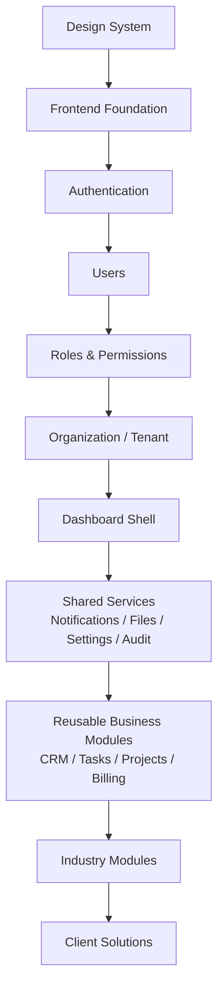

# 10-MVP-ROADMAP.md

## 1. Document Information

| Field | Value |
|---|---|
| Project | AXIVON ONE — Modular Business & Digital Platform |
| Document | MVP Roadmap |
| Version | 1.0 |
| Status | Draft — Living Document |
| Owner | Product Management (with Engineering Leadership) |
| Audience | Leadership, Product Management, Project Management, UI/UX Team, Frontend Team, Backend Team, Full-Stack Team, future developers |
| Purpose | Answers what AXIVON ONE builds first, what it builds later, and why — turning the module priorities and phasing already established in `00-PROJECT-OVERVIEW.md` §12–20 into a concrete, gated, team-executable roadmap |
| Related Documents | `00-PROJECT-OVERVIEW.md`, `01-UI-UX-TEAM.md`, `02-FRONTEND-TEAM.md`, `03-BACKEND-TEAM.md`, `04-FULL-STACK-TEAM.md`, `05-SYSTEM-ARCHITECTURE.md`, `06-DATABASE-ARCHITECTURE.md`, `07-API-SPECIFICATION.md`, `08-GIT-GITHUB-STANDARD.md`, `09-AGILE-SPRINT-PLAN.md`, `11-MODULE-CATALOG.md` |
| Last Updated | TBD — set on first commit to repository |

This document does not move any module's priority, phase, or scope classification away from what `00-PROJECT-OVERVIEW.md` §12–19 already establishes. Where this document adds detail (entry/exit criteria, dependency sequencing, team allocation), it is presented as an elaboration of those existing decisions, not a replacement for them.

---

## 2. Roadmap Purpose

**Why a roadmap is required:** four teams building a reusable platform, rather than a single project, face a specific danger `00-PROJECT-OVERVIEW.md` §35 names directly: the temptation to build broadly instead of deeply — a little bit of every industry, several unvalidated integrations, and a growing pile of speculative capability, none of it stable enough to actually reuse. A roadmap exists to make the *sequence* of work an explicit, defended decision, not an emergent side effect of whichever team has capacity this sprint.

**Why MVP scope must be controlled:** the entire economic case for AXIVON ONE — "faster for future delivery" (`00-PROJECT-OVERVIEW.md` §4) — depends on the foundation being genuinely solid before anything is built on top of it. A Core Platform rushed to make room for Industry Modules produces the opposite of the intended outcome: Industry Modules built on an unstable foundation don't reduce future effort, they multiply the cost of fixing the foundation later, now with more code depending on it.

**How the roadmap supports the reusable-platform strategy:** it enforces the sequence `00-PROJECT-OVERVIEW.md` §3 already commits to — "a strong, well-tested core first, a growing catalog of reusable business modules next, and industry modules added as real client needs justify them" — by making each stage's entry into the next conditional on defined exit criteria (§10), not on calendar time elapsed.

**How roadmap decisions affect the four teams:** the roadmap is what turns `00-PROJECT-OVERVIEW.md` §21's four-team collaboration model and `09-AGILE-SPRINT-PLAN.md` §4's staggered coordination model into an actual sequence of work — it tells UI/UX which module to design next, Backend which API to build next, Frontend which UI to implement next, and Full-Stack where the next integration point will be, all pointed at the same target at the same time.

---

## 3. Roadmap Principles

1. **Build the foundation first.** Core Platform capabilities (§6) are never deprioritized in favor of a business or industry module that "looks more exciting" or more directly client-facing.
2. **Reuse before rebuilding.** Before any new module is proposed, the Module Catalog (`11-MODULE-CATALOG.md`) is checked for an existing or extensible capability (per `11-MODULE-CATALOG.md` §19).
3. **Stabilize core capabilities before adding industries.** No Industry Module (Phase 4, §9) begins meaningful development before the Core Platform (Phase 1) and Shared Services (Phase 2) have met their exit criteria (§10).
4. **Prioritize high-reuse modules.** Where two candidate modules are otherwise comparable, the one with higher reusability (per `00-PROJECT-OVERVIEW.md` §15's Reusability column) is sequenced first.
5. **Avoid unnecessary complexity.** A capability is built to the level of sophistication the current, validated need requires — not to a speculative future need (per `00-PROJECT-OVERVIEW.md` §40, principle 10).
6. **Validate important assumptions early.** Multi-tenant data isolation, RBAC, and the API contract conventions are proven in Phase 1, while the blast radius of getting them wrong is smallest — not discovered to be wrong once a dozen modules depend on them.
7. **Protect the core architecture.** Roadmap decisions never require compromising the architectural boundaries `05-SYSTEM-ARCHITECTURE.md` §10 already sets (Core never depends on Business or Industry code).
8. **Keep client-specific features outside the reusable core where possible.** A roadmap item motivated by one client's specific need is classified per `00-PROJECT-OVERVIEW.md` §13 before it's scheduled, not assumed to belong in Core or a Reusable Module by default.
9. **Test before declaring modules reusable.** A module does not appear as "Reusable" on the roadmap or in the catalog until it meets the Module Quality Gate (`11-MODULE-CATALOG.md` §18) — including having actually been reused by a second consumer (`11-MODULE-CATALOG.md` §4).
10. **Expand only after the foundation is stable.** Moving from one phase to the next is a deliberate, checked decision (§10), not an automatic calendar progression.

---

## 4. Product Maturity Model

```text
Idea → Planned → Designed → In Development → Testing → Stable → Reusable → Production Proven → Mature → Deprecated / Replaced
```

| Stage | Meaning |
|---|---|
| **Idea** | A candidate capability identified, not yet evaluated or classified (`00-PROJECT-OVERVIEW.md` §13) |
| **Planned** | Classified and placed on this roadmap, with a target phase (§9) |
| **Designed** | UI/UX and/or API contract design complete and approved |
| **In Development** | Actively being implemented by the relevant team(s) |
| **Testing** | Implementation complete; undergoing the testing required by the relevant Definition of Done (`01`–`04`, `09-AGILE-SPRINT-PLAN.md` §15) |
| **Stable** | Meets its Definition of Done; working correctly for its original, first use case |
| **Reusable** | Has been used, unmodified beyond configuration, by a genuinely second, independent context (a second client, or a second module depending on it) — the concrete bar defined in `11-MODULE-CATALOG.md` §4–5 |
| **Production Proven** | Running in a live client deployment over a meaningful period without significant defects — a step beyond "Reusable" that reflects real-world durability, not just a second successful use |
| **Mature** | Stable, Reusable, and Production Proven, with a settled contract that other modules confidently build on without checking for churn |
| **Deprecated / Replaced** | Superseded by a newer approach or module; on a documented migration path (`11-MODULE-CATALOG.md` §21) |

This roadmap tracks capabilities primarily through **Idea → Planned → In Development → Stable → Reusable**; "Production Proven" and "Mature" are properties that accrue after a module ships into real client use, and are tracked in `11-MODULE-CATALOG.md` rather than on this forward-looking roadmap.

---

## 5. Roadmap Levels

These map directly to `00-PROJECT-OVERVIEW.md` §19's Version Roadmap — this document does not introduce new version semantics, only elaborates the existing ones into phases (§9).

| Level | Purpose |
|---|---|
| **MVP** | The minimum platform foundation required to prove AXIVON ONE's reusability model actually works — not a finished, client-ready product for any single industry (`00-PROJECT-OVERVIEW.md` §17). Success is measured by whether the foundation is *genuinely reusable*, not by how many features exist. |
| **V1** | A stable, reusable **business platform** — mature enough in its Reusable Business Module catalog (Employee, Project, Billing, Payments, Reports, Search) to serve most general business/corporate/service clients without new module development (`00-PROJECT-OVERVIEW.md` §19). |
| **V2** | Expanded modules and the platform's **first real Industry Modules**, chosen by actual client demand and reuse potential, not built speculatively across every vertical at once (`00-PROJECT-OVERVIEW.md` §16, §19). |
| **V3 / Future** | Advanced ecosystem capabilities — analytics, AI-assisted features, workflow automation, a broader industry catalog, and potentially a module marketplace (`00-PROJECT-OVERVIEW.md` §39) — pursued only once validated by real demand and platform maturity, never spun up "because the platform should eventually have it." |

Version labels are not used mechanically as calendar milestones — a module does not become "V1" simply because enough sprints have passed since MVP; it becomes V1-phase work because `00-PROJECT-OVERVIEW.md` §15–16 and the phase exit criteria (§10) say it's next in sequence and ready to start.

---

## 6. MVP Definition

The MVP is the **Foundation + Initial Business Capability** scope from `00-PROJECT-OVERVIEW.md` §17, expressed here with an explicit MoSCoW breakdown.

### Foundation

| Capability | MoSCoW |
|---|---|
| Repository/project setup, development standards (`08-GIT-GITHUB-STANDARD.md`) | Must Have |
| Design system foundation (`01-UI-UX-TEAM.md`) | Must Have |
| Authentication | Must Have |
| User Management | Must Have |
| Role Management | Must Have |
| Permission Management | Must Have |
| Organization/Tenant foundation (including verified tenant data isolation, `07-API-SPECIFICATION.md` §18) | Must Have |
| Dashboard foundation (shell only, per `00-PROJECT-OVERVIEW.md` §17) | Should Have |
| Settings | Should Have |
| Notifications | Should Have |
| File Management | Should Have |
| Audit Logs | Should Have |

### Initial Business Capability

| Capability | MoSCoW |
|---|---|
| CRM foundation | Must Have |
| Customer Management | Must Have |
| Lead Management | Must Have |
| Task Management | Must Have |
| Contact Management | Could Have |
| Basic reporting | Could Have |

### Not in MVP

Everything in §7 (MVP Non-Scope), plus:

- Project Management, Employee Management, Billing, Payments (all explicitly V1, per `00-PROJECT-OVERVIEW.md` §15)
- Common Reporting infrastructure and cross-module Search (both explicitly V1, per `00-PROJECT-OVERVIEW.md` §14)
- Any Industry Module (all V2/Future, per `00-PROJECT-OVERVIEW.md` §16)

**Why the "Should Have" / "Could Have" split within Foundation and Initial Business Capability:** `00-PROJECT-OVERVIEW.md` §14 assigns `P0` to Authentication, User Management, Roles, Permissions, and Organization/Tenant, and `P1` to Dashboard, Notifications, File Management, Settings, and Audit Logs. The `P0` set is what makes the platform *usable and safe* at all (nothing works without identity, access control, and tenant isolation); the `P1` set is necessary for the MVP to feel like a real platform rather than a bare API, but a slip in one of them does not block declaring the MVP foundation viable, whereas a slip in the `P0` set does.

---

## 7. MVP Non-Scope

Explicitly excluded from MVP, per `00-PROJECT-OVERVIEW.md` §18, with the reasoning made explicit:

| Excluded | Why It Waits |
|---|---|
| Full hospital management | Highest regulatory/security complexity of any industry (`00-PROJECT-OVERVIEW.md` §16); building it before the Core security posture is proven would mean building the *most* sensitive industry on the *least* validated foundation |
| Full hotel management | Distinct booking/inventory model with low reuse of Core/Business Module patterns — an industry, not a foundation validation exercise |
| Full restaurant POS | Distinct operational model (POS/kitchen flow) with low reuse of existing patterns; validates almost nothing about the reusable core |
| Full e-commerce platform | Advanced e-commerce (cart, checkout, delivery logistics) is explicitly out of MVP per `00-PROJECT-OVERVIEW.md` §18; the underlying Product/Billing/Payment modules it would need are themselves V1/V2 work |
| Advanced AI | Not a current business objective (`00-PROJECT-OVERVIEW.md` §8); building it now would be speculative capability with no validated need |
| Complex analytics | Common Reporting itself is V1-phase (§14); an advanced analytics/BI layer on top of it is `Future` (`00-PROJECT-OVERVIEW.md` §39) |
| Dozens of integrations | `00-PROJECT-OVERVIEW.md` §8 explicitly rejects replacing every external SaaS; integrations are added as real modules need them (Billing needs a payment provider, not the other way around) |
| Every payment provider | Payments itself is V1-phase (§14); provider breadth is a scaling concern for after the abstraction (`07-API-SPECIFICATION.md` §41) is proven with one |
| Mobile applications | Not in current scope per `00-PROJECT-OVERVIEW.md` §33's Out of Scope list, unless explicitly scoped later |
| Advanced workflow engines | No validated need yet; would be speculative infrastructure ahead of any module that requires it |

The unifying reason across all of these: the MVP's objective is **a strong, reusable foundation, not broad feature coverage** (`00-PROJECT-OVERVIEW.md` §18) — every item above either belongs to a later, already-sequenced phase (§9) or has no validated need yet at all.

---

## 8. MVP Success Criteria

Observable, non-numerical criteria — consistent with `00-PROJECT-OVERVIEW.md` §84's caution against inventing unrealistic targets before baseline data exists:

- Core authentication works reliably across the registration, login, logout, and password-reset flows (`07-API-SPECIFICATION.md` §16).
- Users, Roles, and Permissions work correctly, including custom, organization-defined roles composed from the shared permission catalog (`07-API-SPECIFICATION.md` §17).
- Organizations can be represented safely — verified specifically by security tests proving Organization A cannot reach Organization B's data through any endpoint (`07-API-SPECIFICATION.md` §18, §42).
- Core modules are demonstrably reusable — at minimum, exercised against more than one configuration/scenario without code changes, even if a true second client engagement hasn't happened yet.
- Frontend, Backend, and API standards (`02`, `03`, `07`) are followed consistently across every MVP module, not just the first one built.
- Documentation for every MVP module meets the standard set in `11-MODULE-CATALOG.md` §22.
- Automated testing exists at the level each team's Definition of Done requires (`01`–`04`), including the tenant-isolation security tests above.
- A basic customer solution (CRM + Tasks, configured, per `00-PROJECT-OVERVIEW.md` §17) can be assembled and demonstrated using only MVP modules and configuration — no client-specific code required for the standard case.
- The platform's architecture (`05-SYSTEM-ARCHITECTURE.md`) supports adding a new Reusable Business Module without modifying Core.

---

## 9. Roadmap Phases

```text
PHASE 0 — Discovery & Foundation
PHASE 1 — Core Platform
PHASE 2 — Shared Services
PHASE 3 — Reusable Business Modules
PHASE 4 — Industry Modules
PHASE 5 — Client Solution Framework
PHASE 6 — Continuous Evolution
```

This is `00-PROJECT-OVERVIEW.md` §20's Development Phases, elaborated with the additional detail those phase names imply and the master module lists from §12–16 attached to each phase.

### PHASE 0 — Discovery & Foundation

**Focus:** Requirements confirmation, architecture decisions (the `TBD` list across `05`–`07`), GitHub/repository setup (`08-GIT-GITHUB-STANDARD.md`), design foundation (`01-UI-UX-TEAM.md`), development standards, backlog setup (`09-AGILE-SPRINT-PLAN.md` §8–9). Corresponds to Sprint 0 (`09-AGILE-SPRINT-PLAN.md` §18, §20).

### PHASE 1 — Core Platform

**Focus:** Authentication, Users, Roles, Permissions, Organizations, Dashboard (shell), Settings — the `P0`/`P1` Core Module Catalog entries (`00-PROJECT-OVERVIEW.md` §14) that are MVP-scoped. Corresponds to Sprints 1–3.

### PHASE 2 — Shared Services

**Focus:** Notifications, Files, Audit Logs — the remaining MVP-scoped Core modules — plus early architectural groundwork for Search and Reporting foundation, which are themselves V1-phase (`00-PROJECT-OVERVIEW.md` §14). Corresponds to Sprint 4.

### PHASE 3 — Reusable Business Modules

**Focus:** CRM (Customers, Leads — MVP), Contacts/Activities (V1, per `07-API-SPECIFICATION.md` §36), Task Management (MVP), then, once MVP is validated, Project Management, Employee Management, Product Management, Service Management, and Billing/Payments (all V1, per `00-PROJECT-OVERVIEW.md` §15). Corresponds to Sprints 5–6 (MVP portion) and Sprint 7+ (V1 portion, per `09-AGILE-SPRINT-PLAN.md` §18).

### PHASE 4 — Industry Modules

**Focus:** The first Industry Module(s) — Education and/or E-Commerce, per `00-PROJECT-OVERVIEW.md` §16 and §19's V2 goals, chosen by actual client demand, not built speculatively across every vertical. Coaching/Training, Healthcare/Hospital, Restaurant, Hotel, and Retail follow later, in the priority order §16 already establishes. This phase does not begin until Phase 1–3's exit criteria (§10) are met.

### PHASE 5 — Client Solution Framework

**Focus:** Maturing the Client Configuration model — branding, module enable/disable, custom fields, workflow settings, and the client-specific extension process (`11-MODULE-CATALOG.md` §10, §19) — so that assembling a client solution from the catalog becomes fast and low-risk, per `00-PROJECT-OVERVIEW.md` §26.

### PHASE 6 — Continuous Evolution

**Focus:** Ongoing module expansion, new integrations, advanced reporting, automation, AI-assisted features, mobile, and ecosystem capabilities — all `Future`-labeled per `00-PROJECT-OVERVIEW.md` §39, pursued only as validated by real demand from the client base the platform has by then acquired.

**Phase overlap is expected and intentional**, per the parallel-work model in `00-PROJECT-OVERVIEW.md` §32 and `09-AGILE-SPRINT-PLAN.md` §4 — for example, Phase 5's configuration tooling can mature in parallel with early Phase 3 work, since configuration is a Core-adjacent capability, not dependent on any specific Business Module being finished first. What does **not** overlap: Phase 4 (Industry Modules) does not begin in earnest until Phase 1–3's exit criteria (§10) are satisfied, per Roadmap Principle 3 (§3).

---

## 10. Phase Entry & Exit Criteria

| Phase | Entry Criteria | Exit Criteria |
|---|---|---|
| **Phase 0** | Project charter/vision agreed (`00-PROJECT-OVERVIEW.md` exists and is approved) | Architecture `TBD` decisions in `05`–`07` that block Phase 1 are resolved; repository and CI/CD exist (`08-GIT-GITHUB-STANDARD.md`); design tokens/foundation exist (`01-UI-UX-TEAM.md`); backlog is populated (`09-AGILE-SPRINT-PLAN.md` §8–9) |
| **Phase 1** | Phase 0 exit criteria met | Authentication, Users, Roles, Permissions, and Organization/Tenant all meet their Definition of Done (`03-BACKEND-TEAM.md` §20, `02-FRONTEND-TEAM.md` §19); tenant-isolation security tests pass (`07-API-SPECIFICATION.md` §18, §42); Dashboard shell renders per-role/per-org correctly |
| **Phase 2** | Phase 1 exit criteria met | Notifications, File Management, and Audit Logs meet their Definition of Done; Settings is functional at the org and user level |
| **Phase 3 (MVP portion)** | Phase 2 exit criteria met | CRM (Customers, Leads) and Task Management meet their Definition of Done; a basic customer solution can be assembled from Core + CRM + Tasks + Configuration (§8's MVP success criterion) — **this is the MVP milestone** |
| **Phase 3 (V1 portion)** | MVP milestone reached; a pilot/real client engagement (or credible internal validation) has exercised the MVP foundation | Project Management, Employee Management, Billing, Payments, Search, and Common Reporting each independently meet their Definition of Done and Module Quality Gate (`11-MODULE-CATALOG.md` §18) |
| **Phase 4** | V1 Reusable Business Module catalog is Stable, per `11-MODULE-CATALOG.md`'s maturity tracking; a specific Industry Module has real, documented client demand (not speculative) | The first Industry Module reaches Stable status and has been validated against at least one real or credible pilot client scenario, proving the "Core + Reusable + Industry + Configuration" assembly model (`00-PROJECT-OVERVIEW.md` §19's V2 Expected Outcome) |
| **Phase 5** | Phase 3 (V1 portion) substantially complete; at least conceptual demand for faster client assembly exists | Branding, module enable/disable, and custom-field/workflow configuration are usable without code changes for the standard case (§8's MVP criterion extended to V1 scope) |
| **Phase 6** | Phases 1–5 have produced a Mature (§4) platform with real client usage data | Continuous — this phase does not have a terminal exit criterion; it is re-evaluated on an ongoing basis against `00-PROJECT-OVERVIEW.md` §39's Future Evolution list |

A phase is not entered because the calendar suggests it's time — it's entered because the prior phase's exit criteria are checked and satisfied, per Roadmap Principle 10 (§3).

---

## 11. Priority Framework

```text
P0 — Critical : the platform does not function, or is unsafe, without this
P1 — High     : required for the current phase's committed scope
P2 — Medium   : valuable, next-in-line capability, not blocking the current phase
P3 — Low      : deferred without materially affecting the roadmap's near-term outcomes
```

This mirrors `00-PROJECT-OVERVIEW.md` §14–16's existing priority assignments exactly (Authentication/Users/Roles/Permissions/Org = `P0`; Dashboard/Notifications/Files/Settings/Audit = `P1`; Search/Reporting = `P2`; and so on through the Business and Industry catalogs) — this document does not re-prioritize any module, only explains the criteria those existing priorities already reflect.

---

## 12. Roadmap Table

| Phase | Capability | Priority | Purpose | Dependencies | Status |
|---|---|---|---|---|---|
| 0 | Repository/CI/CD setup | P0 | Enable all subsequent work | None | Planned |
| 0 | Development standards (`08`) | P0 | Cross-team consistency | None | Planned |
| 0 | Design system foundation | P0 | Cross-team consistency | None | Planned |
| 1 | Authentication | P0 | Secure identity | Phase 0 | Planned |
| 1 | User Management | P0 | Account/profile management | Authentication | Planned |
| 1 | Role Management | P0 | Access control foundation | User Management | Planned |
| 1 | Permission Management | P0 | Granular access control | Role Management | Planned |
| 1 | Organization/Tenant | P0 | Client isolation | Roles & Permissions | Planned |
| 1 | Dashboard (shell) | P1 | Landing experience | Organization/Tenant | Planned |
| 2 | Notifications | P1 | User communication | Organization/Tenant | Planned |
| 2 | File Management | P1 | Document/asset handling | Organization/Tenant | Planned |
| 2 | Settings | P1 | Org/user configuration | Organization/Tenant | Planned |
| 2 | Audit Logs | P1 | Accountability/traceability | Organization/Tenant | Planned |
| 3 (MVP) | CRM — Customers, Leads | P0 | Sales/relationship management | Core Platform | Planned |
| 3 (MVP) | Task Management | P0 | Universal operational need | Core Platform | Planned |
| 3 (MVP) | Basic Reporting | P2 | Early decision support | CRM, Tasks | Planned |
| 3 (V1) | Contacts, Activities (CRM extension) | P2 | CRM depth | CRM foundation | Planned |
| 3 (V1) | Employee Management | P1 | Staff records | Core Platform | Planned |
| 3 (V1) | Project Management | P1 | Multi-step initiative tracking | Core Platform, Tasks | Planned |
| 3 (V1) | Product Management | P2 | Sellable item catalog | Core Platform | Planned |
| 3 (V1) | Service Management | P2 | Service catalog | Core Platform | Planned |
| 3 (V1) | Billing | P1 | Invoicing | Core Platform | Planned |
| 3 (V1) | Payments | P1 | Payment tracking | Billing | Planned |
| 3 (V1) | Search | P2 | Cross-module search | Core Platform, Business Modules | Planned |
| 3 (V1) | Common Reporting | P2 | Shared reporting infrastructure | Business Modules | Planned |
| 3 (V2) | Communication | P3 | Internal/external messaging | Core Platform | Planned |
| 4 (V2) | Education / E-Commerce (first Industry Module) | P2 | Validate assembly model | Stable V1 Business Modules | Planned |
| 4 (V2) | Coaching/Training | P2 | Overlaps with Education | Education module patterns | Planned |
| 4 (V2/Future) | Healthcare/Hospital | P3 | Higher regulatory complexity | Proven Core security posture | Planned |
| 4 (Future) | Restaurant | P3 | Distinct operational model | Core Platform, Billing | Planned |
| 4 (Future) | Hotel | P3 | Distinct booking/inventory model | Core Platform, Billing | Planned |
| 4 (Future) | Retail | P3 | Overlaps with E-Commerce | E-Commerce module patterns | Planned |
| 5 | Client Solution Framework maturity | P1 | Faster, safer client assembly | V1 Business Modules | Planned |
| 6 | Continuous Evolution (analytics, AI, automation, mobile) | P3 | Ecosystem growth | Mature platform, real client usage | Idea |

This table is a **planning artifact**, not a completion tracker — the authoritative, living record of each module's actual current status belongs in `11-MODULE-CATALOG.md`, which this table defers to for anything beyond initial sequencing.

---

## 13. Dependency Map



**What can run in parallel:**

- **Design System work and Backend architecture decisions** (Phase 0) — UI/UX establishing tokens/components has no dependency on Backend's stack decisions, and vice versa.
- **UI/UX design for an upcoming module and Frontend implementation of the current module** — the one-sprint-ahead staggering already established in `01-UI-UX-TEAM.md` §16 and `09-AGILE-SPRINT-PLAN.md` §4.
- **Frontend and Backend implementation of the same module**, once an API contract is agreed (`07-API-SPECIFICATION.md` §32) — Frontend builds against a mock while Backend implements the real API.
- **Multiple Reusable Business Modules within Phase 3**, once Core Platform (Phase 1) and Shared Services (Phase 2) are stable — CRM and Task Management, for instance, do not depend on each other and can be built by different sub-teams simultaneously.
- **Full-Stack's production-readiness and integration-tooling work**, which can proceed alongside Core module development rather than waiting for it to finish (`00-PROJECT-OVERVIEW.md` §32).

**What cannot run in parallel:** any Reusable Business Module or Industry Module beginning *substantive* development before Organization/Tenant's data-isolation is verified — every module built on top of an unverified tenant boundary inherits that risk, which is exactly the scenario Roadmap Principle 6 (§3) exists to prevent.

---

## 14. Four-Team Roadmap

| Phase | UI/UX | Frontend | Backend | Full Stack |
|---|---|---|---|---|
| 0 — Discovery & Foundation | Design tokens, Figma structure, initial design system | Repo/tooling/CI setup, component library skeleton | Architecture decisions, repo setup, CI/CD foundation | Environment setup, production-readiness checklist |
| 1 — Core Platform | Auth flow design, User/Role/Org UX patterns | Auth UI, User/Role UI, Org/Dashboard UI | Auth service, User/Role/Permission APIs, Org service with tenant isolation | Core module integration, end-to-end smoke testing |
| 2 — Shared Services | Notifications/Files/Settings UI design | Notifications/Files/Settings UI | Notifications, File Management, Settings, Audit Logging APIs | End-to-end Notification delivery verification |
| 3 — Reusable Business Modules | Generic list/detail/form patterns, module-specific UX | CRM/Tasks/Projects/Billing UI | CRM/Tasks/Projects/Billing/Payments APIs | Cross-module integration, Billing/Payments end-to-end ownership |
| 4 — Industry Modules | Industry-specific UX patterns, informed by real client requirements | Industry-specific UI, reusing Phase 3's generic patterns | Industry-specific APIs, built on Business Module APIs (never the reverse, per `05-SYSTEM-ARCHITECTURE.md` §10) | Full ownership of first Industry Module's end-to-end delivery |
| 5 — Client Solution Framework | Branding/configuration UX | Configuration UI (module enable/disable, custom fields) | Configuration data model and APIs | Cross-cutting configuration tooling, admin experience |
| 6 — Continuous Evolution | Evolving design system, new module UX as prioritized | New module UI as prioritized | New module APIs, integrations, as prioritized | New cross-cutting capabilities as prioritized |

Each team's **primary contribution** stays consistent with the ownership model already defined in `00-PROJECT-OVERVIEW.md` §22 and `07-API-SPECIFICATION.md` §5 — this table shows where that ownership lands per phase, not a new division of responsibility.

---

## 15. MVP Sprint Alignment

Traceability to `09-AGILE-SPRINT-PLAN.md` §18's Initial Development Roadmap — this table does not duplicate that document's full sprint detail, only maps roadmap phases to sprint groups.

| Roadmap Phase | Sprint(s) | Major Outcome |
|---|---|---|
| Phase 0 — Discovery & Foundation | Sprint 0 | Repository, CI/CD, design foundation, and standards in place; backlog populated |
| Phase 1 — Core Platform | Sprints 1–3 | Authentication, Users, Roles, Permissions, Organization/Tenant (with verified isolation), Dashboard shell all working |
| Phase 2 — Shared Services | Sprint 4 | Notifications, File Management, Settings, Audit Logs working |
| Phase 3 (MVP portion) — Reusable Business Modules | Sprints 5–6 | CRM (Customers, Leads), Task Management, basic Reporting working — **MVP milestone reached** |
| Phase 3 (V1 portion) — Reusable Business Modules | Sprint 7+ | Project Management, Billing, Payments, Employee Management, Search, Common Reporting reach Stable |
| Phase 4 — Industry Modules | Beyond Sprint 7+, timing contingent on V1 completion and real client demand | First Industry Module (Education and/or E-Commerce) reaches Stable |
| Phase 5 — Client Solution Framework | Overlapping with Phase 3 (V1) and Phase 4, per §9's parallelism note | Configuration tooling mature enough for code-free standard-case assembly |
| Phase 6 — Continuous Evolution | Ongoing, beyond the current sprint roadmap's planning horizon | Evaluated per `00-PROJECT-OVERVIEW.md` §39 as real usage data accumulates |

---

## 16. Release Strategy

- **Internal releases** — frequent, informal deployments to Development/Testing environments (`07-API-SPECIFICATION.md` §7) as increments complete; not every internal release is announced or versioned with the same rigor as a tagged release (`08-GIT-GITHUB-STANDARD.md` §22).
- **MVP release** — the first tagged release (`v0.x.y` per `08-GIT-GITHUB-STANDARD.md` §22) representing the completed Phase 3 (MVP portion) exit criteria (§10) — the concrete artifact that "the MVP is done" refers to.
- **Stable releases** — subsequent tagged releases as V1 modules individually reach Stable and are integrated; these accumulate toward `v1.0.0`, which represents the full V1 Reusable Business Module catalog being genuinely stable (per `08-GIT-GITHUB-STANDARD.md` §22's note that `v1.0.0` marks the first release considered stable enough to represent the validated MVP foundation, extended here to the validated V1 foundation).
- **Module releases** — where a module's contract stabilizes independently of the overall platform release cadence, it may be called out with its own version reference (per `07-API-SPECIFICATION.md` §21's Reusable Module versioning), without requiring a full platform release.
- **Future releases** — Phase 4–6 releases follow the same tagging discipline, gated by real client demand and the phase entry/exit criteria in §10, not a fixed calendar.

**Not every sprint produces a public production release** — consistent with `09-AGILE-SPRINT-PLAN.md` §31, a sprint's increment may land in Development/Testing without immediately being promoted to a tagged Staging/Production release.

---

## 17. Roadmap Change Management

```text
New Requirement
   ↓
Impact Analysis (which phase does this affect? does it change a dependency, §13?)
   ↓
Priority (§11, weighed against currently committed phase scope)
   ↓
Scope Decision (does this belong in the current phase, a later phase, or is it Not in Scope, §7?)
   ↓
Backlog (09-AGILE-SPRINT-PLAN.md §8, added to the appropriate area)
   ↓
Roadmap Update (this document is revised, with the change and rationale documented — never a silent edit)
```

This mirrors `00-PROJECT-OVERVIEW.md` §38's Change Management process exactly, applied specifically to roadmap-level decisions (module sequencing, phase scope) rather than architecture or API decisions, which that section already covers directly.

---

## 18. Client Request → Roadmap Process

```text
Customer Request
   ↓
Is it already available?
   ├── Yes → Configure / Reuse (no roadmap change needed)
   │
   └── No
        ↓
       Is it useful for multiple clients?
        ├── Yes → Classify as Reusable Business Module candidate → 11-MODULE-CATALOG.md §20 (Module Request Process)
        │
        └── No
             ↓
            Is it industry-specific?
             ├── Yes → Classify as Industry Module candidate → placed in Phase 4, prioritized per §16's existing industry ordering
             │
             └── No → Client-Specific Customization → 08-GIT-GITHUB-STANDARD.md §30's Client Customization Rules apply; does not modify the roadmap's Core/Reusable/Industry sequencing
```

This is the same classification logic already established in `00-PROJECT-OVERVIEW.md` §13 and exercised operationally in `09-AGILE-SPRINT-PLAN.md` §33 — this document applies it specifically to the question of *where on the roadmap* a newly classified capability lands, rather than repeating the full classification rationale.

**This is a core AXIVON ONE principle:** no client request is scheduled onto the roadmap without passing through this classification first — skipping it is exactly how client-specific logic ends up hardcoded into Core or a Reusable Module (`08-GIT-GITHUB-STANDARD.md` §30), the single most consequential risk this roadmap is designed to prevent (§19).

---

## 19. Roadmap Risks

| Risk | Mitigation |
|---|---|
| **Scope creep** — new requirements quietly expanding a phase's committed scope | Every new requirement passes through §17's Change Management process; nothing is added to an active sprint outside that process (`09-AGILE-SPRINT-PLAN.md` §32) |
| **Over-engineering** — building more sophistication than the current validated need requires | Roadmap Principle 5 (§3); MVP Non-Scope (§7) explicitly names what's deferred and why |
| **Too many modules built in parallel** — spreading four teams thin across unrelated Epics | Phase gating (§10) — Phase 3's V1 modules and Phase 4's Industry Modules do not begin substantive parallel development before their entry criteria are met |
| **Poor dependencies** — a module built before its prerequisite is actually stable | Dependency Map (§13) is checked before a module enters "In Development" (§4); tenant-isolation and RBAC are proven first, per Roadmap Principle 6 |
| **Technical debt accumulating silently** | Tracked per `09-AGILE-SPRINT-PLAN.md` §28, reviewed during Refinement alongside feature work, not deferred indefinitely |
| **Team bottlenecks** — one team blocking the other three | The staggered coordination model (§4 of `09-AGILE-SPRINT-PLAN.md`; §13 of this document) is specifically designed to keep teams working on parallel tracks rather than a strict sequential handoff |
| **Incomplete documentation** — a module shipping without meeting the documentation standard | Documentation is part of every team's Definition of Done (`01`–`04`) and the Module Quality Gate (`11-MODULE-CATALOG.md` §18) |
| **Uncontrolled client customization** forking the reusable core | §18's Client Request → Roadmap Process, backed by `08-GIT-GITHUB-STANDARD.md` §30's Client Customization Rules |
| **Architecture drift** — implementation quietly diverging from `05-SYSTEM-ARCHITECTURE.md`'s documented boundaries | Architecture changes go through `00-PROJECT-OVERVIEW.md` §38's Change Management process; code review (`08-GIT-GITHUB-STANDARD.md` §10) checks for dependency-direction violations specifically |

This table extends, rather than replaces, `00-PROJECT-OVERVIEW.md` §35's project-wide risk register — every risk above is a roadmap-specific instance of a risk already named there.

---

## 20. Roadmap Governance

| Decision | Approver (Role) |
|---|---|
| Add a new feature/capability to the roadmap | Product Management, following §17's Change Management process |
| Change a capability's priority (§11) | Product Management, with Engineering Manager for cross-team impact |
| Move a roadmap item between phases | Product Management, with Architecture/Technical Lead if the move has architectural implications (e.g., pulling an Industry Module earlier) |
| Approve MVP scope (§6) | Product Management, with Engineering Leadership |
| Approve a phase transition (§10's exit criteria being met) | Engineering Manager, with Product Management and Architecture/Technical Lead |
| Approve major architecture changes affecting the roadmap | Architecture/Technical Lead |

This mirrors `00-PROJECT-OVERVIEW.md` §36's Project Governance table — no new decision-ownership pattern is introduced. Role titles only; no individuals are named.

---

## 21. Roadmap Success Metrics

| Metric | What It Tells You |
|---|---|
| Module reuse (count of modules that have reached "Reusable" per §4/`11-MODULE-CATALOG.md` §4) | The most direct measure of whether the roadmap sequencing is actually producing reusable capability, not just shipped features |
| Delivery lead time (idea → delivered, per phase) | Whether phase gating (§10) is adding meaningful discipline without excessive friction |
| Defect rate | Whether foundation-first sequencing (§3) is actually producing a more stable base for later phases |
| Rework | Whether modules built earlier are holding up as later phases build on them, or requiring frequent revisiting |
| Technical debt trend | Whether Phase 3+ velocity is being achieved sustainably or by accumulating debt in Phase 1–2 foundations |
| Documentation completeness | Whether the Module Catalog (`11-MODULE-CATALOG.md`) accurately reflects what's actually been built |
| Module maturity distribution | How many modules sit at each stage of §4's maturity model — a healthy roadmap shows steady progression, not a pile-up at "In Development" |
| Client customization percentage (customization vs. reuse, per client engagement) | The direct measure of `00-PROJECT-OVERVIEW.md` §6's business objective — increasing the proportion of each client project delivered through reuse |
| Platform stability (defect/incident rate on Core Platform specifically) | Whether the foundation is holding up as more is built on top of it — a leading indicator for whether Phase 4 (Industry Modules) is safe to proceed with |

**These are not individual employee performance metrics.** Every metric above describes the platform and the roadmap's execution, not any one person's output — using them to rank or compare individuals is a misuse, consistent with `09-AGILE-SPRINT-PLAN.md` §27's caution against the same misuse of velocity.

---

## 22. Final MVP Checklist

### Product
- [ ] MVP scope matches §6 exactly — no unapproved additions
- [ ] MVP Non-Scope (§7) items confirmed excluded
- [ ] MVP Success Criteria (§8) are all observable and checked

### UI/UX
- [ ] Design system foundation complete (`01-UI-UX-TEAM.md` §19)
- [ ] All MVP-scope module designs approved and handed off

### Frontend
- [ ] All MVP-scope module UIs implemented and meet `02-FRONTEND-TEAM.md` §19's Definition of Done
- [ ] Error/loading/empty states handled across all MVP screens

### Backend
- [ ] All MVP-scope module APIs implemented and meet `03-BACKEND-TEAM.md` §20's Definition of Done
- [ ] Tenant isolation verified via automated security tests (`07-API-SPECIFICATION.md` §18, §42)

### Full Stack
- [ ] End-to-end integration verified across all MVP-scope modules (`04-FULL-STACK-TEAM.md` §17)
- [ ] Production-readiness checklist (from Sprint 0, `09-AGILE-SPRINT-PLAN.md` §20) satisfied

### Security
- [ ] Authentication, RBAC, and tenant isolation specifically reviewed (`07-API-SPECIFICATION.md` §28)
- [ ] No secrets committed anywhere in the repository history (`08-GIT-GITHUB-STANDARD.md` §24)

### Testing
- [ ] Unit and integration tests passing for every MVP module
- [ ] Negative and authorization tests included, not just happy-path (`07-API-SPECIFICATION.md` §42)

### Documentation
- [ ] Every MVP module documented per `11-MODULE-CATALOG.md` §22's standard
- [ ] `07-API-SPECIFICATION.md` reflects the actual implemented contract, not just the planned one

### Git/GitHub
- [ ] All MVP work merged via reviewed PRs, no direct commits to `develop`/`main` (`08-GIT-GITHUB-STANDARD.md` §17)
- [ ] Branch/commit history for MVP work follows the established conventions (`08-GIT-GITHUB-STANDARD.md` §6–8)

### Release
- [ ] MVP tagged as a release per `08-GIT-GITHUB-STANDARD.md` §22
- [ ] Release notes/changelog reflect what actually shipped (`08-GIT-GITHUB-STANDARD.md` §23)
