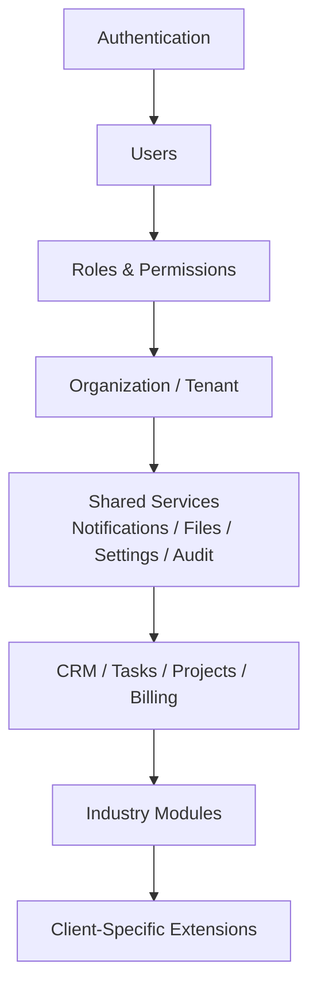

# 11-MODULE-CATALOG.md

## 1. Document Information

| Field | Value |
|---|---|
| Project | AXIVON ONE — Modular Business & Digital Platform |
| Document | Module Catalog |
| Version | 1.0 |
| Status | Draft — Living Document (this document changes more frequently than most in the series — see §30) |
| Owner | Backend Lead / Architecture-Technical Lead (module classification and lifecycle), with Product Management (roadmap placement) |
| Audience | Leadership, Product Management, Project Management, UI/UX Team, Frontend Team, Backend Team, Full-Stack Team, future developers, future module owners |
| Purpose | The centralized inventory and lifecycle registry of every AXIVON ONE module — what it does, its status, who owns it, what it depends on, and where it can be reused — so a future client project starts with "what already exists" rather than "what do we build" |
| Related Documents | `00-PROJECT-OVERVIEW.md`, `01-UI-UX-TEAM.md`, `02-FRONTEND-TEAM.md`, `03-BACKEND-TEAM.md`, `04-FULL-STACK-TEAM.md`, `05-SYSTEM-ARCHITECTURE.md`, `06-DATABASE-ARCHITECTURE.md`, `07-API-SPECIFICATION.md`, `08-GIT-GITHUB-STANDARD.md`, `09-AGILE-SPRINT-PLAN.md`, `10-MVP-ROADMAP.md` |
| Last Updated | TBD — set on first commit to repository |

**A note on accuracy:** as of this document's creation, no AXIVON ONE module has yet been built — the platform is at the roadmap and specification stage (`10-MVP-ROADMAP.md` Phase 0). Every module below is therefore recorded honestly as **Planned** or **Proposed**, never as Stable, Reusable, or Production Proven, regardless of how thoroughly it has been specified elsewhere in this documentation series. This catalog is only useful if its status column can be trusted; marking something further along than it actually is defeats its purpose (see the warning restated in §16).

---

## 2. Purpose of Module Catalog

**Why modules are cataloged:** `00-PROJECT-OVERVIEW.md` §6 sets "increase the proportion of each new client project delivered through reuse rather than new code" as a core business objective. That objective is unreachable if "what we already have" only exists in individual developers' memory — a catalog is what makes reuse an operational choice (search the catalog, §19) rather than a matter of who happens to remember building something similar before.

**Why reuse matters:** every module built once and genuinely reused, per `00-PROJECT-OVERVIEW.md` §2, is development effort that does not need to be repeated for the next client — the entire economic case for AXIVON ONE existing as a platform rather than a series of projects.

**Why ownership matters:** a module without a clear owner (§14) has no one responsible for reviewing whether a proposed change protects or damages its reusability (`08-GIT-GITHUB-STANDARD.md` §29's rule that breaking changes to a Reusable Module are reviewed with every current and anticipated consumer in mind) — ownership is what makes that review actually happen.

**Why module maturity matters:** calling a module "Reusable" is a specific, checkable claim (§5), not a vibe. Teams building on top of a module need to know honestly whether it's proven or merely built, so they can plan accordingly — a Backend team building an Industry Module against a Business Module that's only "Stable," not yet "Reusable," should expect some friction that a truly Reusable dependency wouldn't have.

**How this helps future client projects:** the module discovery process (§27) is specifically designed so a Project Manager scoping a new client engagement can start from "what capabilities does this client need" and quickly determine "how much of this already exists," turning most of a new engagement into assembly and configuration rather than a from-scratch build — precisely the vision `00-PROJECT-OVERVIEW.md` §3 describes.

---

## 3. Module Classification

Every module belongs to exactly one of the four categories already defined in `00-PROJECT-OVERVIEW.md` §12–13:

| Category | Definition |
|---|---|
| **CORE** | Functionality useful across almost every client, regardless of industry — the platform's foundation (Authentication, Users, Roles, Permissions, Organization/Tenant, Dashboard, Settings, Notifications, Files, Audit Logs, Search, Reporting foundation). Core never depends on Business or Industry code (`05-SYSTEM-ARCHITECTURE.md` §10). |
| **REUSABLE BUSINESS MODULE** | Functionality useful across multiple industries, but not universal (e.g., not needed by a pure internal tool) — CRM, Task Management, Project Management, Billing, and similar. May depend on Core; is depended on by Industry Modules. |
| **INDUSTRY MODULE** | Functionality specific to one industry vertical (e.g., attendance tracking, patient records). Built on top of Core + Reusable Business Modules, never the reverse. |
| **CLIENT-SPECIFIC EXTENSION** | Functionality specific to one customer's unique process, with no current evidence a second client would need it. Isolated from Core/Reusable Module code paths (`08-GIT-GITHUB-STANDARD.md` §30). |

Classification is not permanent (`00-PROJECT-OVERVIEW.md` §13) — a Client-Specific Extension can be promoted to Reusable Business Module or Industry Module status if a second client's need is demonstrated, via the deliberate process in `00-PROJECT-OVERVIEW.md` §38's Change Management, never automatically.

---

## 4. Module Lifecycle

```text
Idea → Proposed → Approved → Planned → Design → Development → Testing → Stable → Reusable → Production Proven → Deprecated
```

| Status | Criteria |
|---|---|
| **Idea** | Identified as a candidate; not yet written up or evaluated |
| **Proposed** | Written up per the Module Request Process (§20); awaiting classification/approval |
| **Approved** | Classification confirmed (§3); accepted onto the roadmap, but not yet scheduled into a specific phase |
| **Planned** | Placed in a specific `10-MVP-ROADMAP.md` phase with a target priority |
| **Design** | UI/UX and/or API contract design (`07-API-SPECIFICATION.md`) underway |
| **Development** | Actively being implemented by the relevant team(s) |
| **Testing** | Implementation complete; undergoing the testing required by the relevant Definition of Done |
| **Stable** | Meets its Definition of Done (`01`–`04`, `09-AGILE-SPRINT-PLAN.md` §15) and the Module Quality Gate (§18); working correctly for its first/original use case |
| **Reusable** | Has been used, unmodified beyond configuration, by a genuinely **second**, independent context — a second client engagement, or a second module/Industry Module depending on it |
| **Production Proven** | Running in live client deployment(s) over a meaningful period without significant defects |
| **Deprecated** | Superseded or no longer needed; on a documented migration path (§21) |

Every module entry in this catalog (§6–9) carries its current, honest position in this lifecycle — never a status further along than what has actually happened.

---

## 5. Module Maturity Levels

| Level | Name | Requirement to Reach It |
|---|---|---|
| **Level 0** | Concept | An identified need, written up as at least a Proposed module (§4) |
| **Level 1** | Prototype | A working proof-of-concept exists, demonstrating feasibility — not necessarily following full production standards yet |
| **Level 2** | Internal Working | Meets the relevant team's Definition of Done for its first real use case; used internally or in one client context |
| **Level 3** | Stable | Meets the full Module Quality Gate (§18): documented, tested, reviewed, secure, no known critical defects |
| **Level 4** | Reusable | Has been used by a genuinely second, independent consumer without modification beyond configuration (same bar as the "Reusable" lifecycle status, §4) |
| **Level 5** | Production Proven | Running successfully in live client deployment(s) over a meaningful period |

Moving from one level to the next requires passing the specific gate above it — a module does not skip from Level 1 to Level 4 because it "seems solid"; each intermediate bar (a real Definition of Done pass, then the full Quality Gate, then an actual second use) is checked individually.

---

## 6. Master Module Catalog

Every module currently identified for AXIVON ONE, at its honest current status (per the note in §1 — nothing here has begun development yet).

| ID | Module | Category | Purpose | Priority | Status | Maturity | Owner Team | Dependencies |
|---|---|---|---|---:|---|---|---|---|
| CORE-001 | Authentication | Core | Secure login, registration, password recovery | P0 | Planned | Level 0 | Backend | None |
| CORE-002 | User Management | Core | User profiles, status, org membership | P0 | Planned | Level 0 | Backend | CORE-001 |
| CORE-003 | Role Management | Core | Definition and assignment of roles | P0 | Planned | Level 0 | Backend | CORE-002 |
| CORE-004 | Permission Management | Core | Granular access control | P0 | Planned | Level 0 | Backend | CORE-003 |
| CORE-005 | Organization/Tenant | Core | Client isolation and configuration | P0 | Planned | Level 0 | Backend | CORE-004 |
| CORE-006 | Dashboard | Core | KPI/widget shell | P1 | Planned | Level 0 | Frontend | CORE-005 |
| CORE-007 | Settings | Core | Profile/org/security/branding settings | P1 | Planned | Level 0 | Backend | CORE-005 |
| CORE-008 | Notifications | Core | In-app/email/SMS/push delivery | P1 | Planned | Level 0 | Backend | CORE-005 |
| CORE-009 | File Management | Core | Upload/download/access control | P1 | Planned | Level 0 | Backend | CORE-005 |
| CORE-010 | Audit Logs | Core | Record of significant actions | P1 | Planned | Level 0 | Backend | CORE-005 |
| CORE-011 | Search | Core | Cross-module search | P2 | Planned | Level 0 | Backend | Business Modules (indirect) |
| CORE-012 | Reporting Foundation | Core | Shared reporting infrastructure | P2 | Planned | Level 0 | Backend | Business Modules (indirect) |
| BUS-001 | CRM | Reusable Business Module | Umbrella capability tracking prospects/customers | P0 | Planned | Level 0 | Backend/Frontend | CORE-001–005 |
| BUS-002 | Customer Management | Reusable Business Module | Customer records | P0 | Planned | Level 0 | Backend/Frontend | BUS-001 |
| BUS-003 | Lead Management | Reusable Business Module | Prospect tracking, lead conversion | P0 | Planned | Level 0 | Backend/Frontend | BUS-001, BUS-002 |
| BUS-004 | Contact Management | Reusable Business Module | Contacts belonging to a Customer | P2 | Planned | Level 0 | Backend/Frontend | BUS-002 |
| BUS-005 | Task Management | Reusable Business Module | Assign and track work | P0 | Planned | Level 0 | Backend/Frontend | CORE-001–005 |
| BUS-006 | Project Management | Reusable Business Module | Multi-step initiative tracking | P1 | Planned | Level 0 | Backend/Frontend | BUS-005 |
| BUS-007 | Employee Management | Reusable Business Module | Staff records | P1 | Planned | Level 0 | Backend/Frontend | CORE-001–005 |
| BUS-008 | Product Management | Reusable Business Module | Sellable item catalog | P2 | Planned | Level 0 | Backend/Frontend | CORE-001–005 |
| BUS-009 | Service Management | Reusable Business Module | Offered-service catalog | P2 | Planned | Level 0 | Backend/Frontend | CORE-001–005 |
| BUS-010 | Billing | Reusable Business Module | Invoice generation | P1 | Planned | Level 0 | Backend/Full Stack | CORE-001–005, BUS-002 |
| BUS-011 | Payments | Reusable Business Module | Payment tracking/processing | P1 | Planned | Level 0 | Full Stack | BUS-010 |
| BUS-012 | Communication | Reusable Business Module | Internal/external messaging | P3 | Planned | Level 0 | Backend | CORE-008 |
| BUS-013 | Reporting | Reusable Business Module | Cross-module reporting/export | P2 | Planned | Level 0 | Backend | CORE-012, Business Modules |
| IND-EDU | Education Module Family | Industry Module | Student/Teacher/Course/Attendance/Fees/Exam/Result/Timetable | P2 | Proposed | Level 0 | TBD (first Industry engagement's team allocation) | Core Platform, BUS-001–013 (as applicable) |
| IND-COACH | Coaching/Training Module Family | Industry Module | Student/Course/Batch/Attendance/Fees/Exam | P2 | Proposed | Level 0 | TBD | Overlaps heavily with IND-EDU |
| IND-HOSP | Healthcare/Hospital Module Family | Industry Module | Patient/Doctor/Appointment/Billing | P3 | Proposed | Level 0 | TBD | Core Platform, BUS-010 (Billing) |
| IND-REST | Restaurant Module Family | Industry Module | Menu/Table/Order/Kitchen/Billing | P3 | Proposed | Level 0 | TBD | Core Platform, BUS-010 (Billing) |
| IND-HOTEL | Hotel Module Family | Industry Module | Room/Booking/Guest/Housekeeping | P3 | Proposed | Level 0 | TBD | Core Platform, BUS-010 (Billing) |
| IND-ECOM | E-Commerce Module Family | Industry Module | Product/Category/Cart/Order/Payment/Delivery | P2 | Proposed | Level 0 | TBD | Core Platform, BUS-008, BUS-010, BUS-011 |
| IND-RETAIL | Retail Module Family | Industry Module | Product/Inventory/Customer/Sales/Billing | P3 | Proposed | Level 0 | TBD | Overlaps with IND-ECOM |

Client-Specific Extensions (`CLIENT-XXX`) are not pre-listed here, since none exist until a real client engagement creates one — see §10.

---

## 7. Core Modules

### CORE-001 — Authentication

Secure login, registration, password recovery, email verification, and (organization-configurable) OTP, per `07-API-SPECIFICATION.md` §16. Session/token mechanism is `TBD — Architecture/Technical Lead decision required`.

### CORE-002 — User Management

User profiles, account status, and organization membership — the account layer every other module's "who did this" and "who can see this" ultimately traces back to.

### CORE-003 — Role Management

Definition of named, organization-scoped roles composed from the shared Permission catalog (CORE-004), per `07-API-SPECIFICATION.md` §17.

### CORE-004 — Permission Management

The platform-wide, `module.resource.action`-style permission catalog (`07-API-SPECIFICATION.md` §17) that every Role draws from — read-only via the API; not itself tenant-editable.

### CORE-005 — Organization/Tenant

Client isolation, membership, and per-organization configuration — the single most security-critical module in the catalog, since every other tenant-scoped module depends on its isolation guarantee holding (`07-API-SPECIFICATION.md` §18).

### CORE-006 — Dashboard

The landing/shell experience showing role- and organization-appropriate widgets — an MVP shell only (`00-PROJECT-OVERVIEW.md` §17); rich, configurable widgets are later-phase work.

### CORE-007 — Settings

Profile, organization, security, and branding settings — the primary surface through which Client Configuration (§10) is expressed without code changes.

### CORE-008 — Notifications

In-app, email, SMS, and (future) push delivery, behind a provider-agnostic abstraction (`07-API-SPECIFICATION.md` §41).

### CORE-009 — File Management

Upload/download/access-control for files, behind a storage-provider abstraction (`07-API-SPECIFICATION.md` §24).

### CORE-010 — Audit Logs

Append-only record of significant/administrative actions — read-only via the API (`07-API-SPECIFICATION.md` §35).

### CORE-011 — Search

Cross-module search, V1-phase (`00-PROJECT-OVERVIEW.md` §14) — until built, per-resource `?q=` search (`07-API-SPECIFICATION.md` §22) covers MVP needs.

### CORE-012 — Reporting Foundation

Shared reporting infrastructure that Business Module-specific reports (BUS-013) build on, V1-phase.

*(Detailed field-level entries for each module above follow the Module Detail Template, §11, and are populated as each module reaches Design status — populating them earlier would create documentation that describes an implementation that doesn't exist yet.)*

---

## 8. Reusable Business Modules

### BUS-001 — CRM

The umbrella capability under which Customer (BUS-002), Lead (BUS-003), Contact (BUS-004), and Activity tracking live, per `07-API-SPECIFICATION.md` §36. MVP-phase for Customers/Leads; V1 for Contacts/Activities.

### BUS-002 — Customer Management

Customer record management — the highest reuse-value Reusable Business Module in the catalog per `00-PROJECT-OVERVIEW.md` §15 ("Very High" reusability).

### BUS-003 — Lead Management

Prospect tracking through to Lead → Customer conversion (`06-DATABASE-ARCHITECTURE.md` §10's documented relationship, `07-API-SPECIFICATION.md` §36's `POST /leads/{id}/convert`).

### BUS-004 — Contact Management

Contacts nested under a Customer (`07-API-SPECIFICATION.md` §36) — V1-phase.

### BUS-005 — Task Management

Universal operational work-tracking, usable standalone or attached to a Lead, Customer, or Project (`06-DATABASE-ARCHITECTURE.md` §10). MVP-phase, `P0`, "Very High" reusability per `00-PROJECT-OVERVIEW.md` §15.

### BUS-006 — Project Management

Multi-step initiative tracking with Members and (optionally) Tasks nested underneath (`07-API-SPECIFICATION.md` §37). V1-phase.

### BUS-007 — Employee Management

Staff record management — "needed by nearly every organization" per `00-PROJECT-OVERVIEW.md` §15; V1-phase.

### BUS-008 — Product Management

Sellable item catalog, feeding into Billing (BUS-010) and, later, the E-Commerce Industry Module (IND-ECOM). V1/V2-phase.

### BUS-009 — Service Management

Offered-service catalog for service-based businesses. V1/V2-phase.

### BUS-010 — Billing

Invoice generation and management (`07-API-SPECIFICATION.md` §38) — "needed by almost every paying client" per `00-PROJECT-OVERVIEW.md` §15; V1-phase, "Very High" reusability.

### BUS-011 — Payments

Payment tracking/processing against Billing's invoices, with idempotency and strict output filtering (`07-API-SPECIFICATION.md` §38, §26). V1-phase, "Very High" reusability.

### BUS-012 — Communication

Internal/external messaging beyond basic Notifications (CORE-008) — V2-phase, `P3`, "Medium" reusability per `00-PROJECT-OVERVIEW.md` §15.

### BUS-013 — Reporting

Cross-module reporting/export built on the Reporting Foundation (CORE-012) — V1-phase.

---

## 9. Industry Modules

None of the following are MVP. All are shown with their actual roadmap status per `00-PROJECT-OVERVIEW.md` §16 and `10-MVP-ROADMAP.md` §9 — **Proposed/Planned for a future phase**, not scheduled for near-term development.

### Education — `P2`, V2

Student Management, Teacher Management, Course Management, Class Management, Attendance, Fees, Exams, Results, Timetable. High reuse potential — "clear reusable patterns (record-keeping, scheduling, billing)" per `00-PROJECT-OVERVIEW.md` §16.

### Healthcare — `P3`, V2/Future

Patient Management, Doctor Management, Appointment Management, Billing. Deferred until the Core security posture is proven, given elevated regulatory/security complexity.

### Restaurant — `P3`, Future

Menu, Table Management, Orders, Kitchen, Billing. Deferred — distinct POS/kitchen operational model with lower reuse of existing patterns.

### Hotel — `P3`, Future

Room Management, Booking, Guest Management, Housekeeping. Deferred — distinct booking/inventory model.

### E-Commerce — `P2`, V2

Product Catalog, Categories, Cart, Orders, Payments, Delivery. High reuse potential — builds substantially on Product Management (BUS-008), Billing (BUS-010), and Payments (BUS-011).

### Retail — `P3`, Future

Products, Inventory readiness, Customers, Sales, Billing. Deferred — overlaps with E-Commerce, adds physical inventory/POS concerns.

### Coaching / Training — `P2`, V2

Students, Courses, Batches, Attendance, Fees, Exams. Overlaps heavily with Education's patterns.

Industries are not developed in parallel from day one, per `00-PROJECT-OVERVIEW.md` §16's stated prioritization logic: (1) how much of the industry's needs are already covered by Reusable Business Modules, (2) actual client demand, (3) regulatory/security complexity.

---

## 10. Client-Specific Extensions

**Naming convention:** `CLIENT-<short-client-identifier>-<sequence>`, e.g., `CLIENT-ACME-001` — no real client names are used in this shared documentation series itself; the convention is illustrative.

- **Client ownership:** a Client-Specific Extension is owned by the client engagement's assigned team (typically Full-Stack, per `04-FULL-STACK-TEAM.md`'s cross-cutting delivery role), not by a platform-wide module owner — it exists for one client, not the platform.
- **Why it exists:** documented explicitly at creation time, referencing the classification decision from `00-PROJECT-OVERVIEW.md` §13 that determined it did *not* qualify as Reusable or Industry-specific.
- **Whether it could become reusable later:** every Client-Specific Extension entry includes an explicit note on reuse potential, reviewed whenever a second client's requirement looks similar (`00-PROJECT-OVERVIEW.md` §13's promotion path) — this is what prevents a second client's similar need from silently becoming a second, independent Client-Specific Extension instead of a promotion opportunity being noticed.
- **Dependencies:** documented the same as any other module (§15), but with the explicit constraint that a Client-Specific Extension may **consume** Core/Reusable/Industry module APIs, and must **never** be imported into or merge its logic into Core/Reusable/Industry code paths (`08-GIT-GITHUB-STANDARD.md` §30, `05-SYSTEM-ARCHITECTURE.md` §10).
- **Maintenance responsibility:** stays with the owning client engagement's team for the life of that engagement; if the client relationship ends, the extension is either deprecated (§21) or, if genuinely valuable, evaluated for promotion rather than left orphaned.

No `CLIENT-XXX` entries exist in this catalog yet, since no client engagement has begun (§1).

---

## 11. Module Detail Template

```text
Module ID:
Module Name:
Category:                 (Core / Reusable Business Module / Industry Module / Client-Specific Extension)
Status:                   (per the lifecycle in §4)
Maturity:                 (per the levels in §5)
Owner:                    (Team, per §14)
Supporting Teams:
Description:
Business Purpose:
Users:
Features:
Dependencies:             (per §12/§15)
API Dependencies:         (referencing 07-API-SPECIFICATION.md's relevant catalog section)
Database Dependencies:    (referencing 06-DATABASE-ARCHITECTURE.md's relevant entity model)
UI/UX Dependencies:       (referencing 01-UI-UX-TEAM.md's relevant design pattern)
Configuration Options:    (per §25)
Security Considerations:  (per §23)
Testing Requirements:     (per §24)
Documentation:            (link, once it exists, per §22's standard)
Reusability:              (score, per §13, once evaluable)
Supported Industries:     (which Industry Modules, if any, depend on this)
Client Usage:             (which client engagements use this, once any exist)
Known Limitations:
Future Enhancements:
```

**This template is filled in only as far as real information exists.** For a module still at "Planned" status, most fields below "Business Purpose" are left as `TBD` or `Not yet applicable` rather than populated with speculative detail — a template filled with guesses is less useful than one that honestly shows what isn't known yet.

---

## 12. Module Dependency Graph



**Explanation of dependencies:**

- **Authentication → Users:** a user cannot be managed without first being identifiable — Authentication is the entry point every account-bearing capability depends on.
- **Users → Roles & Permissions:** access control is meaningless without an identity to attach it to.
- **Roles & Permissions → Organization/Tenant:** roles and permissions are evaluated *within* an organization's context (`07-API-SPECIFICATION.md` §17–18) — tenant scoping sits on top of, and enforces boundaries around, the access-control layer.
- **Organization/Tenant → Shared Services:** Notifications, Files, Settings, and Audit Logs are all tenant-scoped resources; none of them are meaningful without an established tenant boundary to scope them to.
- **Shared Services → Business Modules:** CRM, Tasks, Projects, and Billing all rely on Notifications (for alerts), Files (for attachments), and Audit Logs (for accountability) as they operate.
- **Business Modules → Industry Modules:** every Industry Module is built *on top of* Reusable Business Modules — e.g., Education's Fees capability depends on Billing (BUS-010) rather than reimplementing invoicing (`05-SYSTEM-ARCHITECTURE.md` §10's explicit example).
- **Industry Modules → Client-Specific Extensions:** a client engagement may layer a genuinely one-off extension on top of an Industry Module (or directly on Core/Business Modules) — but per §10, this dependency is one-directional; nothing upstream ever depends on a Client-Specific Extension.

---

## 13. Module Reusability Score

Scores are **review indicators**, assigned by the module's owning team during its Stable/Reusable transition (§4) — not a precise or absolute measurement, and not meaningful to assign before a module has actually been built and used at least once.

| Module | Reusability | Maintainability | Scalability | Testability | Configurability |
|---|---:|---:|---:|---:|---:|
| CORE-001 Authentication | TBD | TBD | TBD | TBD | TBD |
| CORE-005 Organization/Tenant | TBD | TBD | TBD | TBD | TBD |
| BUS-001 CRM | TBD | TBD | TBD | TBD | TBD |
| BUS-005 Task Management | TBD | TBD | TBD | TBD | TBD |
| BUS-010 Billing | TBD | TBD | TBD | TBD | TBD |

Scores (1–5 scale, once assignable) are populated as each module reaches Stable status and undergoes its first real review — assigning them earlier, before there's an implementation to actually assess, would produce numbers that look precise but reflect nothing real. This table is a placeholder structure, ready to be populated honestly as modules mature, not a set of premature judgments.

---

## 14. Module Ownership

| Module | Primary Team | Supporting Teams | Technical Owner Role | Product Owner Role |
|---|---|---|---|---|
| CORE-001–005 (Auth, Users, Roles, Permissions, Org) | Backend | Full Stack | Backend Lead | Product Owner |
| CORE-006 Dashboard | Frontend | Backend | Frontend Lead | Product Owner |
| CORE-007–010 (Settings, Notifications, Files, Audit) | Backend | Frontend, Full Stack | Backend Lead | Product Owner |
| CORE-011 Search | Backend | Frontend | Backend Lead | Product Owner |
| CORE-012 Reporting Foundation | Backend | Full Stack | Backend Lead | Product Owner |
| BUS-001–004 (CRM family) | Backend/Frontend jointly | Full Stack | Backend Lead (API), Frontend Lead (UI) | Product Owner |
| BUS-005 Task Management | Backend/Frontend jointly | Full Stack | Backend Lead (API), Frontend Lead (UI) | Product Owner |
| BUS-006 Project Management | Backend/Frontend jointly | Full Stack | Backend Lead (API), Frontend Lead (UI) | Product Owner |
| BUS-007–009 (Employee, Product, Service) | Backend/Frontend jointly | Full Stack | Backend Lead (API), Frontend Lead (UI) | Product Owner |
| BUS-010–011 (Billing, Payments) | Full Stack | Backend, Frontend | Full-Stack Lead | Product Owner |
| BUS-012 Communication | Backend | Frontend | Backend Lead | Product Owner |
| BUS-013 Reporting | Backend | Frontend, Full Stack | Backend Lead | Product Owner |
| Industry Modules (all) | Full Stack (first build), transitioning to the relevant discipline once patterns stabilize | UI/UX, Frontend, Backend | Full-Stack Lead (initially) | Product Owner |
| Client-Specific Extensions | The client engagement's assigned team | Varies by extension | The assigned team's Lead | Product Owner |

No individuals are named — role titles only, matching every other document in this series.

---

## 15. Module Dependency Matrix

| Module | Depends On | Used By |
|---|---|---|
| CORE-001 Authentication | None | CORE-002 through every other module (transitively) |
| CORE-002 User Management | CORE-001 | CORE-003, CORE-005, all modules requiring an actor |
| CORE-003 Role Management | CORE-002 | CORE-004, all authorization-checking modules |
| CORE-004 Permission Management | CORE-003 | All authorization-checking modules |
| CORE-005 Organization/Tenant | CORE-001–004 | Every tenant-scoped module (all Core §7–12, all Business §8, all Industry §9) |
| CORE-006 Dashboard | CORE-005 | End users (terminal — nothing depends on Dashboard) |
| CORE-007 Settings | CORE-005 | Client Configuration (§10), all modules exposing configuration |
| CORE-008 Notifications | CORE-005 | BUS-003 (Lead follow-ups), BUS-005 (Task assignment alerts), BUS-010/011 (Billing/Payment alerts), all Industry Modules |
| CORE-009 File Management | CORE-005 | BUS-001 (CRM attachments), BUS-006 (Project files), all Industry Modules with document needs |
| CORE-010 Audit Logs | CORE-005 | All modules performing significant/administrative actions |
| CORE-011 Search | CORE-005, indirectly all searchable Business Modules | End users, Frontend |
| CORE-012 Reporting Foundation | CORE-005, indirectly all reportable Business Modules | BUS-013 Reporting |
| BUS-001 CRM | CORE-001–005 | BUS-003 (Lead conversion), Industry Modules with customer-relationship needs |
| BUS-002 Customer Management | BUS-001 | BUS-004 (Contacts), BUS-010 (Billing recipients) |
| BUS-003 Lead Management | BUS-001, BUS-002 | — |
| BUS-004 Contact Management | BUS-002 | — |
| BUS-005 Task Management | CORE-001–005 | BUS-006 (Project Tasks, optionally) |
| BUS-006 Project Management | BUS-005 | — |
| BUS-007 Employee Management | CORE-001–005 | Industry Modules with staff needs (IND-EDU's Teacher, IND-HOSP's Doctor, etc.) |
| BUS-008 Product Management | CORE-001–005 | BUS-010 (Billing line items), IND-ECOM, IND-RETAIL |
| BUS-009 Service Management | CORE-001–005 | BUS-010 (Billing line items) |
| BUS-010 Billing | CORE-001–005, BUS-002 | BUS-011 (Payments), IND-EDU (Fees), IND-HOSP (Billing), IND-REST (Billing), IND-HOTEL (Billing), IND-ECOM (Payments) |
| BUS-011 Payments | BUS-010 | IND-ECOM |
| BUS-012 Communication | CORE-008 | — |
| BUS-013 Reporting | CORE-012, all reportable Business Modules | End users, Frontend |
| IND-EDU, IND-COACH, IND-HOSP, IND-REST, IND-HOTEL, IND-ECOM, IND-RETAIL | Core Platform + relevant Business Modules (per §9) | Client-Specific Extensions (if any) |

This matrix is what a future developer or Project Manager consults before proposing a new module — if a needed capability's dependency chain already exists here, extension (§19) is very likely cheaper than new development.

---

## 16. Module Status Board

| Status | Modules |
|---|---|
| **Planned** | CORE-001 through CORE-012, BUS-001 through BUS-013 (all — per `10-MVP-ROADMAP.md`'s phase assignments, §9 of that document) |
| **In Design** | None yet |
| **In Development** | None yet |
| **Testing** | None yet |
| **Stable** | None yet |
| **Reusable** | None yet |
| **Deprecated** | None |
| **Proposed** (Industry Modules, awaiting real client demand before Planned status) | IND-EDU, IND-COACH, IND-HOSP, IND-REST, IND-HOTEL, IND-ECOM, IND-RETAIL |

**No module is falsely marked as completed.** This board reflects the platform's actual current state — pre-development, at the specification and roadmap stage. It is expected, and required by this document's purpose, that this table changes frequently and is one of the first things updated as work begins (§30).

---

## 17. Module Versioning

- **Version:** each module's contract is versioned as part of the Backend service's overall semantic version for MVP/V1 (`08-GIT-GITHUB-STANDARD.md` §29) — not independently published, per that document's reasoning (no validated need yet for independent module release cadences).
- **Breaking changes:** a breaking change to a module's API contract requires a MAJOR version bump (`08-GIT-GITHUB-STANDARD.md` §21) and the same review rigor as a Core API breaking change (`07-API-SPECIFICATION.md` §33) — reviewed with every current and reasonably-anticipated consumer in mind, not just whichever client motivated the change.
- **Backward compatibility:** preferred wherever practical, following `07-API-SPECIFICATION.md` §8's additive-first approach.
- **Deprecation:** follows `07-API-SPECIFICATION.md` §34's process — a documented notice, replacement, migration path, and timeline before removal.
- **Release notes:** generated from the platform's Conventional Commit history (`08-GIT-GITHUB-STANDARD.md` §8, §23), scoped to the module's name (e.g., `feat(crm): ...`) so a module-specific changelog can be derived even without independent module versioning.

Should a module later need independent versioning (e.g., if it's externalized as a publishable package, per `00-PROJECT-OVERVIEW.md` §39's "developer platform" Future direction), this section is the place that decision gets documented and the versioning model revised.

---

## 18. Module Quality Gate

A module is **not** labeled "Reusable" (§4) until it meets:

- [ ] Requirements documented
- [ ] UX documented (`01-UI-UX-TEAM.md` §19's Definition of Done, for any user-facing module)
- [ ] UI complete (`02-FRONTEND-TEAM.md` §19)
- [ ] Frontend complete (`02-FRONTEND-TEAM.md` §19)
- [ ] Backend complete (`03-BACKEND-TEAM.md` §20)
- [ ] Database complete (per `06-DATABASE-ARCHITECTURE.md`'s relevant entity model)
- [ ] API documented (`07-API-SPECIFICATION.md` §31)
- [ ] Security reviewed (`07-API-SPECIFICATION.md` §28, including tenant-isolation verification per §18 of that document)
- [ ] Unit tests passing
- [ ] Integration tests passing
- [ ] Error handling implemented per the platform's error standard (`07-API-SPECIFICATION.md` §14)
- [ ] Documentation complete (§22 of this document)
- [ ] Configuration supported (§25 — no hardcoded client-specific behavior)
- [ ] Dependencies documented (§15)
- [ ] No known critical defects (per `09-AGILE-SPRINT-PLAN.md` §29's Critical severity definition)
- [ ] Code/design review complete (`08-GIT-GITHUB-STANDARD.md` §10)
- [ ] **Actually used by a second, independent consumer** — this is the item that distinguishes "Stable" from "Reusable" (§4), and is not satisfied by architecture alone, however well-designed

**Customization by module type:** a pure backend/data module (e.g., Audit Logs) may reasonably skip the UX/UI-specific items if it has no direct UI surface; an Industry Module's gate additionally requires that its Core/Business Module dependencies (§15) are themselves already Stable or Reusable, per `10-MVP-ROADMAP.md` §3's Roadmap Principle 3.

---

## 19. Module Reuse Process

```text
New Client Requirement
   ↓
Search Module Catalog (this document, §6 and §15)
   ↓
Module Exists?
   ├── YES → Reuse (configure per §25; no new development)
   │
   └── NO
        ↓
       Can Existing Module Be Extended?
        ├── YES → Extend (within the existing module's boundaries, reviewed for reusability impact per §18)
        │
        └── NO
             ↓
            Is Capability Reusable Across Multiple Clients?
             ├── YES → Create Reusable Module (via §20's Module Request Process)
             │
             └── NO → Client-Specific Extension (§10)
```

This is the concrete, catalog-driven version of the classification logic in `00-PROJECT-OVERVIEW.md` §13, and is the process a Project Manager or Backend developer actually runs through before writing any new code — checking this catalog first is not optional diligence, it's the mechanism that makes "reuse before rebuilding" (`10-MVP-ROADMAP.md` §3, Roadmap Principle 2) a real practice rather than an aspiration.

---

## 20. Module Request Process

A new module proposal (moving a candidate from Idea to Proposed, §4) includes:

- **Business need** — what problem this solves, and for whom.
- **Existing alternatives** — the result of running §19's Module Reuse Process first; a request that skips this step is sent back before review.
- **Reuse potential** — an honest assessment of how many current or anticipated clients/industries would use this, informing its classification (§3).
- **Dependencies** — which existing modules (§15) this would build on.
- **Estimated complexity** — a rough sizing (T-shirt or story-point range, per `09-AGILE-SPRINT-PLAN.md` §13), to inform prioritization.
- **Security considerations** — anything notable up front (e.g., a module touching payment data or health information warrants early flagging).
- **Ownership** — the proposed owning team (§14), subject to confirmation by governance (§29).
- **Roadmap impact** — where this would land on `10-MVP-ROADMAP.md` (which phase, what it would displace or extend), assessed via that document's §17 Change Management process.

---

## 21. Module Deprecation

A module is deprecated when:

- **Replaced** — a newer module or approach supersedes it.
- **No longer needed** — the capability it provided is no longer relevant to any current or anticipated client.
- **Security issue** — a fundamental security flaw that cannot be reasonably patched in place.
- **Architectural change** — a platform-wide architecture shift (e.g., a tenant-isolation strategy change, per `00-PROJECT-OVERVIEW.md` §38) makes the module's implementation obsolete.
- **Low usage** — genuinely low or no adoption across clients, confirmed rather than assumed.
- **Duplicate capability** — a merge/consolidation with another module that covers the same need more completely.

**Migration documentation requirements:** every deprecation includes a documented replacement (if any), a migration path for existing consumers, and a timeline — following the same discipline `07-API-SPECIFICATION.md` §34 already requires for API-level deprecation, applied here at the module level. A module is never removed from active use without this documentation existing first.

---

## 22. Module Documentation Standard

Every module that reaches Stable status has a README covering:

```text
Purpose
Features
Architecture
Dependencies
Setup
Configuration
API
Database
Testing
Security
Usage
Limitations
Changelog
```

This is the practical, per-module elaboration of `07-API-SPECIFICATION.md` §31's documentation requirements and `08-GIT-GITHUB-STANDARD.md` §5's `docs/` directory convention — every mature module's documentation lives alongside its code, in this same standardized shape, so a developer moving between modules doesn't have to learn a new documentation structure each time.

---

## 23. Module Security

Every module, regardless of category, is expected to address:

- **Authentication** — does this module rely on the platform's shared authentication (CORE-001), or (it should never need to) implement its own?
- **Authorization** — what permissions (`07-API-SPECIFICATION.md` §17) gate this module's actions?
- **Tenant isolation** — does every data access in this module respect organization scoping (`07-API-SPECIFICATION.md` §18)? This is checked explicitly, not assumed, for every module — see the Module Quality Gate (§18).
- **Data access** — what's the minimum data this module's responses expose (`07-API-SPECIFICATION.md` §3's "minimal unnecessary data exposure" principle)?
- **Input validation** — does the module use the shared validation layer (`07-API-SPECIFICATION.md` §15), or has it introduced a one-off approach that needs review?
- **Sensitive data** — does this module handle anything requiring special care (payment data in BUS-011, health information in IND-HOSP)? Flagged explicitly during the Module Request Process (§20).
- **Logging** — does this module's logging follow the platform's rules on what is and isn't logged (`07-API-SPECIFICATION.md` §29)?
- **File access** — if this module handles files, does it go through CORE-009 rather than a bespoke storage integration?
- **External integrations** — if this module talks to an external provider, is it behind the Integration API abstraction (`07-API-SPECIFICATION.md` §41), keeping the module itself provider-agnostic?

---

## 24. Module Testing

| Test Type | When Required |
|---|---|
| Unit tests | Every module, always |
| Integration tests | Every module, always |
| API tests | Every module exposing an API |
| UI tests | Every module with a Frontend surface |
| E2E tests | Modules with meaningful cross-layer flows (most Business and Industry Modules); less critical for pure backend utility modules |
| Regression tests | Any module that has had a bug fixed — the fix ships with a test that would have caught it |
| Security tests | Every tenant-scoped module (essentially all of them, per CORE-005's dependency, §15) — specifically including tenant-isolation negative tests, per `07-API-SPECIFICATION.md` §42 |

**Testing scales with risk, not uniformly:** a module handling payment data (BUS-011) or health information (IND-HOSP) warrants deeper security and edge-case testing than a low-risk utility module like CORE-006 Dashboard's shell rendering. The Module Quality Gate (§18) requires unit and integration tests universally, but the *depth* of testing — how many edge cases, how much negative-path coverage — is a judgment the owning team makes explicit and documents, rather than a fixed formula applied identically everywhere.

---

## 25. Module Configuration Model

Every module exposes its client-specific variability through configuration, never through hardcoded conditionals (`08-GIT-GITHUB-STANDARD.md` §30):

| Configuration Type | Example |
|---|---|
| Module Enabled / Disabled | An organization has Billing (BUS-010) enabled but not Project Management (BUS-006) |
| Custom Labels | An organization renames "Leads" to "Prospects" in its UI |
| Custom Fields | An organization adds an industry-specific field to Customer Management (BUS-002) without a code change |
| Workflow Settings | An organization configures which Lead statuses exist and their order |
| Role Permissions | An organization's specific role-to-permission mapping, drawn from the shared Permission catalog (CORE-004) |
| Branding | An organization's logo, colors, and (within limits) typography, per `01-UI-UX-TEAM.md`'s token-based theming |
| Feature Flags | A module capability that's rolled out to some organizations before general availability |

A module that cannot express a client's variation through this configuration model, and genuinely needs different behavior, is a signal that either the configuration model needs to grow (a platform-level decision, per `00-PROJECT-OVERVIEW.md` §38) or the requirement is a Client-Specific Extension (§10) — not a reason to add an `if organization.id == ...` conditional directly into the module.

---

## 26. Module → Client Assembly Examples

Illustrative only — no actual client engagement has occurred yet (§1).

### School

```text
CORE
  + BUS-001 CRM
  + IND-EDU (Student, Teacher, Attendance, Fees, Exam)
  + Client Configuration
```

### Hospital

```text
CORE
  + BUS-001 CRM
  + IND-HOSP (Patient, Doctor, Appointment, Billing)
  + Client Configuration
```

### Restaurant

```text
CORE
  + BUS-001 CRM
  + IND-REST (Menu, Tables, Orders, Kitchen, Billing)
  + Client Configuration
```

**How the catalog makes assembly faster:** in each example above, "CORE" and "CRM" are not rebuilt per client — they're the same modules, configured (§25) differently per organization. Only the Industry Module family and any genuinely unique requirement (a Client-Specific Extension, if needed) represent net-new work for that specific engagement. As the Industry Module catalog (§9) matures from Proposed through Stable to Reusable, the proportion of a new client engagement that's pure assembly — rather than new development — grows, which is the direct, observable expression of `00-PROJECT-OVERVIEW.md` §6's core business objective.

---

## 27. Module Discovery for Future Projects

```text
Client Requirements (gathered via normal discovery — 00-PROJECT-OVERVIEW.md §8 confirms this is still required, even on a reusable platform)
   ↓
Break Requirements Into Capabilities
   ↓
Search Module Catalog (§6, §15)
   ↓
Identify Reusable Modules (Core + Business + any relevant Industry Module already Stable/Reusable)
   ↓
Identify Missing Capabilities
   ↓
Classify Missing Capabilities (00-PROJECT-OVERVIEW.md §13 / this document §3)
   ↓
Estimate Reuse vs. New Development (informs the client engagement's actual cost/timeline)
   ↓
Create Project Plan
```

A Project Manager scoping a new client engagement starts here, not with a blank page — even before any module in this catalog has reached "Reusable," this process still tells them exactly what's Planned, In Development, or Stable, so the estimate reflects the platform's real current state rather than its aspirational one.

---

## 28. Module Roadmap

| Module | Current Status | Target Version | Priority | Dependency | Notes |
|---|---|---|---|---|---|
| CORE-001–005 | Planned | MVP | P0 | None (foundation) | Must complete before any tenant-scoped module begins substantive development |
| CORE-006–010 | Planned | MVP | P1 | CORE-001–005 | |
| CORE-011–012 | Planned | V1 | P2 | CORE-001–005, relevant Business Modules | |
| BUS-001–003, BUS-005 | Planned | MVP | P0 | CORE-001–005 | CRM (Customers, Leads) and Task Management — the MVP's Initial Business Capability |
| BUS-004 | Planned | V1 | P2 | BUS-002 | |
| BUS-006, BUS-007 | Planned | V1 | P1 | CORE-001–005, (BUS-005 for BUS-006) | |
| BUS-008, BUS-009 | Planned | V1/V2 | P2 | CORE-001–005 | |
| BUS-010, BUS-011 | Planned | V1 | P1 | CORE-001–005, BUS-002 (for BUS-010) | |
| BUS-012 | Planned | V2 | P3 | CORE-008 | |
| BUS-013 | Planned | V1 | P2 | CORE-012, Business Modules | |
| IND-EDU, IND-ECOM, IND-COACH | Proposed | V2 | P2 | Stable V1 Business Modules | Highest reuse potential among Industry Modules |
| IND-HOSP | Proposed | V2/Future | P3 | Proven Core security posture, BUS-010 | |
| IND-REST, IND-HOTEL, IND-RETAIL | Proposed | Future | P3 | Core Platform, relevant Business Modules | |

---

## 29. Module Governance

| Decision | Approver (Role) |
|---|---|
| Create a module (move from Idea/Proposed to Approved) | Architecture/Technical Lead, with Product Management (per `00-PROJECT-OVERVIEW.md` §38's Change Management process) |
| Rename a module | Backend Lead (or owning discipline's Lead, §14), with this catalog updated in the same change |
| Change a module's classification (§3) | Architecture/Technical Lead, per `00-PROJECT-OVERVIEW.md` §13's explicit note that promotion is deliberate, not automatic |
| Mark a module "Reusable" (§4) | The module's owning Team Lead, verifying the Module Quality Gate (§18) has genuinely been met — not self-certified without the second-consumer evidence |
| Deprecate a module (§21) | Architecture/Technical Lead, with the owning Team Lead |
| Change a module's ownership (§14) | Engineering Manager, with the outgoing and incoming Team Leads |
| Approve major changes to a module's contract (breaking changes, §17) | Backend Lead + Architecture/Technical Lead, per `07-API-SPECIFICATION.md` §33 |

Role titles only — no individuals are named, matching every other document in this series.

---

## 30. Module Catalog Maintenance

This catalog is updated whenever:

- A new module is created (added at Idea/Proposed status, §4).
- A module's status changes (moves along the lifecycle in §4) — including, especially, the moment a module actually reaches Stable, Reusable, or Production Proven, since those transitions are exactly what makes this catalog valuable.
- A module becomes genuinely Reusable (the second-consumer event, §4, §18).
- A major feature is added to an existing module (updating its Module Detail Template entry, §11).
- A dependency changes (updating §12, §15).
- A version changes, especially a breaking change (§17).
- A module is deprecated (§21).
- A client project uses a module for the first time (informing §26's assembly examples and, on a second use, the Reusable status determination).

**This document is a living document in the fullest sense** — unlike most documents in this series, which stabilize once their underlying decisions are made, this catalog is expected to change continuously for as long as AXIVON ONE exists, because it is meant to always reflect the platform's actual, current state.

---

## 31. Final Module Catalog Checklist

- [ ] Every module has an ID (§6)
- [ ] Every module has an owner (§14)
- [ ] Category defined (§3)
- [ ] Status defined, honestly (§4, §16)
- [ ] Maturity defined (§5)
- [ ] Dependencies defined (§15)
- [ ] Reusability evaluated, where evaluable (§13 — not fabricated before a module has actually been built and reused)
- [ ] Documentation exists, for every module that has reached Stable (§22)
- [ ] Testing exists, scaled to risk (§24)
- [ ] Security considered, for every module (§23)
- [ ] Roadmap placement defined (§28, consistent with `10-MVP-ROADMAP.md`)
