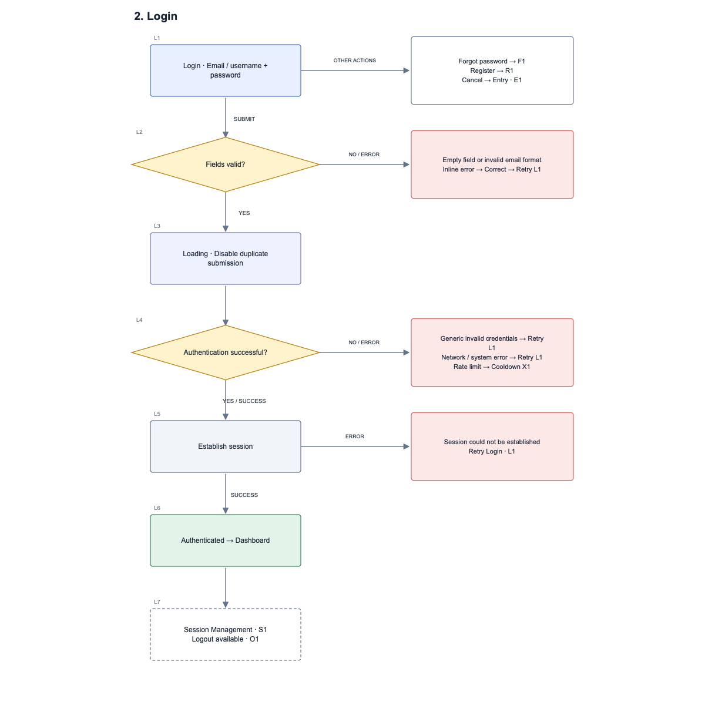

# Phase 1 Authentication User Flow

Task ID: `AX1-CORE-001-UX-01`

Task name: AXIVON ONE Phase 1 Authentication User Flow

Status: Design review candidate; approval pending

## Scope

Design documentation for Entry, Login, Registration, Verification (email link and optional OTP), Forgot Password, Password Reset, Session Management, Logout, and Edge Cases / State Matrix. Covers eight UI states and twelve edge-case categories with named recovery destinations.

This delivery specifies the user flow. It does not implement authentication, APIs, wireframes, high-fidelity screens, or role/permission behavior.

## Files

- [authentication-flow.html](authentication-flow.html): open locally in a browser to view all sections and the state matrix. No external scripts or services are required.
- [authentication-flow.svg](authentication-flow.svg): combined vector diagram for import into Figma. Named references indicate continuations; imported SVG hyperlinks are not a Figma prototype.
- [login-preview.png](login-preview.png): login flow preview for review.
- [flow-data.json](flow-data.json): structured section, node, state, and recovery data. Presentation exports must be kept in sync when the data changes.

## Reading the flow

Read each flow top to bottom. Rectangles represent screens/actions, diamonds represent decisions, and labeled arrows identify outcomes. Dashed boxes and named step IDs continue into other sections. Recovery boxes name the correction, retry, resend, re-authentication, or cancellation destination.

Verification retains its origin: Registration or Password Recovery. Rate limiting retains the interrupted step so retry resumes the correct operation.

## Shared behavior

- Never reveal whether an account or email exists. Public responses stay equivalent for known and unknown identifiers.
- OTP, verification requirements, and automatic sign-in after registration are configurable.
- The flow stays reusable across clients and roles; specific permissions and client policies require separate approved requirements.
- Every error has a recovery action. Loading and disabled states have completion or failure exits.

## Validation completed

- Visually inspected the rendered login and registration diagrams for readable labels and separation of connectors and nodes.
- Parsed the combined SVG successfully as XML.
- Checked unique step IDs in the structured source.
- Checked that all HTML fragment links resolve to an existing element.
- Confirmed the source contains eight state categories and twelve edge-case categories.

API, unit, integration, and E2E implementation tests do not apply to this documentation-only delivery. These checks are not a claim that authentication behavior has been implemented or tested.

## Review and dependencies

- UI/UX and Team Leader approval is pending.
- Confirm configurable verification, OTP, auto sign-in, and session policies against assigned acceptance criteria.
- High-fidelity design, accessibility audit, usability testing, and final developer handoff are not completed by this flow-only submission.
- Example interface copy represents configurable strings, not client-specific production copy.
- Figma import remains pending: MCP quota was exhausted, and browser access required sign-in. The standalone SVG is ready for import.
- The original Community kit and its example were not replaced by these exports.

## Preview

